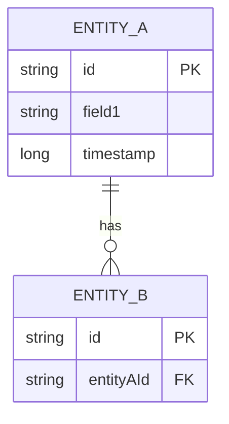

# Initiative Documentation Structure

Complete guide for creating and structuring initiative documentation.

---

## Overview

Each initiative version (`v[N]`) consists of:

1. **index.md** — Project metadata and document index
2. **proposal.md** — Goals, scope, tech stack, milestones, risks, dependencies, decision gates
3. **design.md** — Domain model, protocols, state machines, compliance constraints, gate verification
4. **codespec/** — Optional detailed specifications per milestone (one file per milestone phase)

---

## 1. index.md — Metadata & Index

Quick reference for the initiative. Links all documents.

```markdown
# Initiative v[N]: [Project Title]

**Status:** [Draft | Proposed | Accepted | In Progress | Completed]

**Current Milestone**: [M0 | M1 | M2 | ...]

**Active ADR:** [link or n/a]

> Valid statuses: Draft → Proposed → Accepted → In Progress → Completed

---

## Index

| Document                     | Purpose                                         |
| ---------------------------- | ----------------------------------------------- |
| [proposal.md](./proposal.md) | Project scope, tech stack, milestones, timeline |
| [design.md](./design.md)     | Contracts, State Machines, Schemas              |
| [codespec/](./codespec/)     | Detailed specifications per milestone           |
```

**Notes:**
- Update **Status** as initiative progresses
- Update **Current Milestone** weekly
- Link all ADRs created during this initiative
- Keep this page short — it's a hub, not a spec

---

## 2. proposal.md — Scope, Timeline, Risks

High-level project plan.

```markdown
# Initiative v[N]: [Project Title]

## Overview

[1–2 paragraph problem statement + vision statement]

Example:
> The LightOS iMessage Tool enables users to send and receive iMessages on the Light Phone III while maintaining end-to-end encryption and complying with the Light SDK's native library restrictions. The project reimplements the OpenBubbles protocol stack in Kotlin and integrates rustpush for APNs push delivery.

## Architecture

[ASCII box diagram or subsystem breakdown showing major components and boundaries]

Example:
```
┌─────────────────────────────────┐
│  UI Layer (Compose)             │
├─────────────────────────────────┤
│  Service Layer (Kotlin/JVM)     │
│  - AuthService                  │
│  - MessageService               │
│  - RelayClient                  │
├─────────────────────────────────┤
│  Data Layer (Room + DataStore)  │
├─────────────────────────────────┤
│  Native Push (rustpush .so)     │
└─────────────────────────────────┘
```

## Milestones

| Phase                         | Duration | Deliverable                                          | Exit Criteria                                    |
|-------------------------------|----------|------------------------------------------------------|--------------------------------------------------|
| **0. [Phase Name]**           | N week   | [What ships: libraries, protocols, docs]             | [Measurable pass/fail: test, gate, validation]  |
| **1. [Phase Name]**           | N week   | [Components, modules, integration tests]             | [Gate criteria: e2e test, perf baseline, audit] |

**Effort:** Total duration, team size estimate

## Risk Register

| Risk                                      | Impact | Mitigation                                   |
|-------------------------------------------|--------|----------------------------------------------|
| [Brief problem statement]                 | High   | [Planned response or contingency]            |
| [Dependency unavailable, blocker, etc.]   | Medium | [Alternative approach or timeline adjustment]|

## Dependencies

| Artifact / Dependency             | Function                  | Notes                                      |
|-----------------------------------|---------------------------|-------------------------------------------|
| `com.library:module`              | [What it provides]        | [Version, whitelist status, risk]          |
| `rustpush` (native)               | APNs bridge               | Compiled arm64-v8a; requires NDK approval |

## Decision Gateways

1. **Gate 0 (End of Phase 0):** [Specific pass/fail criteria — examples: "SDK whitelist confirms .so loading permitted", "Plist parser round-trip test passes"]
2. **Gate 1 (End of Phase 1):** [Must validate before Phase 2 starts]

Failure at any gate halts the initiative; escalate blockers immediately.

## References

- [Related ADRs: ADR-001, ADR-005, ...]
- [External specs, RFCs, linked research]
- [Predecessors or related initiatives]
```

**What belongs here:**
- Problem & vision (Why this initiative?)
- System diagram (What gets built?)
- Milestone breakdown (When does each piece ship?)
- Risks & mitigations (What could go wrong?)
- Gate criteria (How do we know Phase X succeeded?)

**What belongs elsewhere:**
- Domain model details → `design.md`
- API/protocol specs → `design.md`
- Task breakdown & effort → `codespec/milestone-[X].md`

---

## 3. design.md — Contracts, Protocols, Constraints

Deep-dive on system behavior and design decisions.

```markdown
# Initiative v[N]: [Project Title]

## Domain Overview & Bounded Contexts

[Conceptual map of major services, aggregates, and boundaries]

Example:
- **AuthContext** — Apple ID session management, 2FA, token persistence
- **MessagingContext** — Message codec, relay protocol, iMessage envelope format
- **PushContext** — rustpush IPC, UnifiedPush bridge, notification routing

## Protocol Specification

### [Protocol Name: e.g., "Mac Relay One-Time Activation API"]

[Message format, wire format, request/response examples, state transitions]

Include: request schema, response schema, error codes, examples, heartbeat / timeout behavior.

## Object Model

### Aggregates
- [Root entity + child entities]

### Entities
- [List with keys and relationships]

### Value Objects
- [Immutable types: Message, AuthToken, etc.]

### Domain Services
- [Services without identity: codec, crypto, email sender, etc.]

## State Machines

### [State Machine Name: e.g., "Apple ID Auth State Machine"]

**States:** IDLE, WAITING_2FA, AUTHENTICATED, EXPIRED

**Transitions:**
```
[IDLE] --login--> [WAITING_2FA] --verify-code--> [AUTHENTICATED]
                       ^                               |
                       |                             (expire)
                       +------- [EXPIRED] <----------+
```

**Invariants:**
- Only one active session per device
- Token must refresh before expiry
- 2FA code valid for 5 minutes

## Compliance & Constraint Mapping

| Constraint | Impact | Implementation |
|---|---|---|
| Light SDK: no arbitrary native libs | High | Use JNI only for rustpush; all else Kotlin |
| Encryption at rest (tokens) | Medium | `androidx.datastore` encrypted prefs |
| End-to-end encryption (messages) | High | AES-GCM + custom Plist codec |

## Milestone [X] Gate Verification

[Checklist of tests/validations required to pass gate]

Example for "Gate 1 (End of Phase 1)":
- [ ] Plist codec round-trip test passes (binary + XML)
- [ ] AES-GCM message encryption/decryption verified with test vectors
- [ ] Room schema unit tests pass (CRUD, indexes)
- [ ] RelayService connects and authenticates via mock relay server
- [ ] IPC heartbeat parsing test passes (length-prefixed JSON framing)
```

**What belongs here:**
- Entity relationships and aggregates
- Protocol specs (request/response, wire format, examples)
- State machines and invariants
- Security & compliance constraints mapped to design

**What belongs elsewhere:**
- Effort estimates, task breakdown → `codespec/`
- Implementation timeline, Gantt chart → `codespec/`
- Code examples, class hierarchy → `codespec/` or source code

---

## 4. codespec/index.md — Roadmap

Optional overview of milestone specs. Describe scope and effort for each.

```markdown
# Codespec Index — [Project Name]

## Overview

This directory contains detailed technical specifications for each milestone.

Each codespec defines:
- Formal requirements (goal, scope in/out, actors, invariants)
- Data model and entity diagram
- Component architecture and interfaces
- Component interactions (workflows, scenarios)
- State machines and lifecycle management
- Algorithms and procedures
- Test matrix (unit, integration, e2e, invariant)
- Task breakdown with effort estimates
- Implementation timeline with internal stories (S1–S5)

## Milestone Specs

### [Milestone 2: Core Service & Data Model](./milestone-2.md)
**Scope:** [1-line summary]
**Effort:** [X hours, Y weeks]

### [Milestone 3: Push & Native Integration](./milestone-3.md)
**Scope:** [1-line summary]
**Effort:** [X hours, Y weeks]
```

---

## 5. codespec/milestone-[X].md — Detailed Implementation Spec

One file per major milestone/phase. Contains everything needed to implement the milestone.

```markdown
# Specification: [Project Name] — [Milestone Title]

## 1. Formal Requirement Restatement

**Goal:** [Clear, concise statement of what this milestone achieves]

**Scope In:**
- [Feature / component 1]
- [Feature / component 2]
- [Dependency contracts from proposal.md]

**Scope Out:**
- [Explicitly excluded; point to later milestone if applicable]

**Actors:**
- [User, System, Service, Database, etc.]

**Invariants:**
- [Constraints that must always hold: uniqueness, encryption, determinism, ordering, etc.]

---

## 2. Data Model



Include: primary keys, foreign keys, indexes, constraints.

---

## 3. Code Architecture

### 3.1 Component Diagram

[ASCII diagram of module layout, service boundaries, package structure]

Example:
```
service/
├── AuthService.kt
├── MessageService.kt
└── RelayClient.kt
repository/
├── MessageRepository.kt
└── TokenRepository.kt
codec/
├── PlistCodec.kt
└── AesGcmCrypto.kt
```

### 3.2 Key Classes / Interfaces

| Component | Responsibility | Primary Methods |
|-----------|---|---|
| `AuthService` | Apple ID auth lifecycle | `login()`, `verify2FA()`, `refreshToken()` |
| `MessageRepository` | Room message CRUD | `insert()`, `findById()`, `delete()` |

---

## 4. Component Interactions

### 4.1 [Scenario: e.g., "User Login Flow"]

**Trigger:** User enters credentials in settings screen

**Steps:**
1. UI calls `AuthService.login(email, password)`
2. Service hits relay with HTTP POST, parses response
3. Relay returns 2FA challenge
4. UI prompts for code, calls `AuthService.verify2FA(code)`
5. Service stores token in encrypted `DataStore`
6. UI navigates to conversation list

**Expected Outcome:** `AuthViewModel.isAuthenticated` = true; token persisted

**Error Handling:**
- Invalid password → `AuthException(INVALID_CREDENTIALS)`
- Relay timeout → retry 3×, backoff 1s/2s/4s
- Network error → offline mode with cached data

---

## 5. Stateful Behavior

### 5.1 [State Machine Name]

**States:** [List all]

**Transitions:**
```
[IDLE] --login--> [AUTH_PENDING] --success--> [AUTHENTICATED]
                       |
                    timeout
                       |
                     [ERROR]
```

**Invariants:**
- [Rule 1]
- [Rule 2]

---

## 6. Algorithmic Logic

### 6.1 [Algorithm Name: e.g., "Message Deduplication"]

**Input:** [Parameter types]

**Output:** [Return type]

**Algorithm:**
```
1. Query DB for messages with same ID in 30-second window
2. If found:
   a. Return existing message (skip duplicate)
3. Else:
   a. Insert new message
   b. Return inserted ID
```

**Complexity:** O(1) average (indexed lookup) + O(1) insert

**Test Cases:**
- Duplicate within 30s → returns existing message
- Duplicate after 30s → inserts new message

---

## 7. Test Matrix

| Test Level | Scope | Example | Pass Criteria |
|---|---|---|---|
| **Unit** | Single class | `PlistCodecTest.testRoundTrip()` | Binary plist encodes/decodes correctly |
| **Integration** | Component + mock | `AuthServiceTest.testLoginFlow()` | Token stored, session active |
| **E2E** | Full milestone | `MessageE2ETest.testSendReceive()` | Message sent to relay, received on device |
| **Invariant** | Constraint check | `DatabaseTest.uniqueMessageIds()` | No duplicate message IDs in DB |

---

## 8. Task Dependencies & Effort Breakdown

| Task | Name | Hours | Depends | Deliverable |
|---|---|---|---|---|
| T1 | Design Room schema | 4 | — | `schema.sql` |
| T2 | Implement MessageDao | 6 | T1 | `MessageDao.kt` |
| T3 | Write Room unit tests | 4 | T2 | `MessageDaoTest.kt` |
| T4 | Implement AuthService | 8 | — | `AuthService.kt` |
| T5 | E2E auth test | 6 | T4 | `AuthE2ETest.kt` |

**Total:** 28 hours

---

## 9. Implementation Timeline (Gantt)

```
S1: Foundation  [====]
S2: Core Impl   [    ====]
S3: Integration [        ====]
S4: Testing     [            ====]
S5: Review      [                ====]

Week: 1  2  3  4  5  6  7  8
```

**Stories (S1–S5):**
- **S1 (Foundation):** Design schema, set up DAOs, mock relay server
- **S2 (Core Impl):** AuthService, codec, repository implementations
- **S3 (Integration):** Wire services together, test interop
- **S4 (Testing):** Unit, integration, e2e test coverage
- **S5 (Review):** Documentation, API docs, ADR updates, handoff

---

## 10. Revision History

| Version | Date | Author | Change |
|---|---|---|---|
| 1.0 | 2025-01-15 | Alice | Initial spec |
| 1.1 | 2025-01-20 | Bob | Added retry logic for relay timeout |

---

## References

- [Related ADRs: ADR-001, ADR-003, ...]
- [Design doc sections: design.md §2–4]
- [Proposal milestones: proposal.md § Milestones]
```

---

## Lifecycle & Progression

### Status Progression

```
Draft → Proposed → Accepted → In Progress → Completed
```

- **Draft:** Initial outline, team internal only
- **Proposed:** Ready for first review by stakeholders
- **Accepted:** Approved and committed to project roadmap
- **In Progress:** Phase(s) actively being worked
- **Completed:** All phases shipped; document is historical reference

### Update Cadence

| Document | Frequency | Trigger |
|---|---|---|
| `index.md` | Weekly | Milestone or status change |
| `proposal.md` | Per phase | New phase, risk materialized, timeline shift |
| `design.md` | Per phase | Protocol changed, new constraint discovered |
| `codespec/` | Per milestone | Detailed spec ready, mid-phase adjustment, post-phase review |

---

## Example Directory Structure

```
docs/initiatives/
├── STRUCTURE.md                    (This file)
├── TEMPLATE.md                     (Deprecated: use STRUCTURE.md)
├── CODESPEC-TEMPLATE.md            (Deprecated: use STRUCTURE.md §5)
├── v1/
│   ├── index.md                    (Metadata + doc index)
│   ├── proposal.md                 (Scope, milestones, risks, gates)
│   ├── design.md                   (Domain, protocols, constraints)
│   └── codespec/
│       ├── index.md                (Spec overview by milestone)
│       ├── milestone-0.md           (Phase 0 detailed spec)
│       ├── milestone-2.md           (Phase 2 detailed spec)
│       └── milestone-5.md           (Phase 5 detailed spec)
└── v2/
    ├── index.md
    ├── proposal.md
    └── design.md
```

---

## Quick Reference: When to Create What

| Situation | Action |
|---|---|
| Starting new initiative | Create `v[N]/index.md`, `proposal.md`, `design.md` |
| Adding detailed implementation spec | Create `v[N]/codespec/milestone-[X].md` |
| Design impacts architecture | Create ADR in `docs/adrs/`; link from `design.md` |
| Initiative status changes (Draft→Proposed) | Update `index.md` **Status** |
| Completing a milestone | Update `index.md` **Current Milestone**; update gate verification |
| Major risk emerges | Add to `proposal.md` **Risk Register**; adjust timeline if needed |
