# Specification: LightOS iMessage Client — Milestone 2 Core Service & Data Model

## 1. Formal Requirement Restatement

**Goal:** Implement the core Kotlin-native service layer and persistence layer for the LightOS iMessage client, including Apple ID authentication state management, Mac relay messaging protocol, rustpush native push integration, custom Plist/AES-GCM message codec, and local persistence via Room and encrypted DataStore.

**Scope In:**

- Apple ID authentication state machine (login, 2FA/SMS verification, session token persistence).
- Mac relay client protocol over HTTP/WebSocket using OkHttp.
- rustpush native service IPC client (Unix domain socket or AIDL) for push notification delivery.
- `MessageCodec` for binary/XML Plist serialization and AES-GCM envelope encryption/decryption.
- `RelayService` for send/receive message lifecycle and command framing.
- `AuthManager` for Apple ID session lifecycle and hardware-info provisioning.
- Room entities: `MessageEntity`, `ThreadEntity`, `ContactEntity`, `AttachmentEntity`, `DomainEventEntity`.
- Encrypted `DataStore` schema for tokens, keys, and activation state.
- `BackgroundSyncWorker` using `androidx.work`.
- `PushReceiver` consuming `org.unifiedpush.android:connector` events.

**Scope Out:**

- UI screens, ViewModels, and Compose navigation (Milestone 3).
- Full attachment upload/download orchestration beyond metadata persistence (Milestone 5).
- rustpush Rust implementation itself; only the Kotlin-side IPC consumer is specified.
- Mac relay server implementation.
- FaceTime, SMS/MMS fallback, and iMessage app extensions.

**Actors:**

- `User` — provides credentials and 2FA codes.
- `LightOS iMessage Tool` — the Kotlin application.
- `rustpush Native Service` — compiled Android `.so` maintaining APNs TLS and UnifiedPush bridge.
- `Mac Relay Server` — provides one-time hardware attestation and message relay.
- `Apple ID Service` — reached indirectly through the relay.
- `UnifiedPush Distributor` — receives rustpush-forwarded push payloads.
- `Room Database` — local cache for messages, threads, contacts.
- `Encrypted DataStore` — local secure storage for tokens and keys.

**Invariants:**

- Only dependencies listed in `LightSdkPlugin.kt` lines 17–37 are permitted [^2].
- All cryptographic operations use `javax.crypto` and `java.security`; no BouncyCastle or SpongyCastle.
- Session tokens and private keys are encrypted at rest via `androidx.datastore`.
- `MessageEntity.id` is a UUIDv4 and globally unique.
- `ThreadEntity.id` is deterministic from the sorted set of participant URIs.
- Only one active `RelayConnection` per `DeviceId`.
- Native IPC messages are length-prefixed JSON (4-byte big-endian length + UTF-8 payload) [^1].
- All outbound iMessage envelopes are signed before transmission.

---

## 2. Data Model

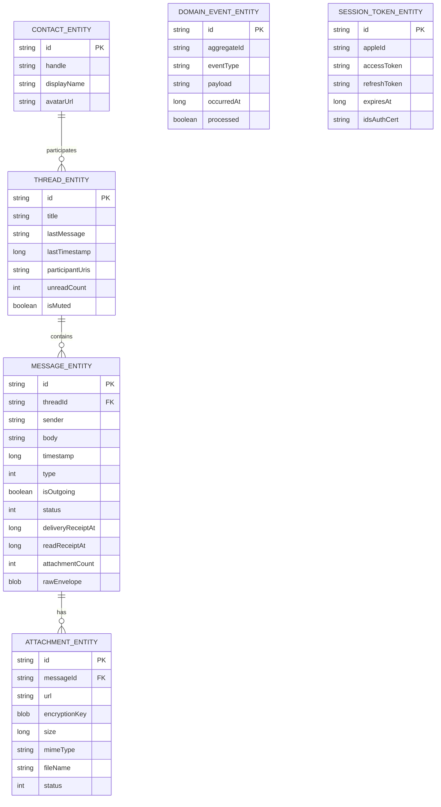

**Field definitions:**

| Entity               | Field             | Type    | Constraints      | Description                                                              |
| -------------------- | ----------------- | ------- | ---------------- | ------------------------------------------------------------------------ |
| MESSAGE_ENTITY       | id                | string  | PK               | UUIDv4 message identifier.                                               |
| MESSAGE_ENTITY       | threadId          | string  | FK, NOT NULL     | Parent thread identifier.                                                |
| MESSAGE_ENTITY       | sender            | string  | NOT NULL         | URI of the sender (`tel:` or `mailto:`).                                 |
| MESSAGE_ENTITY       | body              | string  | NOT NULL         | Decrypted message text; empty string for attachments-only.               |
| MESSAGE_ENTITY       | timestamp         | long    | NOT NULL         | Unix epoch milliseconds (UTC).                                           |
| MESSAGE_ENTITY       | type              | int     | NOT NULL         | `0=TEXT`, `1=ATTACHMENT`, `2=TYPING`, `3=READ_RECEIPT`.                  |
| MESSAGE_ENTITY       | isOutgoing        | boolean | NOT NULL         | `true` if sent from this device.                                         |
| MESSAGE_ENTITY       | status            | int     | NOT NULL         | `0=DRAFT`, `1=ENCRYPTED`, `2=SENT`, `3=DELIVERED`, `4=READ`, `5=FAILED`. |
| MESSAGE_ENTITY       | deliveryReceiptAt | long    | nullable         | Unix ms when delivery receipt received.                                  |
| MESSAGE_ENTITY       | readReceiptAt     | long    | nullable         | Unix ms when read receipt received.                                      |
| MESSAGE_ENTITY       | attachmentCount   | int     | NOT NULL         | Number of attachments linked to this message.                            |
| MESSAGE_ENTITY       | rawEnvelope       | blob    | nullable         | Encrypted bplist envelope as received from relay.                        |
| THREAD_ENTITY        | id                | string  | PK               | Deterministic hash of sorted participant URIs.                           |
| THREAD_ENTITY        | title             | string  | NOT NULL         | Display title; defaults to first participant display name.               |
| THREAD_ENTITY        | lastMessage       | string  | NOT NULL         | Snippet of last message.                                                 |
| THREAD_ENTITY        | lastTimestamp     | long    | NOT NULL         | Unix ms of last activity.                                                |
| THREAD_ENTITY        | participantUris   | string  | NOT NULL         | JSON array of participant URIs.                                          |
| THREAD_ENTITY        | unreadCount       | int     | NOT NULL         | Count of unread incoming messages.                                       |
| THREAD_ENTITY        | isMuted           | boolean | NOT NULL         | Thread mute flag.                                                        |
| CONTACT_ENTITY       | id                | string  | PK               | UUIDv4 contact identifier.                                               |
| CONTACT_ENTITY       | handle            | string  | NOT NULL, UNIQUE | `tel:` or `mailto:` URI.                                                 |
| CONTACT_ENTITY       | displayName       | string  | NOT NULL         | Resolved display name.                                                   |
| CONTACT_ENTITY       | avatarUrl         | string  | nullable         | Optional avatar CDN URL.                                                 |
| ATTACHMENT_ENTITY    | id                | string  | PK               | UUIDv4 attachment identifier.                                            |
| ATTACHMENT_ENTITY    | messageId         | string  | FK, NOT NULL     | Parent message identifier.                                               |
| ATTACHMENT_ENTITY    | url               | string  | NOT NULL         | iCloud or relay-proxied attachment URL.                                  |
| ATTACHMENT_ENTITY    | encryptionKey     | blob    | NOT NULL         | AES-256 attachment encryption key.                                       |
| ATTACHMENT_ENTITY    | size              | long    | NOT NULL         | Attachment size in bytes.                                                |
| ATTACHMENT_ENTITY    | mimeType          | string  | NOT NULL         | MIME type.                                                               |
| ATTACHMENT_ENTITY    | fileName          | string  | NOT NULL         | Original file name.                                                      |
| ATTACHMENT_ENTITY    | status            | int     | NOT NULL         | `0=PENDING`, `1=DOWNLOADING`, `2=DOWNLOADED`, `3=FAILED`.                |
| DOMAIN_EVENT_ENTITY  | id                | string  | PK               | UUIDv4 event identifier.                                                 |
| DOMAIN_EVENT_ENTITY  | aggregateId       | string  | NOT NULL         | Identifier of the affected aggregate.                                    |
| DOMAIN_EVENT_ENTITY  | eventType         | string  | NOT NULL         | Fully-qualified event class name.                                        |
| DOMAIN_EVENT_ENTITY  | payload           | string  | NOT NULL         | JSON-serialized event payload.                                           |
| DOMAIN_EVENT_ENTITY  | occurredAt        | long    | NOT NULL         | Unix ms event timestamp.                                                 |
| DOMAIN_EVENT_ENTITY  | processed         | boolean | NOT NULL         | `true` after all projections handled the event.                          |
| SESSION_TOKEN_ENTITY | id                | string  | PK               | UUIDv4 session identifier.                                               |
| SESSION_TOKEN_ENTITY | appleId           | string  | NOT NULL         | Apple ID email address.                                                  |
| SESSION_TOKEN_ENTITY | accessToken       | string  | NOT NULL         | Encrypted access token.                                                  |
| SESSION_TOKEN_ENTITY | refreshToken      | string  | NOT NULL         | Encrypted refresh token.                                                 |
| SESSION_TOKEN_ENTITY | expiresAt         | long    | NOT NULL         | Unix ms token expiry.                                                    |
| SESSION_TOKEN_ENTITY | idsAuthCert       | string  | nullable         | Encrypted IDS authentication certificate PEM.                            |

---

## 3. Code Architecture

```mermaid
classDiagram
    class IAuthManager {
        <<interface>>
        + val state: StateFlow~AuthState~
        + suspend fun startAuthentication(appleId: AppleId, password: String): Result~Unit~
        + suspend fun submitTwoFactorCode(code: String): Result~Unit~
        + suspend fun resendTwoFactorCode(): Result~Unit~
        + suspend fun refreshSession(): Result~Unit~
        + suspend fun logout(): Result~Unit~
    }
    class AuthManager {
        - authStateMachine: AuthStateMachine
        - tokenRepository: ITokenRepository
        - relayClient: IRelayClient
        - nativeClient: INativeServiceClient
        - coroutineScope: CoroutineScope
        + val state: StateFlow~AuthState~
        + suspend fun startAuthentication(appleId: AppleId, password: String): Result~Unit~
        + suspend fun submitTwoFactorCode(code: String): Result~Unit~
        + suspend fun resendTwoFactorCode(): Result~Unit~
        + suspend fun refreshSession(): Result~Unit~
        + suspend fun logout(): Result~Unit~
    }
    class IRelayService {
        <<interface>>
        + val connectionState: StateFlow~RelayConnectionState~
        + suspend fun connect(endpoint: RelayEndpoint): Result~Unit~
        + suspend fun disconnect(): Result~Unit~
        + suspend fun sendMessage(message: OutgoingMessage): Result~MessageId~
        + suspend fun requestSync(): Result~Unit~
    }
    class RelayService {
        - okHttpClient: OkHttpClient
        - webSocket: WebSocket?
        - messageCodec: IMessageCodec
        - commandQueue: MutableList~RelayCommand~
        - reconnectPolicy: ReconnectPolicy
        + val connectionState: StateFlow~RelayConnectionState~
        + suspend fun connect(endpoint: RelayEndpoint): Result~Unit~
        + suspend fun disconnect(): Result~Unit~
        + suspend fun sendMessage(message: OutgoingMessage): Result~MessageId~
        + suspend fun requestSync(): Result~Unit~
        - fun onWebSocketOpen(webSocket: WebSocket)
        - fun onWebSocketMessage(bytes: ByteString)
        - fun onWebSocketFailure(t: Throwable)
    }
    class IMessageCodec {
        <<interface>>
        + fun encodeEnvelope(payload: MessagePayload, recipientKey: PublicKey, senderKey: PrivateKey): Result~ByteArray~
        + fun decodeEnvelope(envelope: ByteArray, recipientKey: PrivateKey, senderCert: X509Certificate): Result~MessagePayload~
        + fun encodePlist(value: PlistValue): Result~ByteArray~
        + fun decodePlist(bytes: ByteArray): Result~PlistValue~
    }
    class MessageCodec {
        - plistCodec: PlistCodec
        - cryptoEngine: CryptoEngine
        + fun encodeEnvelope(payload: MessagePayload, recipientKey: PublicKey, senderKey: PrivateKey): Result~ByteArray~
        + fun decodeEnvelope(envelope: ByteArray, recipientKey: PrivateKey, senderCert: X509Certificate): Result~MessagePayload~
        + fun encodePlist(value: PlistValue): Result~ByteArray~
        + fun decodePlist(bytes: ByteArray): Result~PlistValue~
    }
    class PlistCodec {
        + fun encode(value: PlistValue): Result~ByteArray~
        + fun decode(bytes: ByteArray): Result~PlistValue~
        - fun parseBinaryPlist(bytes: ByteArray): PlistValue
        - fun parseXmlPlist(xml: String): PlistValue
    }
    class CryptoEngine {
        - secureRandom: SecureRandom
        + fun generateAesKey(): SecretKey
        + fun aesGcmEncrypt(plaintext: ByteArray, key: SecretKey, aad: ByteArray?): AesGcmResult
        + fun aesGcmDecrypt(ciphertext: ByteArray, key: SecretKey, iv: ByteArray, tag: ByteArray, aad: ByteArray?): Result~ByteArray~
        + fun rsaOaepWrap(aesKey: SecretKey, publicKey: PublicKey): Result~ByteArray~
        + fun rsaOaepUnwrap(wrappedKey: ByteArray, privateKey: PrivateKey): Result~SecretKey~
        + fun ecdsaSign(data: ByteArray, privateKey: PrivateKey): Result~ByteArray~
        + fun ecdsaVerify(data: ByteArray, signature: ByteArray, certificate: X509Certificate): Result~Unit~
    }
    class INativeServiceClient {
        <<interface>>
        + val connectionState: StateFlow~NativeServiceState~
        + suspend fun connect(): Result~Unit~
        + suspend fun disconnect(): Result~Unit~
        + suspend fun sendCommand(command: NativeCommand): Result~NativeResponse~
    }
    class NativeServiceClient {
        - socket: LocalSocket?
        - outputStream: OutputStream?
        - inputStream: InputStream?
        - dispatcher: CoroutineDispatcher
        + val connectionState: StateFlow~NativeServiceState~
        + suspend fun connect(): Result~Unit~
        + suspend fun disconnect(): Result~Unit~
        + suspend fun sendCommand(command: NativeCommand): Result~NativeResponse~
        - fun writeLengthPrefixedJson(json: String)
        - suspend fun readLengthPrefixedJson(): String
    }
    class ITokenRepository {
        <<interface>>
        + suspend fun saveSession(session: SessionToken): Result~Unit~
        + suspend fun getSession(appleId: AppleId): SessionToken?
        + suspend fun deleteSession(appleId: AppleId): Result~Unit~
        + suspend fun saveEncryptionKey(alias: String, key: ByteArray): Result~Unit~
        + suspend fun getEncryptionKey(alias: String): ByteArray?
    }
    class EncryptedTokenRepository {
        - dataStore: DataStore~Preferences~
        - masterKey: MasterKey
        + suspend fun saveSession(session: SessionToken): Result~Unit~
        + suspend fun getSession(appleId: AppleId): SessionToken?
        + suspend fun deleteSession(appleId: AppleId): Result~Unit~
        + suspend fun saveEncryptionKey(alias: String, key: ByteArray): Result~Unit~
        + suspend fun getEncryptionKey(alias: String): ByteArray?
    }
    class IMessageRepository {
        <<interface>>
        + fun observeMessages(threadId: ThreadId): Flow~List~MessageEntity~~
        + suspend fun insertMessage(message: MessageEntity): Result~Unit~
        + suspend fun updateMessageStatus(messageId: MessageId, status: MessageStatus): Result~Unit~
        + suspend fun getMessageById(messageId: MessageId): MessageEntity?
    }
    class MessageRepository {
        - messageDao: MessageDao
        - domainEventDao: DomainEventDao
        + fun observeMessages(threadId: ThreadId): Flow~List~MessageEntity~~
        + suspend fun insertMessage(message: MessageEntity): Result~Unit~
        + suspend fun updateMessageStatus(messageId: MessageId, status: MessageStatus): Result~Unit~
        + suspend fun getMessageById(messageId: MessageId): MessageEntity?
    }
    class IThreadRepository {
        <<interface>>
        + fun observeThreads(): Flow~List~ThreadEntity~~
        + suspend fun upsertThread(thread: ThreadEntity): Result~Unit~
        + suspend fun getThreadById(threadId: ThreadId): ThreadEntity?
        + suspend fun incrementUnread(threadId: ThreadId): Result~Unit~
    }
    class ThreadRepository {
        - threadDao: ThreadDao
        + fun observeThreads(): Flow~List~ThreadEntity~~
        + suspend fun upsertThread(thread: ThreadEntity): Result~Unit~
        + suspend fun getThreadById(threadId: ThreadId): ThreadEntity?
        + suspend fun incrementUnread(threadId: ThreadId): Result~Unit~
    }
    class IContactRepository {
        <<interface>>
        + suspend fun resolveContact(uri: Uri): ContactEntity?
        + suspend fun saveContact(contact: ContactEntity): Result~Unit~
        + fun observeContacts(): Flow~List~ContactEntity~~
    }
    class ContactRepository {
        - contactDao: ContactDao
        + suspend fun resolveContact(uri: Uri): ContactEntity?
        + suspend fun saveContact(contact: ContactEntity): Result~Unit~
        + fun observeContacts(): Flow~List~ContactEntity~~
    }
    class PushReceiver {
        - relayService: IRelayService
        + fun onMessage(message: PushMessage, instance: String)
        + fun onNewEndpoint(endpoint: String, instance: String)
        + fun onRegistrationFailed(instance: String)
        + fun onUnregistered(instance: String)
    }
    class BackgroundSyncWorker {
        - relayService: IRelayService
        - messageRepository: IMessageRepository
        + suspend fun doWork(): Result
        - suspend fun performSync(): Result~Unit~
    }
    class AuthStateMachine {
        - currentState: AuthState
        + fun transition(event: AuthEvent): Result~AuthState~
        + fun getState(): AuthState
    }
    class MessageDao {
        + @Insert suspend fun insert(message: MessageEntity)
        + @Query suspend fun getById(id: String): MessageEntity?
        + @Query fun observeByThread(threadId: String): Flow~List~MessageEntity~~
        + @Update suspend fun update(message: MessageEntity)
    }
    class ThreadDao {
        + @Insert(onConflict = REPLACE) suspend fun upsert(thread: ThreadEntity)
        + @Query fun observeAll(): Flow~List~ThreadEntity~~
        + @Query suspend fun getById(id: String): ThreadEntity?
        + @Query suspend fun incrementUnread(id: String)
    }
    class ContactDao {
        + @Insert(onConflict = REPLACE) suspend fun upsert(contact: ContactEntity)
        + @Query suspend fun getByHandle(handle: String): ContactEntity?
        + @Query fun observeAll(): Flow~List~ContactEntity~~
    }
    class DomainEventDao {
        + @Insert suspend fun insert(event: DomainEventEntity)
        + @Query suspend fun unprocessed(): List~DomainEventEntity~
        + @Update suspend fun markProcessed(id: String)
    }

    IAuthManager <|.. AuthManager : implements
    IRelayService <|.. RelayService : implements
    IMessageCodec <|.. MessageCodec : implements
    INativeServiceClient <|.. NativeServiceClient : implements
    ITokenRepository <|.. EncryptedTokenRepository : implements
    IMessageRepository <|.. MessageRepository : implements
    IThreadRepository <|.. ThreadRepository : implements
    IContactRepository <|.. ContactRepository : implements

    AuthManager --> AuthStateMachine : owns
    AuthManager --> ITokenRepository : uses
    AuthManager --> IRelayService : uses
    AuthManager --> INativeServiceClient : uses
    RelayService --> IMessageCodec : uses
    MessageCodec --> PlistCodec : uses
    MessageCodec --> CryptoEngine : uses
    NativeServiceClient --> RelayService : notifies
    PushReceiver --> IRelayService : triggers sync
    BackgroundSyncWorker --> IRelayService : uses
    BackgroundSyncWorker --> IMessageRepository : uses
    MessageRepository --> MessageDao : uses
    MessageRepository --> DomainEventDao : uses
    ThreadRepository --> ThreadDao : uses
    ContactRepository --> ContactDao : uses
    EncryptedTokenRepository --> DataStore : uses
```

**Module boundaries:**

| Component                  | Responsibility                                                        | Owned By                                     |
| -------------------------- | --------------------------------------------------------------------- | -------------------------------------------- |
| `AuthManager`              | Apple ID state machine, credential submission, token refresh, logout. | Authentication & Activation bounded context  |
| `RelayService`             | WebSocket lifecycle, command framing, send/receive message routing.   | Relay Communication bounded context          |
| `MessageCodec`             | Plist serialization and AES-GCM/RSA/ECDSA envelope construction.      | Cryptography / Messaging bounded context     |
| `PlistCodec`               | Binary and XML property list parsing/encoding.                        | Plist Serialization bounded context          |
| `CryptoEngine`             | AES-GCM, RSA-OAEP, ECDSA primitives using Android JCE.                | Cryptography bounded context                 |
| `NativeServiceClient`      | Length-prefixed JSON IPC to rustpush native service.                  | Native Service Communication bounded context |
| `PushReceiver`             | UnifiedPush notification consumption and routing.                     | Push & Delivery bounded context              |
| `EncryptedTokenRepository` | Secure storage and retrieval of tokens and keys.                      | Authentication & Activation bounded context  |
| `MessageRepository`        | Message CRUD, status updates, and event projection.                   | Local Messaging & Storage bounded context    |
| `ThreadRepository`         | Thread upsert, observation, and unread counters.                      | Local Messaging & Storage bounded context    |
| `ContactRepository`        | Contact resolution and persistence.                                   | Local Messaging & Storage bounded context    |
| `BackgroundSyncWorker`     | Periodic health check and sync trigger.                               | Push & Delivery bounded context              |

---

## 4. Component Interactions

### 4.1 Send Message

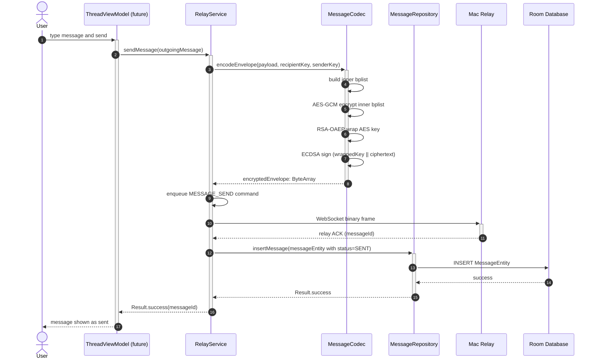

**Preconditions:** `RelayService` is connected to Mac relay; `AuthManager` state is `Activated`; recipient public key is cached.
**Postconditions:** `MessageEntity` persisted with `status=SENT`; relay has acknowledged the frame.

### 4.2 Receive Message

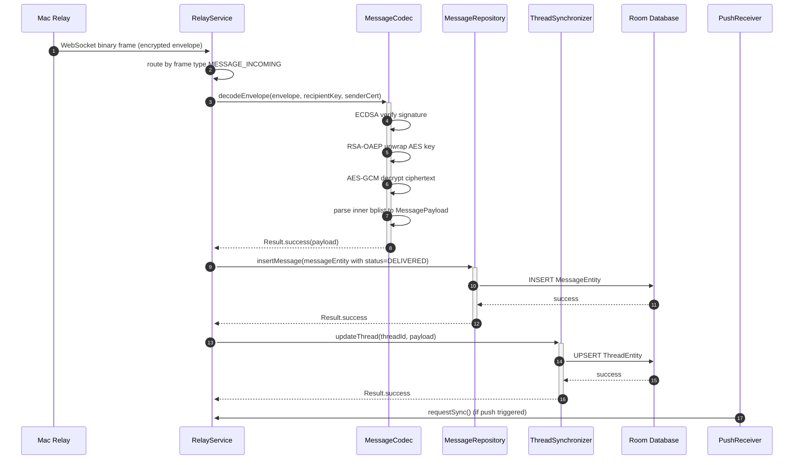

**Preconditions:** `RelayService` connected; `MessageCodec` initialized with keys.
**Postconditions:** Incoming message and thread persisted; UI Flow emits new data.

### 4.3 Apple ID Authentication

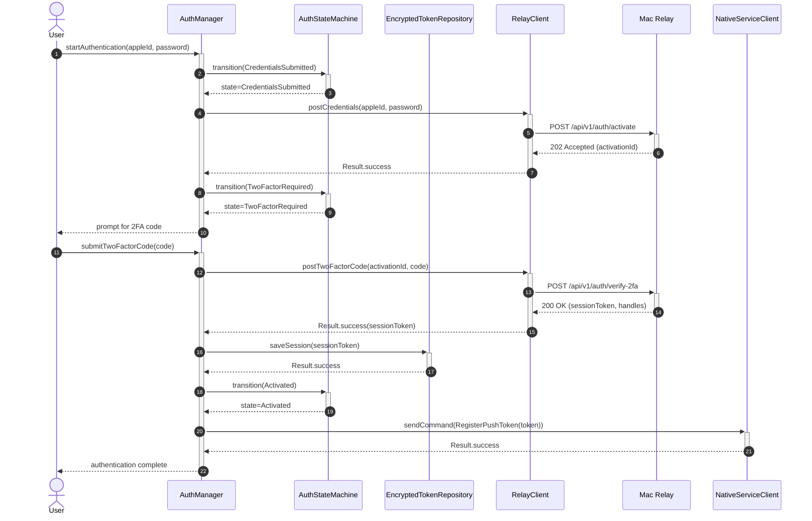

**Preconditions:** No active session or user explicitly re-authenticating.
**Postconditions:** `SessionTokenEntity` persisted; `AuthState` is `Activated`; push token registered with rustpush.

### 4.4 Native Push Notification

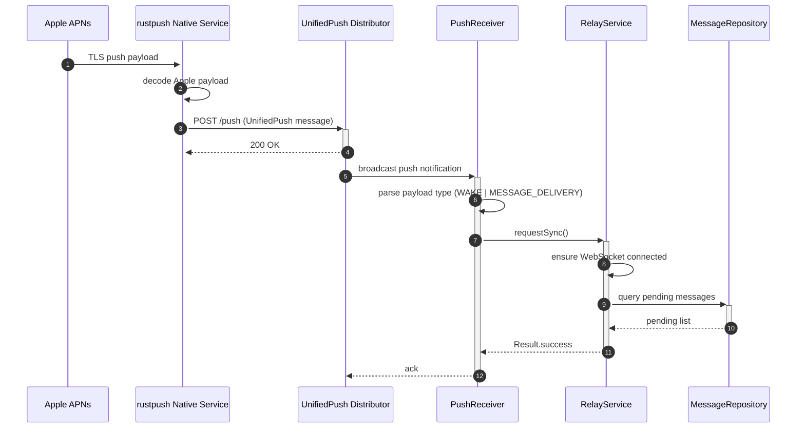

**Preconditions:** rustpush native service connected to APNs; UnifiedPush distributor registered.
**Postconditions:** Kotlin app triggered to sync with relay; push acknowledged.

### 4.5 Background Sync

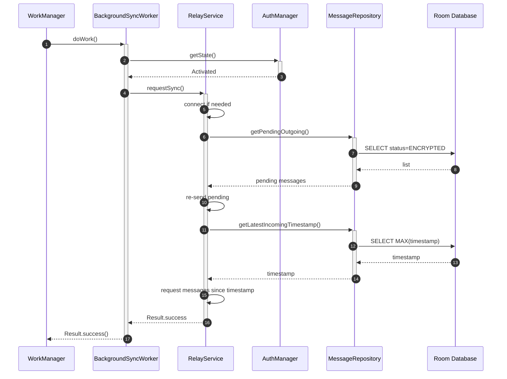

**Preconditions:** `AuthManager` state is `Activated`; periodic work scheduled.
**Postconditions:** Pending outgoing messages re-sent; new incoming messages fetched.

---

## 5. Stateful Behavior

### 5.1 Apple ID Auth State Machine

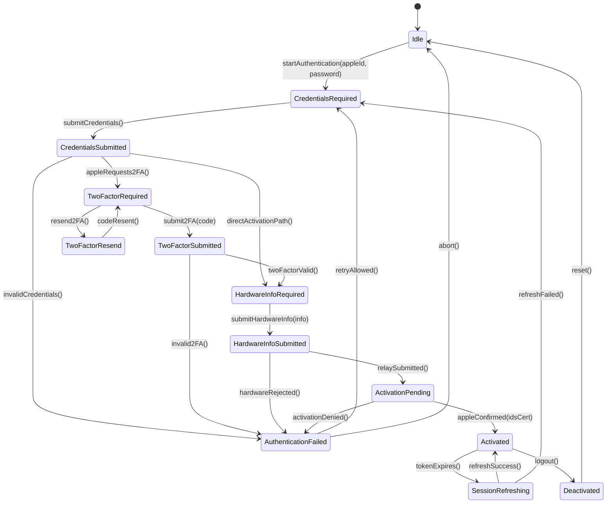

**Transition table:**

| From                  | To                    | Trigger                                | Guard                                     | Action                           |
| --------------------- | --------------------- | -------------------------------------- | ----------------------------------------- | -------------------------------- |
| Idle                  | CredentialsRequired   | `startAuthentication()`                | —                                         | Reset retry count.               |
| CredentialsRequired   | CredentialsSubmitted  | `submitCredentials(appleId, password)` | `appleId` valid email, password non-empty | Post credentials to relay.       |
| CredentialsSubmitted  | TwoFactorRequired     | `appleRequests2FA()`                   | Apple response indicates 2FA              | Show 2FA prompt.                 |
| CredentialsSubmitted  | HardwareInfoRequired  | `directActivationPath()`               | Apple skips 2FA                           | Proceed to hardware info.        |
| CredentialsSubmitted  | AuthenticationFailed  | `invalidCredentials()`                 | HTTP 401                                  | Increment retry count.           |
| TwoFactorRequired     | TwoFactorSubmitted    | `submit2FA(code)`                      | `code` length 6                           | Post code to relay.              |
| TwoFactorRequired     | TwoFactorResend       | `resend2FA()`                          | Less than 3 resends                       | Request new code.                |
| TwoFactorResend       | TwoFactorRequired     | `codeResent()`                         | —                                         | Reset code timer.                |
| TwoFactorSubmitted    | HardwareInfoRequired  | `twoFactorValid()`                     | HTTP 200                                  | Proceed to hardware info.        |
| TwoFactorSubmitted    | AuthenticationFailed  | `invalid2FA()`                         | HTTP 403                                  | Increment retry count.           |
| HardwareInfoRequired  | HardwareInfoSubmitted | `submitHardwareInfo(info)`             | `hardwareInfo` valid                      | Send hardware info to relay.     |
| HardwareInfoSubmitted | ActivationPending     | `relaySubmitted()`                     | Relay accepted                            | Start polling activation status. |
| HardwareInfoSubmitted | AuthenticationFailed  | `hardwareRejected()`                   | Apple rejects hardware                    | Log error.                       |
| ActivationPending     | Activated             | `appleConfirmed(idsCert)`              | IDS cert received                         | Persist session; register push.  |
| ActivationPending     | AuthenticationFailed  | `activationDenied()`                   | Activation failed                         | Log error.                       |
| Activated             | SessionRefreshing     | `tokenExpires()`                       | `expiresAt - now < 300s`                  | Refresh token.                   |
| SessionRefreshing     | Activated             | `refreshSuccess()`                     | New token received                        | Update stored session.           |
| SessionRefreshing     | CredentialsRequired   | `refreshFailed()`                      | Refresh token invalid                     | Clear session.                   |
| Activated             | Deactivated           | `logout()`                             | User action                               | Delete session.                  |
| Deactivated           | Idle                  | `reset()`                              | —                                         | Reset state machine.             |
| AuthenticationFailed  | CredentialsRequired   | `retryAllowed()`                       | Retry count < 3                           | Allow retry.                     |
| AuthenticationFailed  | Idle                  | `abort()`                              | Retry count >= 3 or user cancels          | Reset.                           |

### 5.2 Relay Connection

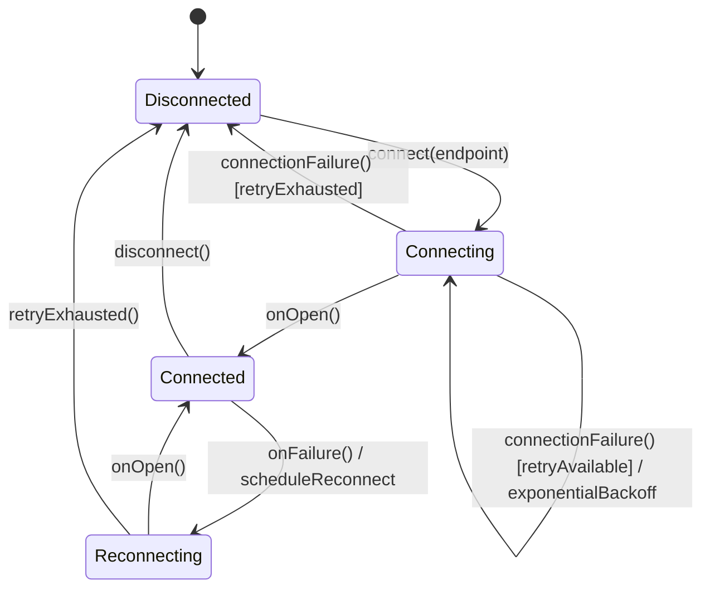

**Transition table:**

| From         | To           | Trigger               | Guard            | Action                                |
| ------------ | ------------ | --------------------- | ---------------- | ------------------------------------- |
| Disconnected | Connecting   | `connect(endpoint)`   | `endpoint` valid | Create OkHttp WebSocket.              |
| Connecting   | Connected    | `onOpen()`            | —                | Start 30s heartbeat.                  |
| Connecting   | Disconnected | `connectionFailure()` | retry count >= 5 | Emit `RelayConnectionLost`.           |
| Connecting   | Connecting   | `connectionFailure()` | retry count < 5  | Wait `2^retry * 1000 ms`.             |
| Connected    | Reconnecting | `onFailure(t)`        | —                | Cancel heartbeat; schedule reconnect. |
| Connected    | Disconnected | `disconnect()`        | —                | Close socket cleanly.                 |
| Reconnecting | Connected    | `onOpen()`            | —                | Reset retry count; flush queue.       |
| Reconnecting | Disconnected | `retryExhausted()`    | retry count >= 5 | Emit terminal failure.                |

### 5.3 Message Entity

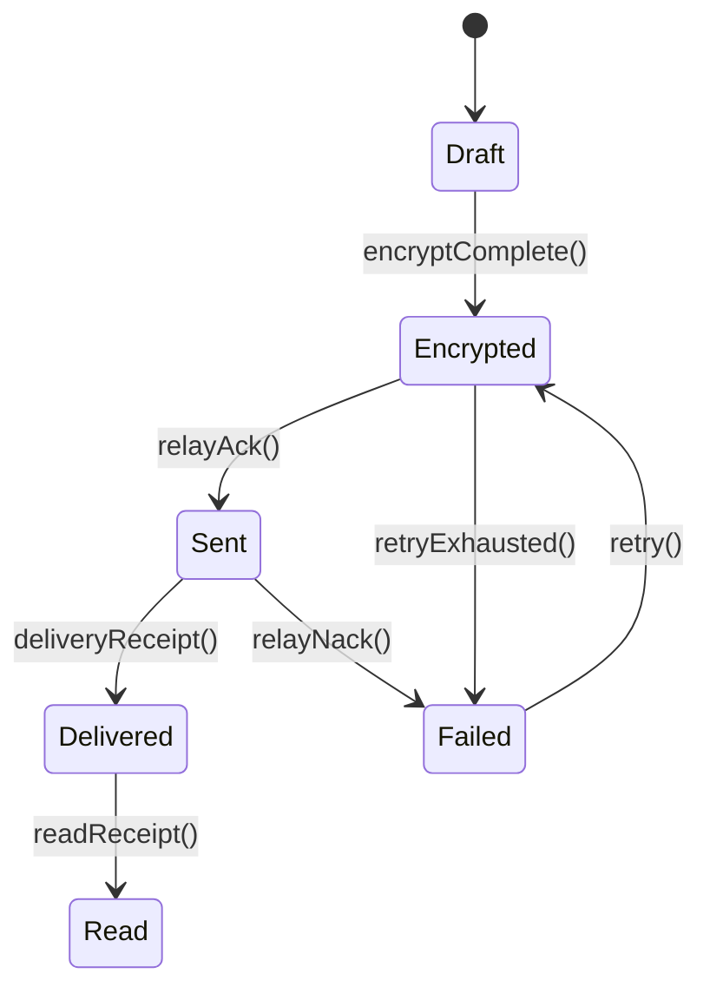

**Transition table:**

| From      | To        | Trigger             | Guard                  | Action                      |
| --------- | --------- | ------------------- | ---------------------- | --------------------------- |
| Draft     | Encrypted | `encryptComplete()` | `MessageCodec` success | Store raw envelope.         |
| Encrypted | Sent      | `relayAck()`        | Relay ACK received     | Update `status=SENT`.       |
| Sent      | Delivered | `deliveryReceipt()` | DLR received           | Update `deliveryReceiptAt`. |
| Sent      | Failed    | `relayNack()`       | Relay NACK or timeout  | Update `status=FAILED`.     |
| Delivered | Read      | `readReceipt()`     | Read receipt received  | Update `readReceiptAt`.     |
| Failed    | Encrypted | `retry()`           | Retry count < 5        | Re-encode and re-send.      |
| Encrypted | Failed    | `retryExhausted()`  | Retry count >= 5       | Final failure.              |

---

## 6. Algorithmic Logic

### 6.1 Encrypt Message Envelope

```mermaid
flowchart TD
    Start([Start]) --> Input[Receive MessagePayload, recipient PublicKey, sender PrivateKey]
    Input --> BuildInner[Build inner bplist from payload]
    BuildInner --> GenKey[Generate 32-byte random AES key via SecureRandom]
    GenKey --> GenIv[Generate 12-byte random IV]
    GenIv --> AesEncrypt[AES-256-GCM encrypt inner bplist]
    AesEncrypt --> WrapKey[RSA-2048-OAEP-SHA256 wrap AES key with recipient PublicKey]
    WrapKey --> Concat[Concatenate wrappedKey || ciphertext || authTag]
    Concat --> Sign[ECDSA P-256 sign concatenation with sender PrivateKey]
    Sign --> BuildOuter[Build outer bplist envelope: v, c, k, s, i, t]
    BuildOuter --> Encode[Encode outer bplist to ByteArray]
    Encode --> End([End])
```

### 6.2 Decrypt Message Envelope

```mermaid
flowchart TD
    Start([Start]) --> Input[Receive ByteArray envelope, recipient PrivateKey, sender Certificate]
    Input --> Decode[Decode outer bplist]
    Decode --> Extract{All fields present?}
    Extract -->|No| ErrorInvalid[Return InvalidEnvelopeError]
    Extract -->|Yes| Verify[ECDSA verify signature over wrappedKey||ciphertext]
    Verify -->|Invalid| ErrorSig[Return SignatureVerificationError]
    Verify -->|Valid| Unwrap[RSA-OAEP unwrap AES key with recipient PrivateKey]
    Unwrap -->|Failure| ErrorKey[Return KeyUnwrapError]
    Unwrap -->|Success| Decrypt[AES-256-GCM decrypt ciphertext with IV and tag]
    Decrypt -->|Failure| ErrorDecrypt[Return DecryptionError]
    Decrypt -->|Success| Parse[Parse inner bplist to MessagePayload]
    Parse --> End([End])
    ErrorInvalid --> End
    ErrorSig --> End
    ErrorKey --> End
    ErrorDecrypt --> End
```

### 6.3 Auth State Transition

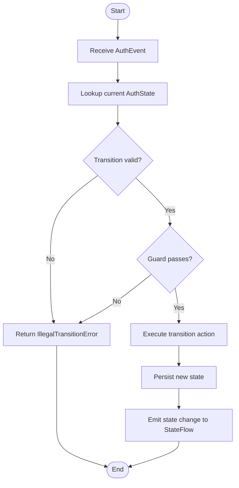

### 6.4 Relay Reconnect with Backoff

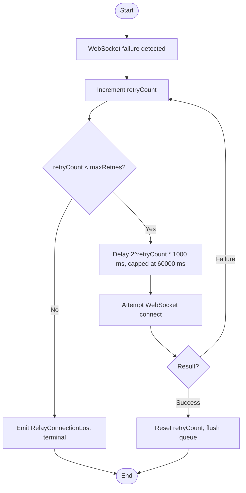

---

## 7. Exhaustive Test Matrix

### 7.1 Unit Paths

| Target                                 | Scenario            | Input                                            | Expected Output                              | Assertion                                     |
| -------------------------------------- | ------------------- | ------------------------------------------------ | -------------------------------------------- | --------------------------------------------- |
| `CryptoEngine.aesGcmEncrypt`           | Valid plaintext     | `plaintext="hello", key=random32, aad=null`      | `AesGcmResult` with 12-byte IV, 16-byte tag  | `assertEquals(16, result.tag.size)`           |
| `CryptoEngine.aesGcmDecrypt`           | Valid ciphertext    | `result.ciphertext, key, result.iv, result.tag`  | Original plaintext                           | `assertEquals("hello", decrypted)`            |
| `CryptoEngine.aesGcmDecrypt`           | Tampered ciphertext | Flip one bit in ciphertext                       | `DecryptionError`                            | `assertTrue(result.isFailure)`                |
| `CryptoEngine.rsaOaepWrap`             | Valid key           | Random AES key, RSA public key                   | Wrapped key ByteArray                        | `assertTrue(wrapped.isNotEmpty())`            |
| `CryptoEngine.rsaOaepUnwrap`           | Valid wrapped key   | Wrapped key, RSA private key                     | Original AES key bytes                       | `assertArrayEquals(original, unwrapped)`      |
| `CryptoEngine.ecdsaSign`               | Valid data          | `data=byteArray, privateKey`                     | Signature ByteArray                          | `assertTrue(signature.isNotEmpty())`          |
| `CryptoEngine.ecdsaVerify`             | Valid signature     | `data, signature, certificate`                   | `Result.success`                             | `assertTrue(result.isSuccess)`                |
| `CryptoEngine.ecdsaVerify`             | Invalid signature   | `data, tamperedSignature, certificate`           | `SignatureVerificationError`                 | `assertTrue(result.isFailure)`                |
| `PlistCodec.encode`                    | Simple dictionary   | `PlistValue.Dict("k" to PlistValue.String("v"))` | Non-empty ByteArray starting with `bplist00` | `assertTrue(bytes.startsWith(bplist00))`      |
| `PlistCodec.decode`                    | Binary plist        | Valid bplist00 bytes                             | Equivalent `PlistValue`                      | `assertEquals(expected, actual)`              |
| `PlistCodec.decode`                    | XML plist           | Valid XML plist string                           | Equivalent `PlistValue`                      | `assertEquals(expected, actual)`              |
| `MessageCodec.encodeEnvelope`          | Valid payload       | `MessagePayload, recipientKey, senderKey`        | Non-empty bplist envelope                    | `assertTrue(envelope.isNotEmpty())`           |
| `MessageCodec.decodeEnvelope`          | Valid envelope      | `envelope, recipientKey, senderCert`             | Original `MessagePayload`                    | `assertEquals(expected, actual)`              |
| `AuthStateMachine.transition`          | Valid transition    | `Idle -> CredentialsSubmitted`                   | `CredentialsSubmitted` state                 | `assertEquals(CredentialsSubmitted, state)`   |
| `AuthStateMachine.transition`          | Invalid transition  | `Idle -> Activated`                              | `IllegalTransitionError`                     | `assertTrue(result.isFailure)`                |
| `RelayService.sendMessage`             | Connected relay     | `OutgoingMessage`                                | `Result.success(messageId)`                  | `assertEquals(messageId, result.getOrNull())` |
| `RelayService.sendMessage`             | Disconnected relay  | `OutgoingMessage`                                | `Result.failure(RelayNotConnectedError)`     | `assertTrue(result.isFailure)`                |
| `NativeServiceClient.sendCommand`      | Connected socket    | `NativeCommand.SendMessage`                      | `NativeResponse.Ack`                         | `assertTrue(response is Ack)`                 |
| `NativeServiceClient.sendCommand`      | Disconnected socket | `NativeCommand.SendMessage`                      | `NativeServiceDisconnectedError`             | `assertTrue(result.isFailure)`                |
| `EncryptedTokenRepository.saveSession` | Valid session       | `SessionToken`                                   | `Result.success`                             | `assertTrue(result.isSuccess)`                |
| `EncryptedTokenRepository.getSession`  | Existing session    | `appleId`                                        | `SessionToken` equal to saved                | `assertEquals(saved, loaded)`                 |
| `MessageRepository.insertMessage`      | Valid entity        | `MessageEntity`                                  | `Result.success` and DB row exists           | `assertNotNull(dao.getById(id))`              |
| `ThreadRepository.upsertThread`        | New thread          | `ThreadEntity`                                   | Thread persisted                             | `assertNotNull(dao.getById(id))`              |
| `ThreadRepository.incrementUnread`     | Existing thread     | `threadId`                                       | `unreadCount` incremented by 1               | `assertEquals(1, thread.unreadCount)`         |

### 7.2 Integration Paths

| Flow                                  | Steps              | Mocked                           | Verified                         | Result |
| ------------------------------------- | ------------------ | -------------------------------- | -------------------------------- | ------ |
| 4.1 Send Message                      | 1–9                | Mac relay as MockWebServer       | DB state, relay frame format     | Pass   |
| 4.2 Receive Message                   | 1–9                | Mac relay pushes binary frame    | Decrypted payload, thread update | Pass   |
| 4.3 Apple ID Authentication           | 1–17               | Mac relay activation endpoints   | Session stored, state=Activated  | Pass   |
| 4.4 Native Push Notification          | 1–10               | rustpush service as local socket | Sync triggered, DB updated       | Pass   |
| 4.5 Background Sync                   | 1–10               | RelayService, MessageRepository  | Pending messages re-sent         | Pass   |
| Auth flow with 2FA                    | Full state machine | Relay 2FA endpoints              | State transitions correct        | Pass   |
| Message send with attachment metadata | 1–9                | Relay, CDN                       | AttachmentEntity persisted       | Pass   |

### 7.3 Edge Cases & Failure Modes

| Condition                     | Stimulus                             | Expected Behavior                                                 | Invariant Preserved       |
| ----------------------------- | ------------------------------------ | ----------------------------------------------------------------- | ------------------------- |
| Duplicate message ID          | Insert same `MessageEntity.id` twice | Second insert ignored or updates existing                         | Uniqueness                |
| Relay frame timeout           | No ACK within 10s                    | `MessageEntity.status=FAILED`; retry scheduled                    | State consistency         |
| WebSocket disconnect mid-send | `onFailure` during send              | Message queued; reconnect with backoff                            | No message loss           |
| Invalid 2FA code              | Submit `000000`                      | State remains `TwoFactorRequired`; retry allowed                  | No session created        |
| Expired session token         | Token `expiresAt` in past            | `AuthManager` auto-refresh; fallback to login                     | Tokens never used expired |
| Native service crash          | IPC socket closed                    | `NativeServiceConnectionLost` emitted; reconnect                  | Push delivery resumes     |
| Corrupted DataStore           | Master key unavailable               | `TokenRepository` returns failure; user must re-auth              | No plaintext leak         |
| Empty message body            | Send text=""                         | Allowed for attachment-only; persisted with empty body            | Data integrity            |
| Thread with one participant   | Single URI set                       | Thread ID deterministic; no crash                                 | Deterministic IDs         |
| Message with 5 attachments    | Multiple attachment metadata         | All `AttachmentEntity` rows inserted; message `attachmentCount=5` | Referential integrity     |

### 7.4 Invariant Checks

| Invariant                       | Enforcement Point                             | Verification Test                     |
| ------------------------------- | --------------------------------------------- | ------------------------------------- |
| Only whitelisted dependencies   | `build.gradle.kts` dependency block           | `LightSdkPlugin` whitelist test       |
| Crypto via JCE only             | `CryptoEngine` implementation                 | No BouncyCastle classes loaded        |
| Tokens encrypted at rest        | `EncryptedTokenRepository.saveSession`        | DataStore file inspection test        |
| Thread ID deterministic         | `ThreadId.generate(participants)`             | Same participants produce same ID     |
| Single active relay session     | `RelayService.connect`                        | Second connect closes previous socket |
| Native IPC length-prefixed JSON | `NativeServiceClient.writeLengthPrefixedJson` | Wire format byte count test           |
| Message UUID uniqueness         | `MessageEntity.id` generation                 | UUIDv4 format and uniqueness test     |
| Outbound envelopes signed       | `MessageCodec.encodeEnvelope`                 | Signature verification test           |

---

## 8. Task Dependencies

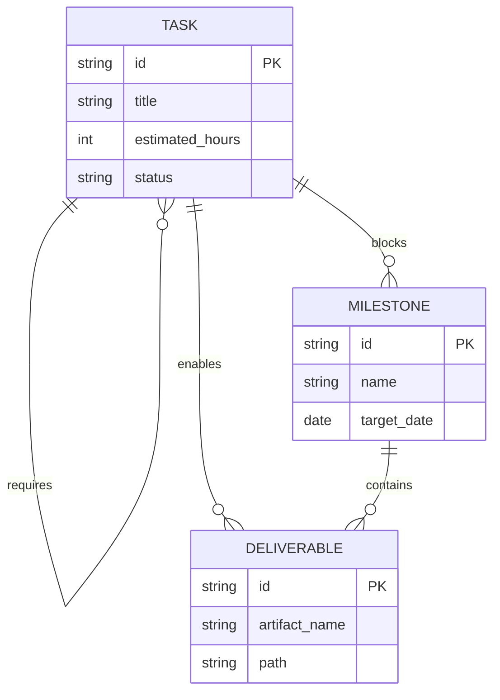

**Dependency rules:**

- A `Task` with status `blocked` must have an uncompleted `requires` `Task`.
- A `Milestone` is `achievable` only when all `blocks` `Task`s are complete.
- A `Deliverable` is `available` only when all `enables` `Task`s are complete.

**Task dependency graph:**

| Task ID  | Requires                               | Blocks Story | Enables Deliverable |
| -------- | -------------------------------------- | ------------ | ------------------- |
| TASK_001 | —                                      | S1           | DEL_001             |
| TASK_002 | TASK_001                               | S1           | DEL_002             |
| TASK_003 | TASK_001                               | S2           | DEL_003             |
| TASK_004 | TASK_001                               | S2           | DEL_004             |
| TASK_005 | TASK_002                               | S3           | DEL_005             |
| TASK_006 | TASK_003, TASK_004                     | S3           | DEL_006             |
| TASK_007 | TASK_003, TASK_004                     | S3           | DEL_007             |
| TASK_008 | TASK_006                               | S4           | DEL_008             |
| TASK_009 | TASK_008                               | S4           | DEL_009             |
| TASK_010 | TASK_001                               | S3           | DEL_010             |
| TASK_011 | TASK_010, TASK_006                     | S4           | DEL_011             |
| TASK_012 | TASK_003, TASK_004                     | S5           | DEL_012             |
| TASK_013 | TASK_005, TASK_006, TASK_007, TASK_008 | S5           | DEL_013             |
| TASK_014 | TASK_012, TASK_013                     | S5           | DEL_014             |

---

## 9. Implementation Timeline

```mermaid
gantt
    title LightOS iMessage Client — Milestone 2 Implementation Plan
    dateFormat  YYYY-MM-DD
    axisFormat  %m/%d

    section Data Layer
    TASK_001 :a1, 2026-07-18, 4h
    TASK_002 :a2, after a1, 4h
    TASK_010 :a3, after a1, 4h

    section Crypto & Codec
    TASK_003 :b1, after a1, 4h
    TASK_004 :b2, after a1, 4h

    section Core Services
    TASK_005 :c1, after a2, 4h
    TASK_006 :c2, after b1, after b2, 4h
    TASK_007 :c3, after b1, after b2, 4h
    TASK_008 :c4, after c2, 4h

    section Push & Sync
    TASK_009 :d1, after c4, 4h
    TASK_011 :d2, after a3, after c2, 4h

    section Verification
    TASK_012 :e1, after b1, after b2, 4h
    TASK_013 :e2, after c1, after c2, after c3, after c4, 4h
    TASK_014 :e3, after e1, after e2, 2h

    section Stories
    story S1 Data Layer :milestone, after a2, 0h
    story S2 Crypto & Codec :milestone, after b2, 0h
    story S3 Core Services :milestone, after c4, 0h
    story S4 Push & Sync :milestone, after d1, 0h
    story S5 Milestone 2 Review :milestone, after e3, 0h
```

**Task list:**

| ID       | Title                                                                                                                | Est. Hours | Start                                        | Dependencies                           | Owner                       |
| -------- | -------------------------------------------------------------------------------------------------------------------- | ---------- | -------------------------------------------- | -------------------------------------- | --------------------------- |
| TASK_001 | Define Room entities, DAO interfaces, and database schema for Message, Thread, Contact, Attachment, and DomainEvent. | 4          | 2026-07-18                                   | None                                   | Data Engineer               |
| TASK_002 | Implement encrypted DataStore schema and `EncryptedTokenRepository` for session tokens and encryption keys.          | 4          | after TASK_001                               | TASK_001                               | Security Engineer           |
| TASK_003 | Implement custom `PlistCodec` for binary (`bplist00`) and XML property list encoding/decoding.                       | 4          | after TASK_001                               | TASK_001                               | Protocol Engineer           |
| TASK_004 | Implement `CryptoEngine` with AES-256-GCM, RSA-2048-OAEP, and ECDSA P-256 using Android JCE.                         | 4          | after TASK_001                               | TASK_001                               | Security Engineer           |
| TASK_005 | Implement `AuthManager` and `AuthStateMachine` for Apple ID login, 2FA/SMS, and session refresh.                     | 4          | after TASK_002                               | TASK_002                               | Authentication Engineer     |
| TASK_006 | Implement `RelayService` with OkHttp WebSocket lifecycle, command framing, and reconnect backoff.                    | 4          | after TASK_003, TASK_004                     | TASK_003, TASK_004                     | Network Engineer            |
| TASK_007 | Implement `MessageCodec` envelope builder/decoder integrating Plist and CryptoEngine.                                | 4          | after TASK_003, TASK_004                     | TASK_003, TASK_004                     | Protocol Engineer           |
| TASK_008 | Implement `NativeServiceClient` length-prefixed JSON IPC to rustpush native service.                                 | 4          | after TASK_006                               | TASK_006                               | Native Integration Engineer |
| TASK_009 | Implement `PushReceiver` consuming UnifiedPush notifications and routing to relay sync.                              | 4          | after TASK_008                               | TASK_008                               | Push Engineer               |
| TASK_010 | Implement `MessageRepository`, `ThreadRepository`, and `ContactRepository` with Flow exposure.                       | 4          | after TASK_001                               | TASK_001                               | Data Engineer               |
| TASK_011 | Implement `BackgroundSyncWorker` for periodic health checks and pending message sync.                                | 4          | after TASK_010, TASK_006                     | TASK_010, TASK_006                     | Background Engineer         |
| TASK_012 | Write unit tests for PlistCodec, CryptoEngine, AuthStateMachine, and repositories.                                   | 4          | after TASK_003, TASK_004                     | TASK_003, TASK_004                     | QA Engineer                 |
| TASK_013 | Write integration tests for auth flow, send/receive message, native push, and background sync.                       | 4          | after TASK_005, TASK_006, TASK_007, TASK_008 | TASK_005, TASK_006, TASK_007, TASK_008 | QA Engineer                 |
| TASK_014 | Document public APIs, update ADRs, and conduct Milestone 2 review.                                                   | 2          | after TASK_012, TASK_013                     | TASK_012, TASK_013                     | Tech Lead                   |

**Deliverable list:**

| ID      | Artifact                                  | Path                                          | Enabled By |
| ------- | ----------------------------------------- | --------------------------------------------- | ---------- |
| DEL_001 | Room database schema                      | `data/local/RoomDatabase.kt`                  | TASK_001   |
| DEL_002 | Encrypted DataStore token repository      | `data/local/EncryptedTokenRepository.kt`      | TASK_002   |
| DEL_003 | Custom Plist codec                        | `domain/codec/PlistCodec.kt`                  | TASK_003   |
| DEL_004 | JCE crypto engine                         | `domain/crypto/CryptoEngine.kt`               | TASK_004   |
| DEL_005 | Apple ID auth manager                     | `domain/auth/AuthManager.kt`                  | TASK_005   |
| DEL_006 | Relay service                             | `domain/relay/RelayService.kt`                | TASK_006   |
| DEL_007 | Message codec                             | `domain/codec/MessageCodec.kt`                | TASK_007   |
| DEL_008 | Native service IPC client                 | `domain/native/NativeServiceClient.kt`        | TASK_008   |
| DEL_009 | UnifiedPush receiver                      | `domain/push/PushReceiver.kt`                 | TASK_009   |
| DEL_010 | Repository layer                          | `data/repository/*Repository.kt`              | TASK_010   |
| DEL_011 | Background sync worker                    | `domain/sync/BackgroundSyncWorker.kt`         | TASK_011   |
| DEL_012 | Unit test suite                           | `src/test/java/...`                           | TASK_012   |
| DEL_013 | Integration test suite                    | `src/androidTest/java/...`                    | TASK_013   |
| DEL_014 | Milestone 2 specification and ADR updates | `docs/initiatives/v1/codespec/milestone-2.md` | TASK_014   |

---

## 10. Revision History

| Version | Date       | Author                  | Change                                                                                                                                     |
| ------- | ---------- | ----------------------- | ------------------------------------------------------------------------------------------------------------------------------------------ |
| 1.0     | 2026-07-18 | Specification Architect | Initial Milestone 2 implementation-ready specification based on Path A Kotlin-native architecture and DDD artifacts from prior milestones. |

**References**

[^1]: [Applying Domain-Driven Design to Milestone 0 - Kagi Assistant](https://assistant.kagi.com/share/1aca70b8-5a97-435b-a8af-0ddf5e31f9ec) (54%)

[^2]: [LightOS iMessage Client Project Plan - Kagi Assistant](https://assistant.kagi.com/share/f6db4022-ead5-436a-bfbf-2731d594f129) (46%)
