# Specification: LightOS iMessage Client — Milestone 3 rustpush APNs & UnifiedPush Bridge

## 1. Formal Requirement Restatement

**Goal:** Deploy the `rustpush` native service on Android, establish and maintain a persistent APNs TLS connection, bridge incoming Apple push notifications into UnifiedPush events, and implement the Kotlin-side `PushReceiver` and `NativeServiceClient` so that push-driven message delivery is committed to the local Room database.

**Scope In:**

- `rustpush` native service packaging and deployment as an Android executable or bound `.so` service.
- APNs TLS handshake and persistent connection management in `rustpush`.
- One-time hardware attestation via Mac Relay `/api/v1/activate`.
- `rustpush` internal UnifiedPush bridge converting APNs payloads to `WAKE`, `MESSAGE_DELIVERY`, `READ_RECEIPT`, and `TYPING` events.
- Kotlin `NativeServiceClient` managing Unix domain socket (or AIDL) IPC, length-prefixed JSON framing, and 30-second heartbeat.
- Kotlin `PushReceiver` registered with `org.unifiedpush.android:connector`.
- `PushHandler` domain service routing push types to sync, message insertion, read receipt updates, or typing indicators.
- `rustpush` → Kotlin IPC events: `MESSAGE_RECEIVED`, `ACTIVATION_STATUS`, `ERROR`.
- Kotlin → `rustpush` IPC commands: `SEND_MESSAGE`, `ACTIVATE`, `PING`.
- Room persistence of incoming messages triggered by push delivery.
- `WorkManager` integration for deferred sync when push is received while the app is not in the foreground.

**Scope Out:**

- Rust implementation details of `rustpush` itself (this specification defines the Kotlin-side contract and integration surface).
- UI screens for conversation list or thread detail (Milestone 4).
- Full attachment download/upload pipeline (Milestone 5).
- SMS/MMS fallback and FaceTime.
- Runtime messaging through the Mac Relay (relay is one-time activation only).
- End-to-end encryption key management beyond the IPC contract.

**Actors:**

- `User` — provides Apple ID credentials and 2FA codes during activation.
- `LightOS iMessage Tool` — the Kotlin application.
- `rustpush Native Service` — compiled Rust binary or `.so` maintaining APNs TLS and UnifiedPush bridge.
- `Mac Relay Server` — performs one-time hardware attestation.
- `Apple ID Service` — reached indirectly through `rustpush` and the relay.
- `Apple APNs` — TLS push endpoint.
- `UnifiedPush Distributor` — local Android service receiving `rustpush` notifications.
- `Room Database` — local cache for messages and threads.
- `Encrypted DataStore` — secure storage for tokens and native service configuration.

**Invariants:**

- Only dependencies listed in the `LightSdkPlugin.kt` whitelist are permitted .
- Native IPC messages use 4-byte big-endian length + UTF-8 JSON payload .
- Heartbeat interval is exactly 30 seconds; missing `PONG` within 5 seconds marks the connection lost.
- `PushReceiver` must be registered using `org.unifiedpush.android:connector` only.
- Every incoming push of type `MESSAGE_DELIVERY` results in either a persisted `MessageEntity` or a recorded `PushProcessingFailure`.
- `rustpush` is the sole component that opens the APNs TLS connection; the Kotlin app never connects directly to APNs.
- One-time activation certificate is stored encrypted and never transmitted after activation.
- The UnifiedPush bridge endpoint is local-only and authenticated by the distributor registration token.

---

## 2. Data Model

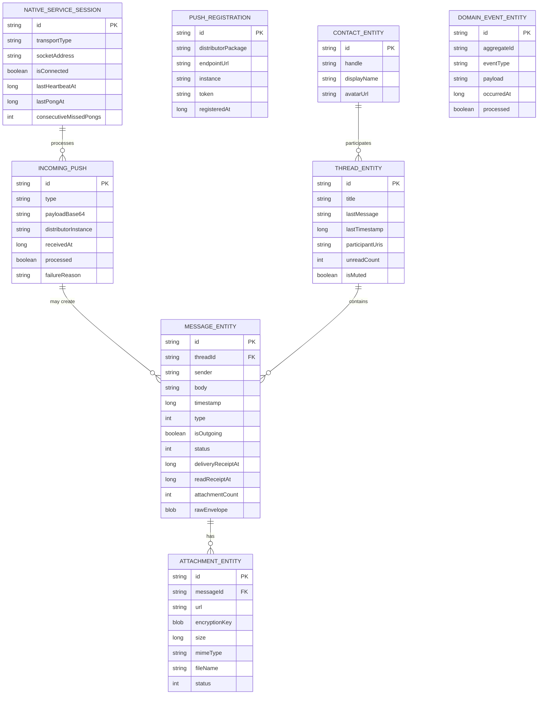

**Field definitions:**

| Entity                 | Field                  | Type    | Constraints      | Description                                                              |
| ---------------------- | ---------------------- | ------- | ---------------- | ------------------------------------------------------------------------ |
| NATIVE_SERVICE_SESSION | id                     | string  | PK               | UUIDv4 session identifier.                                               |
| NATIVE_SERVICE_SESSION | transportType          | string  | NOT NULL         | `UNIX_DOMAIN` or `AIDL`.                                                 |
| NATIVE_SERVICE_SESSION | socketAddress          | string  | NOT NULL         | `abstract:rustpush_ipc` or binder name.                                  |
| NATIVE_SERVICE_SESSION | isConnected            | boolean | NOT NULL         | Current IPC connection state.                                            |
| NATIVE_SERVICE_SESSION | lastHeartbeatAt        | long    | NOT NULL         | Unix ms of last `PING` sent.                                             |
| NATIVE_SERVICE_SESSION | lastPongAt             | long    | NOT NULL         | Unix ms of last `PONG` received.                                         |
| NATIVE_SERVICE_SESSION | consecutiveMissedPongs | int     | NOT NULL         | Count of unanswered `PING`s.                                             |
| PUSH_REGISTRATION      | id                     | string  | PK               | UUIDv4 registration identifier.                                          |
| PUSH_REGISTRATION      | distributorPackage     | string  | NOT NULL         | Package name of the UnifiedPush distributor.                             |
| PUSH_REGISTRATION      | endpointUrl            | string  | NOT NULL         | Endpoint URL assigned by the distributor.                                |
| PUSH_REGISTRATION      | instance               | string  | NOT NULL         | UnifiedPush instance identifier.                                         |
| PUSH_REGISTRATION      | token                  | string  | NOT NULL         | Registration token used to verify incoming pushes.                       |
| PUSH_REGISTRATION      | registeredAt           | long    | NOT NULL         | Unix ms registration timestamp.                                          |
| INCOMING_PUSH          | id                     | string  | PK               | UUIDv4 push identifier.                                                  |
| INCOMING_PUSH          | type                   | string  | NOT NULL         | `WAKE`, `MESSAGE_DELIVERY`, `READ_RECEIPT`, or `TYPING`.                 |
| INCOMING_PUSH          | payloadBase64          | string  | NOT NULL         | Base64-encoded push payload from `rustpush`.                             |
| INCOMING_PUSH          | distributorInstance    | string  | NOT NULL         | UnifiedPush instance that delivered the push.                            |
| INCOMING_PUSH          | receivedAt             | long    | NOT NULL         | Unix ms when push was received.                                          |
| INCOMING_PUSH          | processed              | boolean | NOT NULL         | `true` after successful handling.                                        |
| INCOMING_PUSH          | failureReason          | string  | nullable         | Error description if processing failed.                                  |
| MESSAGE_ENTITY         | id                     | string  | PK               | UUIDv4 message identifier.                                               |
| MESSAGE_ENTITY         | threadId               | string  | FK, NOT NULL     | Parent thread identifier.                                                |
| MESSAGE_ENTITY         | sender                 | string  | NOT NULL         | URI of the sender.                                                       |
| MESSAGE_ENTITY         | body                   | string  | NOT NULL         | Decrypted message text.                                                  |
| MESSAGE_ENTITY         | timestamp              | long    | NOT NULL         | Unix epoch milliseconds (UTC).                                           |
| MESSAGE_ENTITY         | type                   | int     | NOT NULL         | `0=TEXT`, `1=ATTACHMENT`, `2=TYPING`, `3=READ_RECEIPT`.                  |
| MESSAGE_ENTITY         | isOutgoing             | boolean | NOT NULL         | `true` if sent from this device.                                         |
| MESSAGE_ENTITY         | status                 | int     | NOT NULL         | `0=DRAFT`, `1=SUBMITTED`, `2=SENT`, `3=DELIVERED`, `4=READ`, `5=FAILED`. |
| MESSAGE_ENTITY         | deliveryReceiptAt      | long    | nullable         | Unix ms when delivery receipt received.                                  |
| MESSAGE_ENTITY         | readReceiptAt          | long    | nullable         | Unix ms when read receipt received.                                      |
| MESSAGE_ENTITY         | attachmentCount        | int     | NOT NULL         | Number of attachments linked.                                            |
| MESSAGE_ENTITY         | rawEnvelope            | blob    | nullable         | Encrypted bplist envelope as received from `rustpush`.                   |
| THREAD_ENTITY          | id                     | string  | PK               | Deterministic hash of sorted participant URIs.                           |
| THREAD_ENTITY          | title                  | string  | NOT NULL         | Display title.                                                           |
| THREAD_ENTITY          | lastMessage            | string  | NOT NULL         | Snippet of last message.                                                 |
| THREAD_ENTITY          | lastTimestamp          | long    | NOT NULL         | Unix ms of last activity.                                                |
| THREAD_ENTITY          | participantUris        | string  | NOT NULL         | JSON array of participant URIs.                                          |
| THREAD_ENTITY          | unreadCount            | int     | NOT NULL         | Count of unread incoming messages.                                       |
| THREAD_ENTITY          | isMuted                | boolean | NOT NULL         | Thread mute flag.                                                        |
| CONTACT_ENTITY         | id                     | string  | PK               | UUIDv4 contact identifier.                                               |
| CONTACT_ENTITY         | handle                 | string  | NOT NULL, UNIQUE | `tel:` or `mailto:` URI.                                                 |
| CONTACT_ENTITY         | displayName            | string  | NOT NULL         | Resolved display name.                                                   |
| CONTACT_ENTITY         | avatarUrl              | string  | nullable         | Optional avatar URL.                                                     |
| ATTACHMENT_ENTITY      | id                     | string  | PK               | UUIDv4 attachment identifier.                                            |
| ATTACHMENT_ENTITY      | messageId              | string  | FK, NOT NULL     | Parent message identifier.                                               |
| ATTACHMENT_ENTITY      | url                    | string  | NOT NULL         | iCloud or relay-proxied attachment URL.                                  |
| ATTACHMENT_ENTITY      | encryptionKey          | blob    | NOT NULL         | AES-256 attachment encryption key.                                       |
| ATTACHMENT_ENTITY      | size                   | long    | NOT NULL         | Attachment size in bytes.                                                |
| ATTACHMENT_ENTITY      | mimeType               | string  | NOT NULL         | MIME type.                                                               |
| ATTACHMENT_ENTITY      | fileName               | string  | NOT NULL         | Original file name.                                                      |
| ATTACHMENT_ENTITY      | status                 | int     | NOT NULL         | `0=PENDING`, `1=DOWNLOADING`, `2=DOWNLOADED`, `3=FAILED`.                |
| DOMAIN_EVENT_ENTITY    | id                     | string  | PK               | UUIDv4 event identifier.                                                 |
| DOMAIN_EVENT_ENTITY    | aggregateId            | string  | NOT NULL         | Identifier of the affected aggregate.                                    |
| DOMAIN_EVENT_ENTITY    | eventType              | string  | NOT NULL         | Fully-qualified event class name.                                        |
| DOMAIN_EVENT_ENTITY    | payload                | string  | NOT NULL         | JSON-serialized event payload.                                           |
| DOMAIN_EVENT_ENTITY    | occurredAt             | long    | NOT NULL         | Unix ms event timestamp.                                                 |
| DOMAIN_EVENT_ENTITY    | processed              | boolean | NOT NULL         | `true` after all projections handled the event.                          |

---

## 3. Code Architecture

```mermaid
classDiagram
    class INativeServiceClient {
        <<interface>>
        + val connectionState: StateFlow~NativeServiceState~
        + suspend fun connect(): Result~Unit~
        + suspend fun disconnect(): Result~Unit~
        + suspend fun sendCommand(command: NativeCommand): Result~NativeResponse~
        + fun observeEvents(): Flow~NativeEvent~
    }
    class NativeServiceClient {
        - socket: LocalSocket?
        - outputStream: OutputStream?
        - inputStream: InputStream?
        - dispatcher: CoroutineDispatcher
        - heartbeatJob: Job?
        - eventChannel: Channel~NativeEvent~
        + val connectionState: StateFlow~NativeServiceState~
        + suspend fun connect(): Result~Unit~
        + suspend fun disconnect(): Result~Unit~
        + suspend fun sendCommand(command: NativeCommand): Result~NativeResponse~
        + fun observeEvents(): Flow~NativeEvent~
        - fun writeLengthPrefixedJson(json: String)
        - suspend fun readLengthPrefixedJson(): String
        - fun startHeartbeat()
        - fun stopHeartbeat()
    }
    class INativeServiceLauncher {
        <<interface>>
        + suspend fun ensureRunning(): Result~Unit~
        + suspend fun stop(): Result~Unit~
        + fun isRunning(): Boolean
    }
    class NativeServiceLauncher {
        - context: Context
        - processBuilder: ProcessBuilder
        - nativeProcess: Process?
        + suspend fun ensureRunning(): Result~Unit~
        + suspend fun stop(): Result~Unit~
        + fun isRunning(): Boolean
        - fun extractBinaryIfNeeded(): String
        - fun startProcess(binaryPath: String): Result~Process~
    }
    class IAuthService {
        <<interface>>
        + val state: StateFlow~AuthState~
        + suspend fun startAuthentication(appleId: AppleId, password: String): Result~Unit~
        + suspend fun submitTwoFactorCode(code: String): Result~Unit~
        + suspend fun resendTwoFactorCode(): Result~Unit~
        + suspend fun logout(): Result~Unit~
    }
    class AuthService {
        - nativeServiceClient: INativeServiceClient
        - tokenRepository: ITokenRepository
        - stateMachine: AuthStateMachine
        + val state: StateFlow~AuthState~
        + suspend fun startAuthentication(appleId: AppleId, password: String): Result~Unit~
        + suspend fun submitTwoFactorCode(code: String): Result~Unit~
        + suspend fun resendTwoFactorCode(): Result~Unit~
        + suspend fun logout(): Result~Unit~
        - fun handleActivationStatus(event: ActivationStatusEvent)
    }
    class IPushReceiver {
        <<interface>>
        + fun onMessage(message: PushMessage, instance: String)
        + fun onNewEndpoint(endpoint: String, instance: String)
        + fun onRegistrationFailed(instance: String)
        + fun onUnregistered(instance: String)
    }
    class PushReceiver {
        - pushHandler: IPushHandler
        - registrationRepository: IPushRegistrationRepository
        + fun onMessage(message: PushMessage, instance: String)
        + fun onNewEndpoint(endpoint: String, instance: String)
        + fun onRegistrationFailed(instance: String)
        + fun onUnregistered(instance: String)
    }
    class IPushHandler {
        <<interface>>
        + suspend fun handlePush(push: IncomingPush): Result~Unit~
    }
    class PushHandler {
        - messageRepository: IMessageRepository
        - threadRepository: IThreadRepository
        - nativeServiceClient: INativeServiceClient
        - syncWorkScheduler: ISyncWorkScheduler
        + suspend fun handlePush(push: IncomingPush): Result~Unit~
        - suspend fun handleWake()
        - suspend fun handleMessageDelivery(payload: ByteArray)
        - suspend fun handleReadReceipt(payload: ByteArray)
        - suspend fun handleTyping(payload: ByteArray)
    }
    class IPushRegistrationRepository {
        <<interface>>
        + suspend fun saveRegistration(registration: PushRegistration): Result~Unit~
        + suspend fun getRegistration(instance: String): PushRegistration?
        + suspend fun deleteRegistration(instance: String): Result~Unit~
    }
    class PushRegistrationRepository {
        - dataStore: DataStore~Preferences~
        - masterKey: MasterKey
        + suspend fun saveRegistration(registration: PushRegistration): Result~Unit~
        + suspend fun getRegistration(instance: String): PushRegistration?
        + suspend fun deleteRegistration(instance: String): Result~Unit~
    }
    class IMessageRepository {
        <<interface>>
        + fun observeMessages(threadId: ThreadId): Flow~List~MessageEntity~~
        + suspend fun insertMessage(message: MessageEntity): Result~Unit~
        + suspend fun updateMessageStatus(messageId: MessageId, status: MessageStatus): Result~Unit~
        + suspend fun getMessageById(messageId: MessageId): MessageEntity?
    }
    class MessageRepository {
        - messageDao: MessageDao
        - domainEventDao: DomainEventDao
        + fun observeMessages(threadId: ThreadId): Flow~List~MessageEntity~~
        + suspend fun insertMessage(message: MessageEntity): Result~Unit~
        + suspend fun updateMessageStatus(messageId: MessageId, status: MessageStatus): Result~Unit~
        + suspend fun getMessageById(messageId: MessageId): MessageEntity?
    }
    class IThreadRepository {
        <<interface>>
        + fun observeThreads(): Flow~List~ThreadEntity~~
        + suspend fun upsertThread(thread: ThreadEntity): Result~Unit~
        + suspend fun getThreadById(threadId: ThreadId): ThreadEntity?
        + suspend fun incrementUnread(threadId: ThreadId): Result~Unit~
    }
    class ThreadRepository {
        - threadDao: ThreadDao
        + fun observeThreads(): Flow~List~ThreadEntity~~
        + suspend fun upsertThread(thread: ThreadEntity): Result~Unit~
        + suspend fun getThreadById(threadId: ThreadId): ThreadEntity?
        + suspend fun incrementUnread(threadId: ThreadId): Result~Unit~
    }
    class ISyncWorkScheduler {
        <<interface>>
        + fun scheduleImmediateSync()
        + fun schedulePeriodicSync()
        + fun cancelPeriodicSync()
    }
    class SyncWorkScheduler {
        - workManager: WorkManager
        + fun scheduleImmediateSync()
        + fun schedulePeriodicSync()
        + fun cancelPeriodicSync()
    }
    class BackgroundSyncWorker {
        - nativeServiceClient: INativeServiceClient
        - messageRepository: IMessageRepository
        - pushRepository: IPushProcessingRepository
        + suspend fun doWork(): Result
        - suspend fun performSync(): Result~Unit~
    }
    class IPushProcessingRepository {
        <<interface>>
        + suspend fun recordPush(push: IncomingPush): Result~Unit~
        + suspend fun markProcessed(pushId: PushId): Result~Unit~
        + suspend fun getUnprocessed(): List~IncomingPush~
    }
    class PushProcessingRepository {
        - pushDao: PushDao
        + suspend fun recordPush(push: IncomingPush): Result~Unit~
        + suspend fun markProcessed(pushId: PushId): Result~Unit~
        + suspend fun getUnprocessed(): List~IncomingPush~
    }
    class PushDao {
        + @Insert suspend fun insert(push: IncomingPushEntity)
        + @Query suspend fun getUnprocessed(): List~IncomingPushEntity~
        + @Update suspend fun markProcessed(id: String, failureReason: String?)
    }
    class MessageDao {
        + @Insert suspend fun insert(message: MessageEntity)
        + @Query suspend fun getById(id: String): MessageEntity?
        + @Query fun observeByThread(threadId: String): Flow~List~MessageEntity~~
        + @Update suspend fun update(message: MessageEntity)
    }
    class ThreadDao {
        + @Insert(onConflict = REPLACE) suspend fun upsert(thread: ThreadEntity)
        + @Query fun observeAll(): Flow~List~ThreadEntity~~
        + @Query suspend fun getById(id: String): ThreadEntity?
        + @Query suspend fun incrementUnread(id: String)
    }

    INativeServiceClient <|.. NativeServiceClient : implements
    INativeServiceLauncher <|.. NativeServiceLauncher : implements
    IAuthService <|.. AuthService : implements
    IPushReceiver <|.. PushReceiver : implements
    IPushHandler <|.. PushHandler : implements
    IPushRegistrationRepository <|.. PushRegistrationRepository : implements
    IMessageRepository <|.. MessageRepository : implements
    IThreadRepository <|.. ThreadRepository : implements
    ISyncWorkScheduler <|.. SyncWorkScheduler : implements
    IPushProcessingRepository <|.. PushProcessingRepository : implements

    NativeServiceClient --> NativeServiceLauncher : started by
    AuthService --> INativeServiceClient : uses
    AuthService --> ITokenRepository : uses
    PushReceiver --> IPushHandler : delegates
    PushReceiver --> IPushRegistrationRepository : uses
    PushHandler --> IMessageRepository : uses
    PushHandler --> IThreadRepository : uses
    PushHandler --> INativeServiceClient : uses
    PushHandler --> ISyncWorkScheduler : uses
    BackgroundSyncWorker --> INativeServiceClient : uses
    BackgroundSyncWorker --> IMessageRepository : uses
    BackgroundSyncWorker --> IPushProcessingRepository : uses
    MessageRepository --> MessageDao : uses
    ThreadRepository --> ThreadDao : uses
    PushProcessingRepository --> PushDao : uses
    PushRegistrationRepository --> DataStore : uses
    SyncWorkScheduler --> WorkManager : uses
```

**Module boundaries:**

| Component                    | Responsibility                                                               | Owned By                                     |
| ---------------------------- | ---------------------------------------------------------------------------- | -------------------------------------------- |
| `NativeServiceClient`        | IPC lifecycle, length-prefixed JSON framing, heartbeat, event streaming.     | Native Service Communication bounded context |
| `NativeServiceLauncher`      | Extract, deploy, and lifecycle-manage the `rustpush` binary or `.so`.        | Native Service Communication bounded context |
| `AuthService`                | Kotlin-side auth state machine; delegates activation to `rustpush` via IPC.  | Authentication & Activation bounded context  |
| `PushReceiver`               | UnifiedPush callback implementation; receives distributor events.            | Push & Delivery bounded context              |
| `PushHandler`                | Parse push types, route to sync, message insertion, read receipt, or typing. | Push & Delivery bounded context              |
| `PushRegistrationRepository` | Encrypted storage of UnifiedPush registration details.                       | Push & Delivery bounded context              |
| `PushProcessingRepository`   | Idempotent push recording and failure tracking.                              | Push & Delivery bounded context              |
| `SyncWorkScheduler`          | Enqueue immediate and periodic `WorkManager` sync jobs.                      | Push & Delivery bounded context              |
| `BackgroundSyncWorker`       | Process unprocessed pushes, request native sync, persist messages.           | Push & Delivery bounded context              |
| `MessageRepository`          | Message CRUD and event projection.                                           | Local Messaging & Storage bounded context    |
| `ThreadRepository`           | Thread upsert and unread counters.                                           | Local Messaging & Storage bounded context    |

---

## 4. Component Interactions

### 4.1 Deploy and Start rustpush Native Service

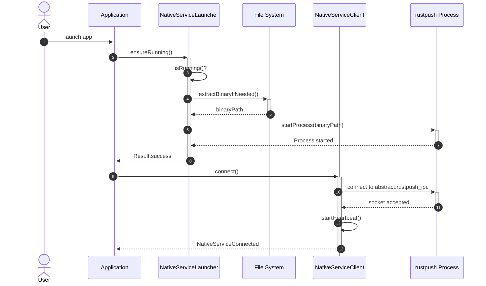

**Preconditions:** `rustpush` binary packaged in `assets/` or `jniLibs/`; app has `INTERNET` permission.
**Postconditions:** `rustpush` process running; `NativeServiceClient` connected and heartbeating.

### 4.2 One-Time Activation via rustpush and Mac Relay

```mermaid
sequenceDiagram
    autonumber
    actor U as User
    participant AS as AuthService
    participant NC as NativeServiceClient
    participant RP as rustpush
    participant REL as Mac Relay
    participant TR as TokenRepository
    participant DB as Room / DataStore

    U->>+AS: startAuthentication(appleId, password)
    AS->>+NC: sendCommand(ACTIVATE)
    NC->>NC: writeLengthPrefixedJson
    NC->>+RP: ACTIVATE {apple_id, password}
    RP->>RP: generate hardware_info
    RP->>+REL: POST /api/v1/activate
    REL-->>-RP: 200 OK (activation certificate)
    RP->>RP: establish APNs TLS
    RP->>RP: authenticate with Apple ID
    RP-->>-NC: ACTIVATION_STATUS {status: 2FA_REQUIRED}
    NC-->>-AS: TwoFactorRequired
    AS-->>-U: prompt 2FA
    U->>+AS: submitTwoFactorCode(code)
    AS->>+NC: sendCommand(ACTIVATE with 2fa_code)
    NC->>+RP: ACTIVATE {apple_id, password, 2fa_code}
    RP->>RP: complete Apple auth
    RP-->>-NC: ACTIVATION_STATUS {status: SUCCESS, handles[]}
    NC-->>-AS: Activated
    AS->>+TR: saveSession(session)
    TR->>DB: encrypted write
    DB-->>-TR: success
    TR-->>-AS: Result.success
    AS->>AS: state=Activated
```

**Preconditions:** `rustpush` running and connected; Mac Relay reachable; valid Apple ID credentials.
**Postconditions:** Apple ID session stored; APNs connection active; `AuthState` is `Activated`.

### 4.3 Send Message via rustpush IPC

```mermaid
sequenceDiagram
    autonumber
    actor U as User
    participant VM as ThreadViewModel (future)
    participant AS as AuthService
    participant NC as NativeServiceClient
    participant RP as rustpush
    participant MR as MessageRepository
    participant DB as Room Database

    U->>+VM: type message and send
    VM->>+AS: requireActivated()
    AS-->>-VM: Activated
    VM->>+NC: sendCommand(SEND_MESSAGE)
    NC->>NC: writeLengthPrefixedJson
    NC->>+RP: SEND_MESSAGE {message_id, recipients, text, attachments}
    RP->>RP: encrypt, sign, send to APNs/iMessage
    RP-->>-NC: ACK {message_id}
    NC-->>-VM: Result.success
    VM->>+MR: insertMessage(status=SUBMITTED)
    MR->>DB: INSERT
    DB-->>-MR: success
    MR-->>-VM: Result.success
    RP->>RP: receive Apple delivery receipt
    RP->>+NC: MESSAGE_RECEIVED (delivery receipt)
    NC->>NC: route to MessageStatusUpdater
    NC->>+MR: updateMessageStatus(messageId, DELIVERED)
    MR->>DB: UPDATE
    DB-->>-MR: success
    MR-->>-NC: Result.success
```

**Preconditions:** `AuthState` is `Activated`; `NativeServiceClient` connected.
**Postconditions:** Outgoing message persisted; delivery receipt updates status to `DELIVERED`.

### 4.4 Receive Incoming Message via rustpush Push

```mermaid
sequenceDiagram
    autonumber
    participant APN as Apple APNs
    participant RP as rustpush
    participant UP as UnifiedPush Distributor
    participant PR as PushReceiver
    participant PH as PushHandler
    participant NC as NativeServiceClient
    participant MR as MessageRepository
    participant TR as ThreadRepository
    participant DB as Room Database

    APN->>+RP: TLS push payload
    RP->>RP: decrypt APNs payload
    RP->>RP: build UnifiedPush message
    RP->>+UP: POST {type: MESSAGE_DELIVERY, data: base64}
    UP-->>-RP: 200 OK
    UP->>+PR: broadcast onMessage
    PR->>PR: parse type and data
    PR->>+PH: handlePush(IncomingPush)
    PH->>PH: decode base64 payload
    PH->>+NC: requestSync() / fetch message details
    NC->>+RP: SEND_MESSAGE? no, GET_MESSAGES since ts
    RP-->>-NC: message details
    NC-->>-PH: Result.success
    PH->>+MR: insertMessage(status=DELIVERED)
    MR->>DB: INSERT MessageEntity
    DB-->>-MR: success
    PH->>+TR: upsertThread(thread)
    TR->>DB: UPSERT ThreadEntity
    DB-->>-TR: success
    PH-->>-PR: Result.success
    PR->>UP: ack
```

**Preconditions:** `rustpush` connected to APNs; UnifiedPush distributor registered; app can receive pushes.
**Postconditions:** Incoming message and thread persisted; push acknowledged.

### 4.5 Heartbeat and Reconnection

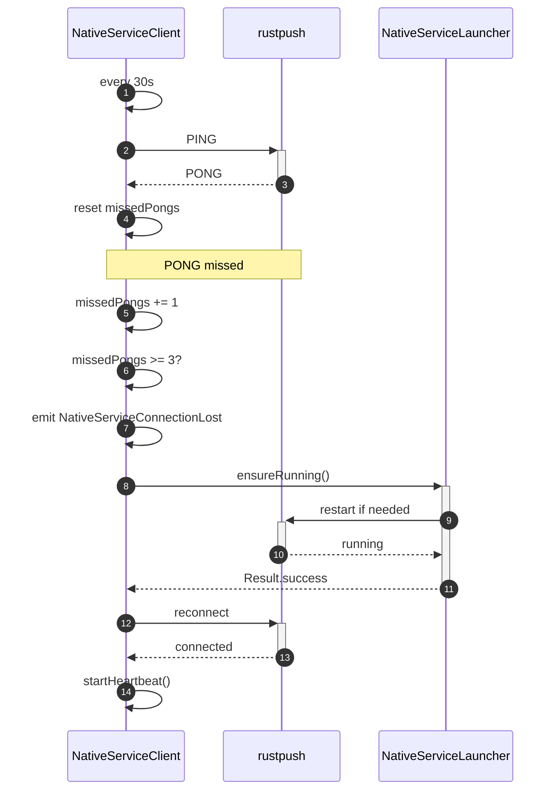

**Preconditions:** `NativeServiceClient` connected.
**Postconditions:** Connection restored after missed heartbeats; heartbeat resumed.

---

## 5. Stateful Behavior

### 5.1 Native Service Connection

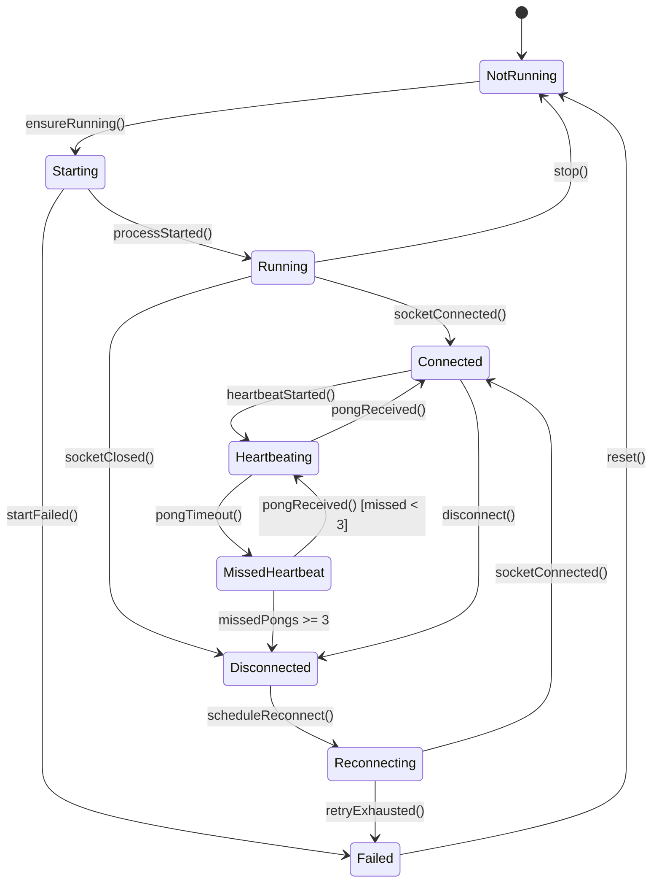

**Transition table:**

| From            | To              | Trigger               | Guard              | Action                    |
| --------------- | --------------- | --------------------- | ------------------ | ------------------------- |
| NotRunning      | Starting        | `ensureRunning()`     | Binary extracted   | Start `rustpush` process. |
| Starting        | Running         | `processStarted()`    | —                  | Process alive.            |
| Starting        | Failed          | `startFailed()`       | —                  | Log error.                |
| Failed          | NotRunning      | `reset()`             | —                  | Clear state.              |
| Running         | Connected       | `socketConnected()`   | —                  | Open IPC socket.          |
| Running         | Disconnected    | `socketClosed()`      | —                  | Connection dropped.       |
| Connected       | Heartbeating    | `heartbeatStarted()`  | —                  | Start 30s `PING` job.     |
| Heartbeating    | Connected       | `pongReceived()`      | —                  | Reset missed count.       |
| Heartbeating    | MissedHeartbeat | `pongTimeout()`       | —                  | Increment missed count.   |
| MissedHeartbeat | Heartbeating    | `pongReceived()`      | `missedPongs < 3`  | Reset missed count.       |
| MissedHeartbeat | Disconnected    | `pongTimeout()`       | `missedPongs >= 3` | Emit connection lost.     |
| Disconnected    | Reconnecting    | `scheduleReconnect()` | `retryCount < 5`   | Exponential backoff.      |
| Reconnecting    | Connected       | `socketConnected()`   | —                  | Reset retry count.        |
| Reconnecting    | Failed          | `retryExhausted()`    | `retryCount >= 5`  | Terminal failure.         |
| Connected       | Disconnected    | `disconnect()`        | —                  | Close socket.             |
| Running         | NotRunning      | `stop()`              | —                  | Kill process.             |

### 5.2 Apple ID Auth State Machine (Milestone 3)

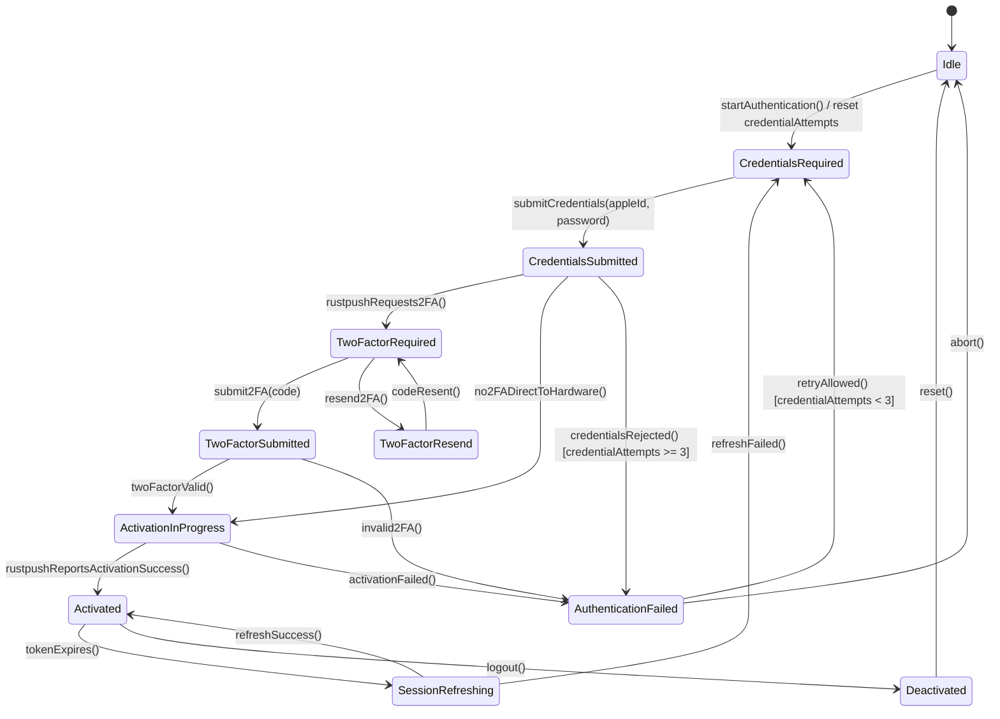

**Transition table:**

| From                 | To                   | Trigger                                | Guard                             | Action                           |
| -------------------- | -------------------- | -------------------------------------- | --------------------------------- | -------------------------------- |
| Idle                 | CredentialsRequired  | `startAuthentication()`                | —                                 | Reset retry count.               |
| CredentialsRequired  | CredentialsSubmitted | `submitCredentials(appleId, password)` | Valid email, non-empty password   | Send `ACTIVATE` to `rustpush`.   |
| CredentialsSubmitted | TwoFactorRequired    | `rustpushRequests2FA()`                | `ACTIVATION_STATUS` indicates 2FA | Show 2FA prompt.                 |
| CredentialsSubmitted | ActivationInProgress | `no2FADirectToHardware()`              | Apple skips 2FA                   | Wait for activation.             |
| TwoFactorRequired    | TwoFactorSubmitted   | `submit2FA(code)`                      | Code length 6                     | Send `ACTIVATE` with code.       |
| TwoFactorRequired    | TwoFactorResend      | `resend2FA()`                          | Resend count < 3                  | Request resend.                  |
| TwoFactorResend      | TwoFactorRequired    | `codeResent()`                         | —                                 | Reset timer.                     |
| TwoFactorSubmitted   | ActivationInProgress | `twoFactorValid()`                     | `ACTIVATION_STATUS` valid         | Wait for activation.             |
| TwoFactorSubmitted   | AuthenticationFailed | `invalid2FA()`                         | `ACTIVATION_STATUS` error         | Increment retry count.           |
| ActivationInProgress | Activated            | `rustpushReportsActivationSuccess()`   | `status=SUCCESS, handles[]`       | Persist session; register push.  |
| ActivationInProgress | AuthenticationFailed | `activationFailed()`                   | `ACTIVATION_STATUS` error         | Increment retry count.           |
| Activated            | SessionRefreshing    | `tokenExpires()`                       | `expiresAt - now < 300s`          | Refresh via `rustpush`.          |
| SessionRefreshing    | Activated            | `refreshSuccess()`                     | New token received                | Update stored session.           |
| SessionRefreshing    | CredentialsRequired  | `refreshFailed()`                      | Refresh token invalid             | Clear session.                   |
| Activated            | Deactivated          | `logout()`                             | User action                       | Delete session; stop `rustpush`. |
| Deactivated          | Idle                 | `reset()`                              | —                                 | Reset state machine.             |
| AuthenticationFailed | CredentialsRequired  | `retryAllowed()`                       | Retry count < 3                   | Allow retry.                     |
| AuthenticationFailed | Idle                 | `abort()`                              | Retry count >= 3 or user cancel   | Reset.                           |

### 5.3 Push Type Handling

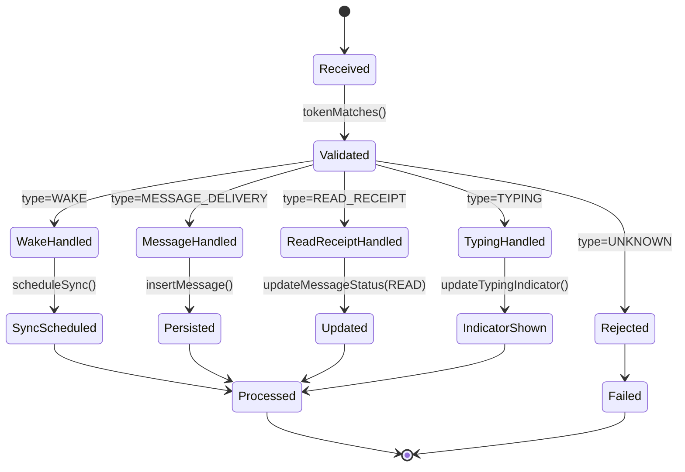

**Transition table:**

| From               | To                 | Trigger                     | Guard                                  | Action                          |
| ------------------ | ------------------ | --------------------------- | -------------------------------------- | ------------------------------- |
| Received           | Validated          | `tokenMatches()`            | Distributor token matches registration | Proceed.                        |
| Validated          | WakeHandled        | `type=WAKE`                 | —                                      | Trigger background sync.        |
| Validated          | MessageHandled     | `type=MESSAGE_DELIVERY`     | Payload decodes                        | Insert message.                 |
| Validated          | ReadReceiptHandled | `type=READ_RECEIPT`         | Message ID exists                      | Update read status.             |
| Validated          | TypingHandled      | `type=TYPING`               | Thread ID exists                       | Update typing indicator.        |
| Validated          | Rejected           | `type=UNKNOWN`              | —                                      | Record failure.                 |
| WakeHandled        | SyncScheduled      | `scheduleSync()`            | —                                      | Enqueue `BackgroundSyncWorker`. |
| MessageHandled     | Persisted          | `insertMessage()`           | DB insert success                      | Mark push processed.            |
| ReadReceiptHandled | Updated            | `updateMessageStatus(READ)` | Message exists                         | Update `readReceiptAt`.         |
| TypingHandled      | IndicatorShown     | `updateTypingIndicator()`   | Thread exists                          | Emit typing event.              |

---

## 6. Algorithmic Logic

### 6.1 Start rustpush Native Service

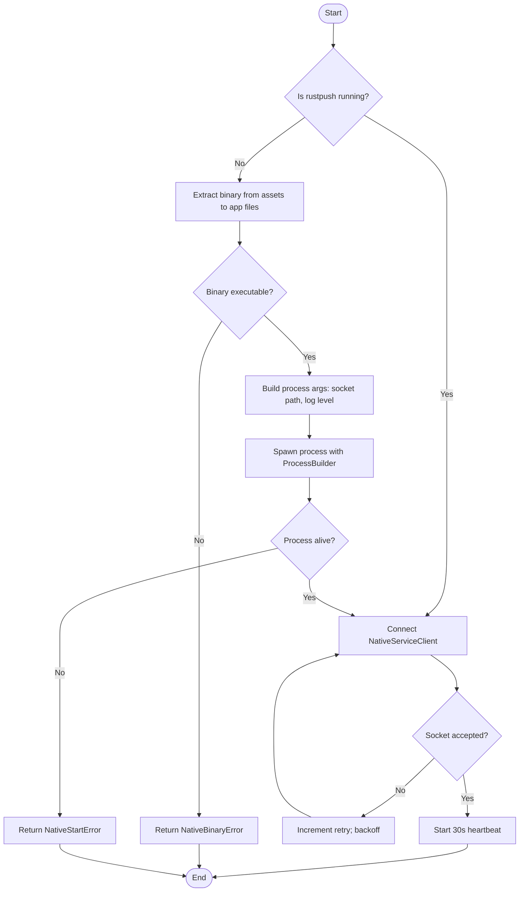

### 6.2 Length-Prefixed JSON IPC Write

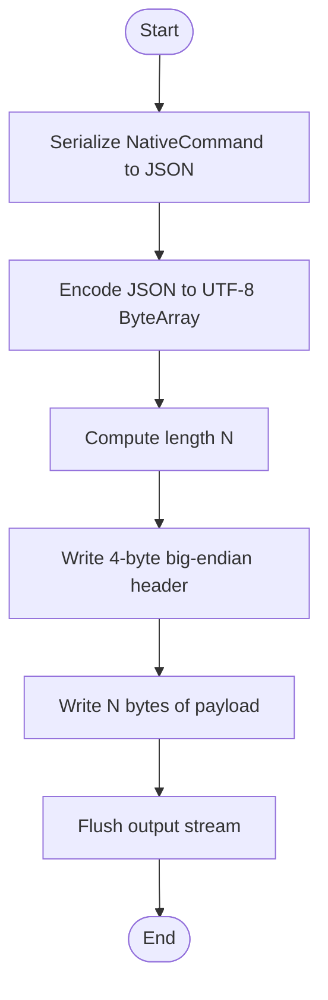

### 6.3 Length-Prefixed JSON IPC Read

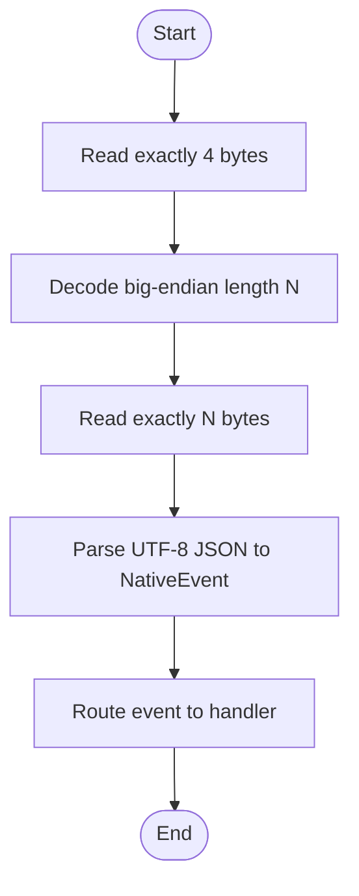

### 6.4 Handle UnifiedPush Message

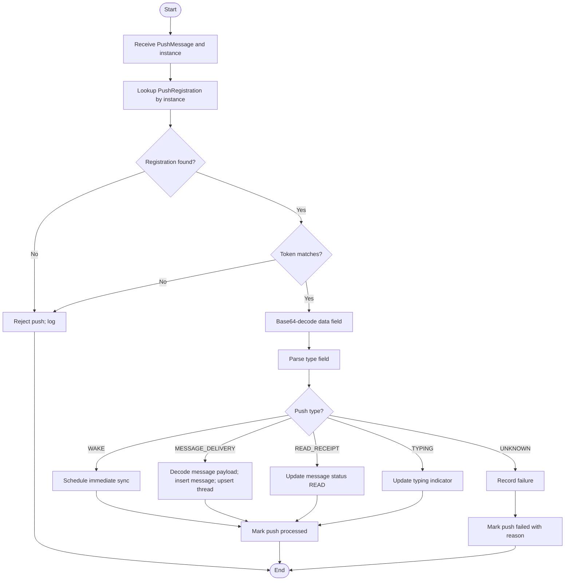

### 6.5 Heartbeat Monitor

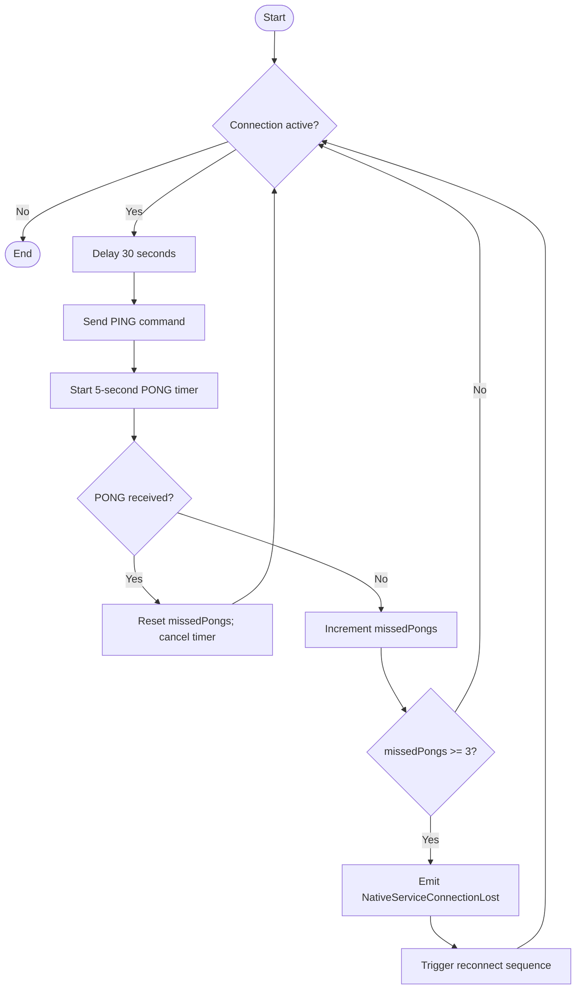

---

## 7. Exhaustive Test Matrix

### 7.1 Unit Paths

| Target                                        | Scenario             | Input                       | Expected Output                      | Assertion                                               |
| --------------------------------------------- | -------------------- | --------------------------- | ------------------------------------ | ------------------------------------------------------- |
| `NativeServiceClient.writeLengthPrefixedJson` | Valid command        | `NativeCommand.Ping`        | 4-byte header + JSON bytes           | `assertEquals(4 + payload.size, written.size)`          |
| `NativeServiceClient.readLengthPrefixedJson`  | Valid event          | 4-byte header + JSON        | Parsed `NativeEvent`                 | `assertTrue(event is Pong)`                             |
| `NativeServiceClient.readLengthPrefixedJson`  | Empty stream         | EOF                         | `NativeServiceDisconnectedError`     | `assertTrue(result.isFailure)`                          |
| `NativeServiceLauncher.ensureRunning`         | Binary not extracted | —                           | Binary extracted and process started | `assertTrue(launcher.isRunning())`                      |
| `NativeServiceLauncher.ensureRunning`         | Already running      | Process alive               | No new process started               | `assertEquals(originalPid, newPid)`                     |
| `AuthService.startAuthentication`             | Valid credentials    | `appleId, password`         | `ACTIVATE` command sent              | `assertCommandSent(ACTIVATE)`                           |
| `AuthService.submitTwoFactorCode`             | Valid code           | `123456`                    | `ACTIVATE` with 2fa_code sent        | `assertCommandSent(ACTIVATE)`                           |
| `AuthService.handleActivationStatus`          | Success              | `status=SUCCESS, handles[]` | State `Activated`                    | `assertEquals(Activated, state)`                        |
| `PushReceiver.onMessage`                      | WAKE push            | `type=WAKE`                 | `PushHandler.handlePush` called      | `verify(pushHandler).handlePush`                        |
| `PushReceiver.onNewEndpoint`                  | New endpoint         | `endpoint=https://...`      | Registration saved                   | `assertRegistrationSaved(endpoint)`                     |
| `PushHandler.handlePush`                      | MESSAGE_DELIVERY     | Valid payload               | Message inserted                     | `assertNotNull(messageRepository.getById(id))`          |
| `PushHandler.handlePush`                      | READ_RECEIPT         | Valid payload               | Message status READ                  | `assertEquals(READ, message.status)`                    |
| `PushHandler.handlePush`                      | TYPING               | Valid payload               | Typing indicator updated             | `assertTypingIndicator(threadId)`                       |
| `PushHandler.handlePush`                      | Unknown type         | `type=INVALID`              | Failure recorded                     | `assertTrue(pushRepository.getUnprocessed().isEmpty())` |
| `SyncWorkScheduler.scheduleImmediateSync`     | Any trigger          | —                           | One-time work enqueued               | `assertWorkEnqueued(ImmediateSync)`                     |
| `SyncWorkScheduler.schedulePeriodicSync`      | Activation complete  | —                           | Periodic 15-minute work enqueued     | `assertWorkEnqueued(PeriodicSync)`                      |
| `BackgroundSyncWorker.doWork`                 | Unprocessed pushes   | 3 unprocessed               | All processed                        | `assertEquals(0, unprocessed.size)`                     |

### 7.2 Integration Paths

| Flow                           | Steps       | Mocked                       | Verified                        | Result |
| ------------------------------ | ----------- | ---------------------------- | ------------------------------- | ------ |
| 4.1 Deploy and Start rustpush  | 1–8         | None (use test build)        | Process starts, socket connects | Pass   |
| 4.2 One-Time Activation        | 1–17        | Mac relay as MockWebServer   | Session stored, state Activated | Pass   |
| 4.3 Send Message via rustpush  | 1–14        | rustpush mock server         | Message persisted, ACK received | Pass   |
| 4.4 Receive Incoming Message   | 1–14        | UnifiedPush distributor mock | Message in Room, push acked     | Pass   |
| 4.5 Heartbeat and Reconnection | 1–10        | Delayed PONG                 | Reconnect after 3 missed PONGs  | Pass   |
| End-to-end push delivery       | Full chain  | Apple APNs simulated         | Room entry created              | Pass   |
| Activation failure recovery    | Invalid 2FA | rustpush mock                | State remains retryable         | Pass   |

### 7.3 Edge Cases & Failure Modes

| Condition                 | Stimulus                               | Expected Behavior                           | Invariant Preserved     |
| ------------------------- | -------------------------------------- | ------------------------------------------- | ----------------------- |
| rustpush binary missing   | `ensureRunning()` called with no asset | `NativeBinaryError`                         | No crash                |
| Process dies unexpectedly | `rustpush` killed                      | `NativeServiceConnectionLost`; auto-restart | Service availability    |
| IPC malformed frame       | Length header > 1MB                    | Discard frame; log error                    | Memory safety           |
| PONG timeout              | No response for 90s                    | Reconnect after 3 missed PONGs              | Connection health       |
| Duplicate push ID         | Same push delivered twice              | Second push idempotently ignored            | No duplicate messages   |
| Invalid distributor token | Token mismatch                         | Push rejected; not processed                | Security                |
| Base64 decode failure     | Corrupted data field                   | Record failure; no crash                    | Robustness              |
| Unknown push type         | `type=INVALID`                         | Record failure; ack not sent                | Distributor reliability |
| App killed during push    | `PushReceiver` receives push           | `WorkManager` enqueues deferred processing  | No push loss            |
| Message insert conflict   | Same `message_id` from push            | Update existing or ignore                   | Uniqueness              |
| Thread ID collision       | Same participants                      | Deterministic ID reused                     | Consistency             |

### 7.4 Invariant Checks

| Invariant                        | Enforcement Point                      | Verification Test                               |
| -------------------------------- | -------------------------------------- | ----------------------------------------------- |
| Only whitelisted dependencies    | `build.gradle.kts`                     | Dependency whitelist test                       |
| Native IPC length-prefixed JSON  | `NativeServiceClient` read/write       | Wire format byte count test                     |
| Heartbeat 30s / 3 missed PONGs   | `NativeServiceClient.startHeartbeat`   | Timer and reconnect test                        |
| UnifiedPush connector only       | `PushReceiver` registration            | `org.unifiedpush.android:connector` import test |
| Push delivery → Room entry       | `PushHandler.handleMessageDelivery`    | End-to-end delivery test                        |
| rustpush sole APNs connector     | `NativeServiceClient` / `RelayService` | No direct APNs connection from Kotlin           |
| Activation certificate encrypted | `TokenRepository.saveSession`          | DataStore encryption test                       |
| One-time Mac relay only          | `AuthService` activation flow          | Relay called only during activation             |

---

## 8. Task Dependencies

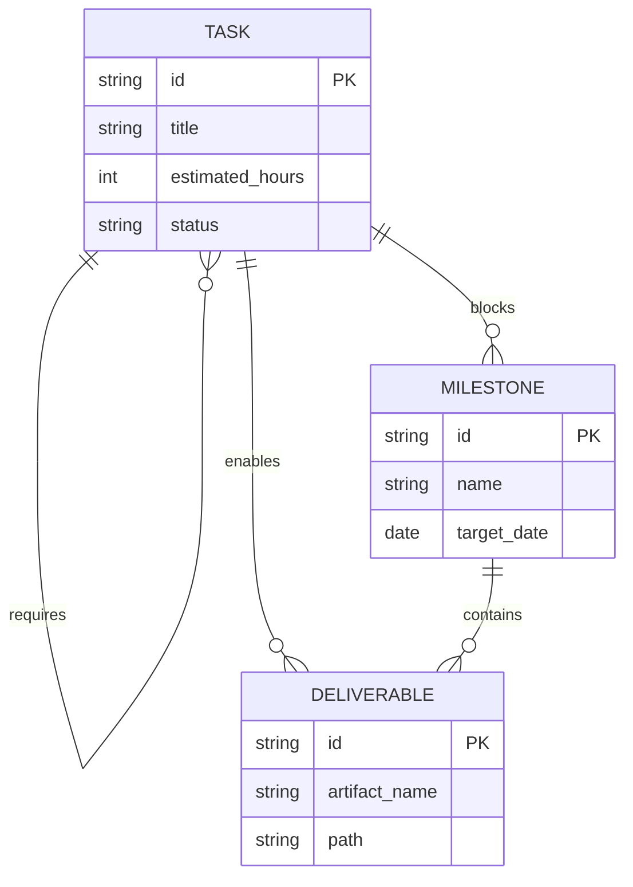

**Dependency rules:**

- A `Task` with status `blocked` must have an uncompleted `requires` `Task`.
- A `Milestone` is `achievable` only when all `blocks` `Task`s are complete.
- A `Deliverable` is `available` only when all `enables` `Task`s are complete.

**Task dependency graph:**

| Task ID  | Requires           | Blocks Story | Enables Deliverable |
| -------- | ------------------ | ------------ | ------------------- |
| TASK_001 | —                  | S1           | DEL_001             |
| TASK_002 | TASK_001           | S1           | DEL_002             |
| TASK_003 | TASK_001           | S2           | DEL_003             |
| TASK_004 | TASK_002           | S2           | DEL_004             |
| TASK_005 | TASK_003           | S3           | DEL_005             |
| TASK_006 | TASK_003           | S3           | DEL_006             |
| TASK_007 | TASK_004, TASK_005 | S3           | DEL_007             |
| TASK_008 | TASK_006           | S4           | DEL_008             |
| TASK_009 | TASK_007, TASK_008 | S4           | DEL_009             |
| TASK_010 | TASK_009           | S5           | DEL_010             |
| TASK_011 | TASK_009           | S5           | DEL_011             |
| TASK_012 | TASK_010, TASK_011 | S5           | DEL_012             |

---

## 9. Implementation Timeline

```mermaid
gantt
    title LightOS iMessage Client — Milestone 3 Implementation Plan
    dateFormat  YYYY-MM-DD
    axisFormat  %m/%d

    section Native Service Deployment
    TASK_001 :a1, 2026-07-18, 4h
    TASK_002 :a2, after a1, 4h

    section IPC & Heartbeat
    TASK_003 :b1, after a1, 4h
    TASK_004 :b2, after a2, 4h

    section Auth Delegation
    TASK_005 :c1, after b1, 4h
    TASK_006 :c2, after b1, 4h

    section UnifiedPush Bridge
    TASK_007 :d1, after c1, after c2, 4h

    section Push Handling
    TASK_008 :e1, after b2, 4h
    TASK_009 :e2, after d1, after e1, 4h

    section Sync & Verification
    TASK_010 :f1, after e2, 4h
    TASK_011 :f2, after e2, 4h
    TASK_012 :f3, after f1, after f2, 2h

    section Stories
    story S1 Native Service Deployed :milestone, after a2, 0h
    story S2 IPC & Heartbeat Stable :milestone, after b2, 0h
    story S3 Auth Delegation Complete :milestone, after c2, 0h
    story S4 UnifiedPush Bridge Live :milestone, after d1, 0h
    story S5 Milestone 3 Review :milestone, after f3, 0h
```

**Task list:**

| ID       | Title                                                                                                       | Est. Hours | Start                    | Dependencies       | Owner                       |
| -------- | ----------------------------------------------------------------------------------------------------------- | ---------- | ------------------------ | ------------------ | --------------------------- |
| TASK_001 | Package `rustpush` binary for Android (ARM64) and add asset extraction logic.                               | 4          | 2026-07-18               | None               | Native Build Engineer       |
| TASK_002 | Implement `NativeServiceLauncher` to deploy, start, and monitor the `rustpush` process.                     | 4          | after TASK_001           | TASK_001           | Native Integration Engineer |
| TASK_003 | Implement `NativeServiceClient` with Unix domain socket connection and length-prefixed JSON framing.        | 4          | after TASK_001           | TASK_001           | Native Integration Engineer |
| TASK_004 | Implement 30-second heartbeat, missed-PONG detection, and automatic reconnect.                              | 4          | after TASK_002           | TASK_002           | Native Integration Engineer |
| TASK_005 | Refactor `AuthService` to delegate `ACTIVATE` commands to `rustpush` and handle `ACTIVATION_STATUS` events. | 4          | after TASK_003           | TASK_003           | Authentication Engineer     |
| TASK_006 | Update auth state machine to reflect `rustpush`-driven activation progress and 2FA flows.                   | 4          | after TASK_003           | TASK_003           | Authentication Engineer     |
| TASK_007 | Implement `SEND_MESSAGE` command path and `MESSAGE_RECEIVED` event routing through `rustpush`.              | 4          | after TASK_005, TASK_006 | TASK_005, TASK_006 | Protocol Engineer           |
| TASK_008 | Implement `PushReceiver` using `org.unifiedpush.android:connector` and registration persistence.            | 4          | after TASK_004           | TASK_004           | Push Engineer               |
| TASK_009 | Implement `PushHandler` to route `WAKE`, `MESSAGE_DELIVERY`, `READ_RECEIPT`, and `TYPING` events.           | 4          | after TASK_007, TASK_008 | TASK_007, TASK_008 | Push Engineer               |
| TASK_010 | Write integration tests for end-to-end push delivery and native service lifecycle.                          | 4          | after TASK_009           | TASK_009           | QA Engineer                 |
| TASK_011 | Implement `BackgroundSyncWorker` and `SyncWorkScheduler` for deferred and periodic sync.                    | 4          | after TASK_009           | TASK_009           | Background Engineer         |
| TASK_012 | Document Milestone 3 APIs, update ADRs, and conduct review.                                                 | 2          | after TASK_010, TASK_011 | TASK_010, TASK_011 | Tech Lead                   |

**Deliverable list:**

| ID      | Artifact                                  | Path                                                             | Enabled By |
| ------- | ----------------------------------------- | ---------------------------------------------------------------- | ---------- |
| DEL_001 | Packaged rustpush binary                  | `src/main/assets/rustpush`                                       | TASK_001   |
| DEL_002 | Native service launcher                   | `domain/native/NativeServiceLauncher.kt`                         | TASK_002   |
| DEL_003 | Native IPC client                         | `domain/native/NativeServiceClient.kt`                           | TASK_003   |
| DEL_004 | Heartbeat and reconnect logic             | `domain/native/HeartbeatManager.kt`                              | TASK_004   |
| DEL_005 | rustpush auth delegation                  | `domain/auth/AuthService.kt`                                     | TASK_005   |
| DEL_006 | Updated auth state machine                | `domain/auth/AuthStateMachine.kt`                                | TASK_006   |
| DEL_007 | Send/receive via rustpush                 | `domain/native/NativeCommand.kt`, `domain/native/NativeEvent.kt` | TASK_007   |
| DEL_008 | UnifiedPush receiver                      | `domain/push/PushReceiver.kt`                                    | TASK_008   |
| DEL_009 | Push handler and routing                  | `domain/push/PushHandler.kt`                                     | TASK_009   |
| DEL_010 | Integration test suite                    | `src/androidTest/java/...`                                       | TASK_010   |
| DEL_011 | Background sync worker                    | `domain/sync/BackgroundSyncWorker.kt`                            | TASK_011   |
| DEL_012 | Milestone 3 specification and ADR updates | `docs/initiatives/v1/codespec/milestone-3.md`                    | TASK_012   |

---

## 10. Revision History

| Version | Date       | Author                  | Change                                                                                                                                       |
| ------- | ---------- | ----------------------- | -------------------------------------------------------------------------------------------------------------------------------------------- |
| 1.0     | 2026-07-18 | Specification Architect | Initial Milestone 3 implementation-ready specification based on Path A rustpush-native architecture and DDD artifacts from prior milestones. |
