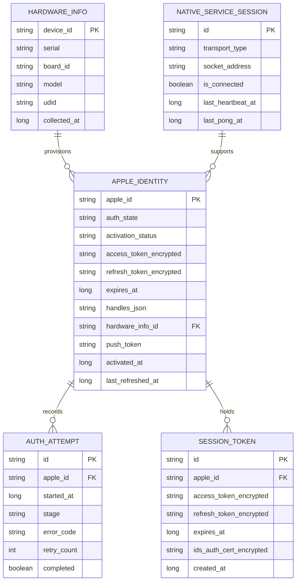
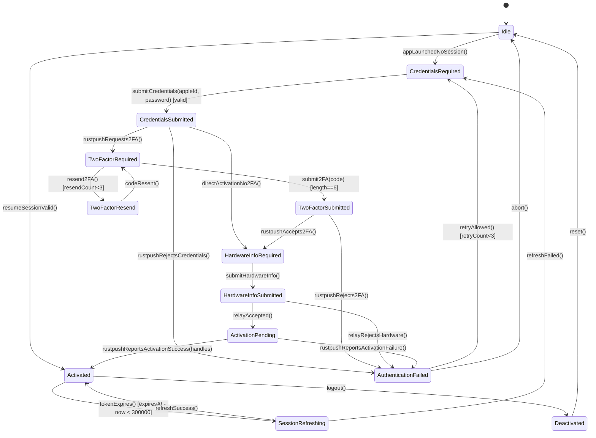
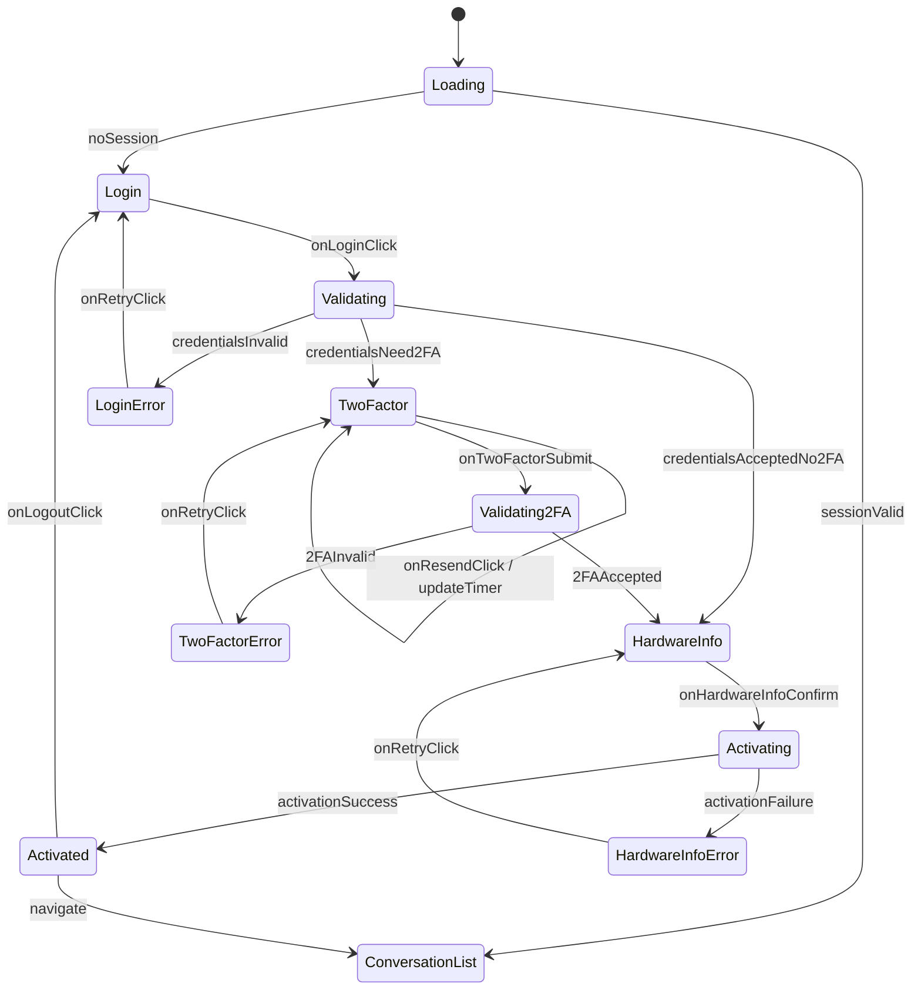
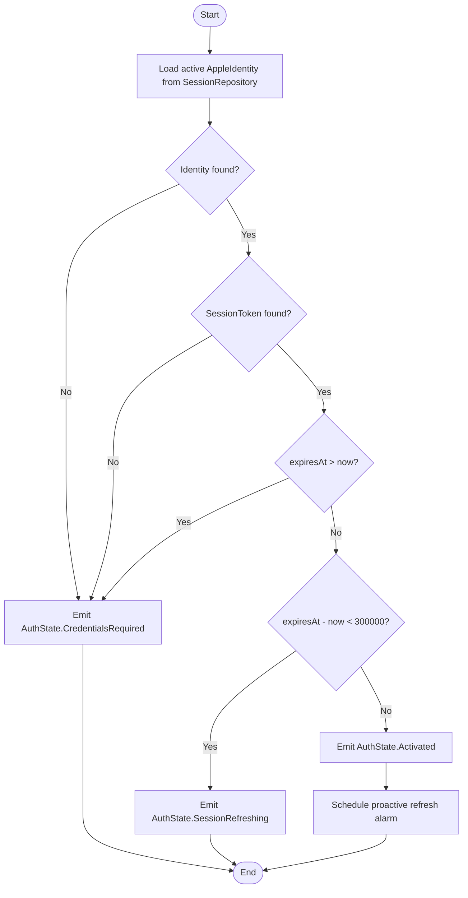
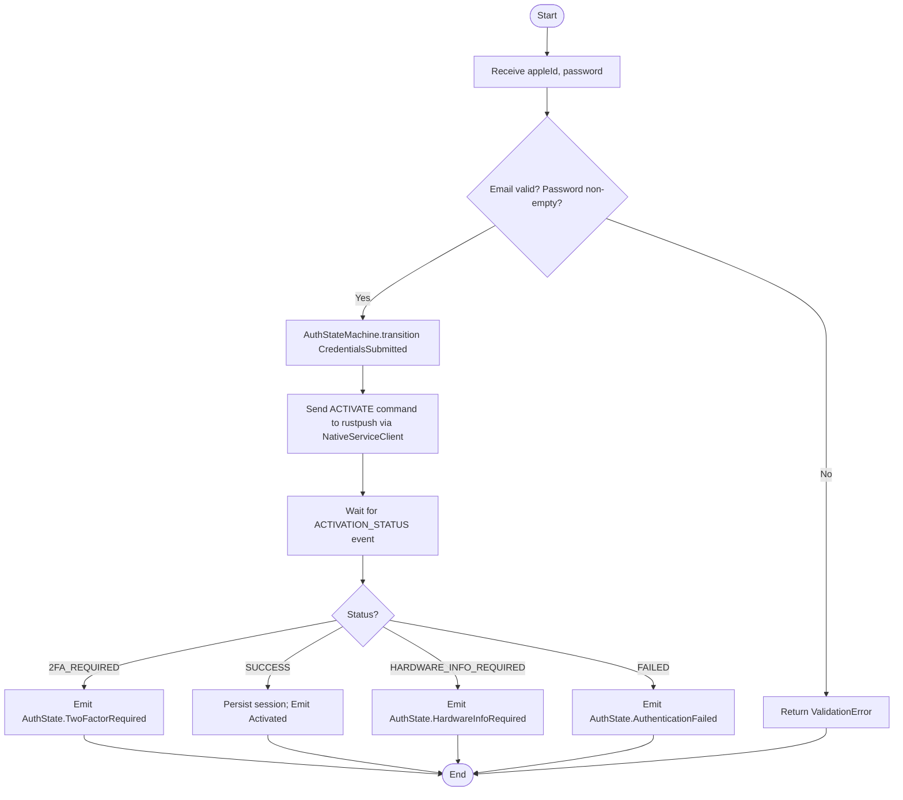
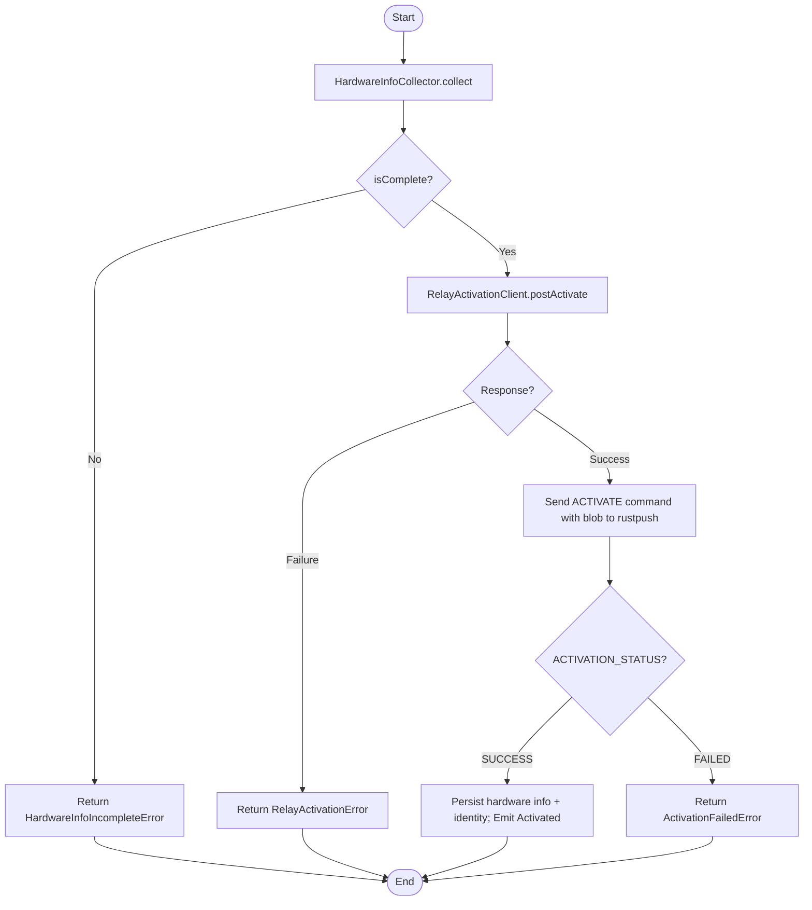
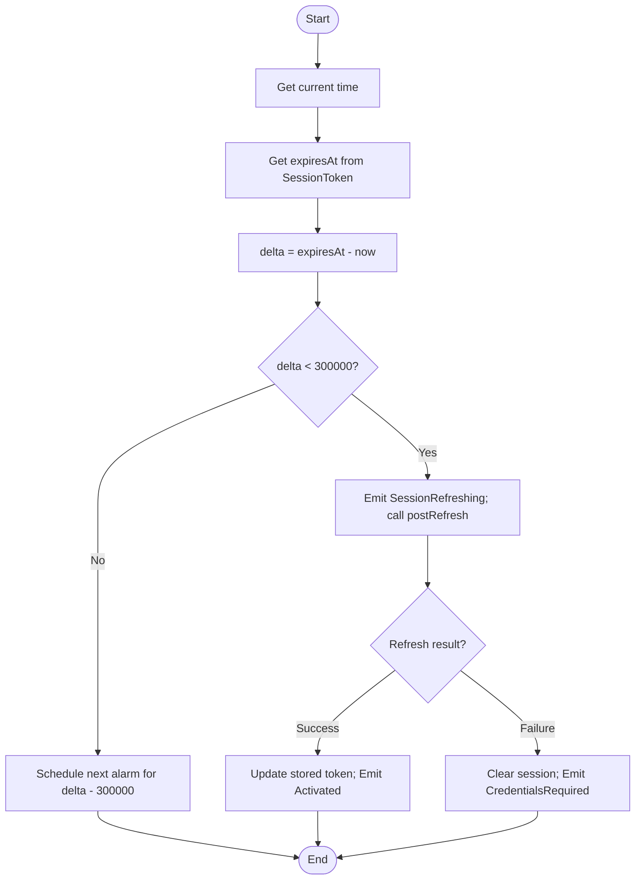
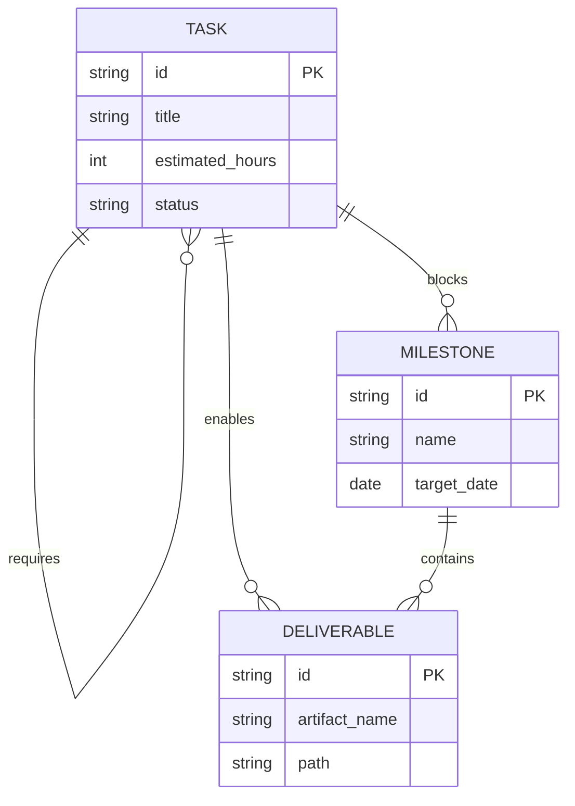

# Specification: LightOS iMessage Client — Milestone 4 Auth & Session Implementation

## 1. Formal Requirement Restatement

**Goal:** Implement the user-facing Apple ID authentication and session lifecycle for the LightOS iMessage client, including credential capture, 2FA/SMS verification, one-time hardware-info provisioning to the Mac relay, session token retrieval, and encrypted persistence in DataStore; expose this through `AppleIdAuth`, `AuthViewModel`, and `LightScreen` auth flows.

This specification builds on the rustpush-native architecture established in the project proposal and Milestone 3, and on the data-layer foundations from Milestone 2.

**Scope In:**

- `AppleIdAuth` domain class: login, 2FA, hardware info provisioning, session token retrieval, refresh, and logout.
- `AuthStateMachine` with deterministic state transitions and retry guards.
- `SessionRepository` encrypted read/write of `AppleIdentity`, `SessionToken`, and `HardwareInfo`.
- `HardwareInfoCollector` gathering serial, board ID, model, and UDID for relay activation.
- `RelayActivationClient` HTTPS client for Mac relay `POST /api/v1/activate`, `/verify-2fa`, and `/refresh`.
- Integration with `NativeServiceClient` from Milestone 3 to forward `ACTIVATE` commands and consume `ACTIVATION_STATUS` events.
- `AuthViewModel` exposing `StateFlow<AuthUiState>` and `Flow<AuthEffect>`.
- `LightScreen` auth composables: `LoginScreen`, `TwoFactorScreen`, `HardwareInfoScreen`, `ActivationProgressScreen`.
- Auto session resume on app launch and proactive refresh before expiry.
- Input validation: Apple ID email format, 2FA code length, password non-empty.

**Scope Out:**

- `rustpush` native service implementation (Milestone 3).
- Message send/receive codec and `MessageCodec` (Milestone 2/5).
- Conversation list, thread, and keyboard UI (Milestone 6).
- Attachment upload/download pipeline (Milestone 5).
- Mac relay server implementation.
- SMS/MMS fallback, FaceTime, and iMessage app extensions.

**Actors:**

- `User` — enters Apple ID credentials, 2FA codes, and confirms hardware info.
- `LightOS iMessage Tool` — the Kotlin application.
- `AppleIdAuth` — domain orchestrator for authentication and session lifecycle.
- `AuthStateMachine` — validates and executes auth state transitions.
- `AuthViewModel` — presentation layer exposing UI state and effects.
- `SessionRepository` — encrypted persistence of session tokens and activation state.
- `HardwareInfoCollector` — collects device hardware identifiers.
- `RelayActivationClient` — HTTPS client for one-time Mac relay activation.
- `NativeServiceClient` — IPC client to `rustpush` native service (Milestone 3).
- `rustpush Native Service` — performs Apple server communication and APNs TLS.
- `Mac Relay Server` — one-time hardware attestation endpoint.
- `Encrypted DataStore` — secure storage for tokens and keys.

**Invariants:**

- Only dependencies listed in `LightSdkPlugin.kt` lines 17–37 are permitted.
- Apple ID password is never persisted to disk; only session tokens and refresh tokens are stored encrypted.
- Session tokens are encrypted at rest via `androidx.datastore` with `MasterKey`.
- Hardware info is transmitted to the Mac relay exactly once per Apple ID/device pairing.
- `AuthState` transitions are deterministic; every transition is validated by `AuthStateMachine`.
- 2FA code must be exactly 6 decimal digits.
- Session refresh is initiated when `expiresAt - now() < 300_000` ms.
- Only one active `AppleIdentity` session is stored per device.
- All relay communication uses HTTPS.
- `AppleIdAuth.state` is the single source of truth for authentication status.

---

## 2. Data Model



**Field definitions:**

| Entity                 | Field                   | Type    | Constraints  | Description                                                |
| ---------------------- | ----------------------- | ------- | ------------ | ---------------------------------------------------------- |
| APPLE_IDENTITY         | apple_id                | string  | PK           | Apple ID email address, primary identity.                  |
| APPLE_IDENTITY         | auth_state              | string  | NOT NULL     | Current `AuthState` enum value.                            |
| APPLE_IDENTITY         | activation_status       | string  | NOT NULL     | `PENDING`, `2FA_REQUIRED`, `SUCCESS`, `FAILED`.            |
| APPLE_IDENTITY         | access_token_encrypted  | string  | nullable     | Encrypted access token from relay.                         |
| APPLE_IDENTITY         | refresh_token_encrypted | string  | nullable     | Encrypted refresh token from relay.                        |
| APPLE_IDENTITY         | expires_at              | long    | nullable     | Unix ms token expiry.                                      |
| APPLE_IDENTITY         | handles_json            | string  | nullable     | JSON array of activated `tel:`/`mailto:` handles.          |
| APPLE_IDENTITY         | hardware_info_id        | string  | FK           | Link to `HARDWARE_INFO` used for activation.               |
| APPLE_IDENTITY         | push_token              | string  | nullable     | UnifiedPush registration token.                            |
| APPLE_IDENTITY         | activated_at            | long    | nullable     | Unix ms when activation succeeded.                         |
| APPLE_IDENTITY         | last_refreshed_at       | long    | nullable     | Unix ms of last successful refresh.                        |
| AUTH_ATTEMPT           | id                      | string  | PK           | UUIDv4 attempt identifier.                                 |
| AUTH_ATTEMPT           | apple_id                | string  | FK, NOT NULL | Associated Apple ID.                                       |
| AUTH_ATTEMPT           | started_at              | long    | NOT NULL     | Unix ms attempt start.                                     |
| AUTH_ATTEMPT           | stage                   | string  | NOT NULL     | Stage at completion or failure.                            |
| AUTH_ATTEMPT           | error_code              | string  | nullable     | Error code if failed.                                      |
| AUTH_ATTEMPT           | retry_count             | int     | NOT NULL     | Number of retries consumed.                                |
| AUTH_ATTEMPT           | completed               | boolean | NOT NULL     | `true` if attempt reached `Activated` or terminal failure. |
| HARDWARE_INFO          | device_id               | string  | PK           | Stable device identifier.                                  |
| HARDWARE_INFO          | serial                  | string  | NOT NULL     | Device serial number.                                      |
| HARDWARE_INFO          | board_id                | string  | NOT NULL     | Device board identifier.                                   |
| HARDWARE_INFO          | model                   | string  | NOT NULL     | Device model string.                                       |
| HARDWARE_INFO          | udid                    | string  | NOT NULL     | Unique device identifier.                                  |
| HARDWARE_INFO          | collected_at            | long    | NOT NULL     | Unix ms when collected.                                    |
| SESSION_TOKEN          | id                      | string  | PK           | UUIDv4 token record identifier.                            |
| SESSION_TOKEN          | apple_id                | string  | FK, NOT NULL | Associated Apple ID.                                       |
| SESSION_TOKEN          | access_token_encrypted  | string  | NOT NULL     | Encrypted access token.                                    |
| SESSION_TOKEN          | refresh_token_encrypted | string  | NOT NULL     | Encrypted refresh token.                                   |
| SESSION_TOKEN          | expires_at              | long    | NOT NULL     | Unix ms expiry.                                            |
| SESSION_TOKEN          | ids_auth_cert_encrypted | string  | nullable     | Encrypted IDS auth certificate PEM.                        |
| SESSION_TOKEN          | created_at              | long    | NOT NULL     | Unix ms creation.                                          |
| NATIVE_SERVICE_SESSION | id                      | string  | PK           | UUIDv4 session identifier (from Milestone 3).              |
| NATIVE_SERVICE_SESSION | transport_type          | string  | NOT NULL     | `UNIX_DOMAIN` or `AIDL`.                                   |
| NATIVE_SERVICE_SESSION | socket_address          | string  | NOT NULL     | IPC address.                                               |
| NATIVE_SERVICE_SESSION | is_connected            | boolean | NOT NULL     | Current IPC connection state.                              |
| NATIVE_SERVICE_SESSION | last_heartbeat_at       | long    | NOT NULL     | Unix ms last `PING` sent.                                  |
| NATIVE_SERVICE_SESSION | last_pong_at            | long    | NOT NULL     | Unix ms last `PONG` received.                              |

---

## 3. Code Architecture

```mermaid
classDiagram
    class IAppleIdAuth {
        <<interface>>
        + val state: StateFlow~AuthState~
        + suspend fun resumeSession(): Result~Unit~
        + suspend fun startAuthentication(appleId: AppleId, password: String): Result~Unit~
        + suspend fun submitTwoFactorCode(code: String): Result~Unit~
        + suspend fun resendTwoFactorCode(): Result~Unit~
        + suspend fun submitHardwareInfo(): Result~Unit~
        + suspend fun refreshSession(): Result~Unit~
        + suspend fun logout(): Result~Unit~
    }
    class AppleIdAuth {
        - authStateMachine: AuthStateMachine
        - sessionRepository: ISessionRepository
        - hardwareInfoCollector: IHardwareInfoCollector
        - relayActivationClient: IRelayActivationClient
        - nativeServiceClient: INativeServiceClient
        - pushTokenRepository: IPushTokenRepository
        - coroutineScope: CoroutineScope
        + val state: StateFlow~AuthState~
        + suspend fun resumeSession(): Result~Unit~
        + suspend fun startAuthentication(appleId: AppleId, password: String): Result~Unit~
        + suspend fun submitTwoFactorCode(code: String): Result~Unit~
        + suspend fun resendTwoFactorCode(): Result~Unit~
        + suspend fun submitHardwareInfo(): Result~Unit~
        + suspend fun refreshSession(): Result~Unit~
        + suspend fun logout(): Result~Unit~
        - suspend fun onActivationStatus(event: ActivationStatusEvent)
        - suspend fun persistActivatedSession(session: SessionToken, handles: List~Uri~)
        - fun scheduleProactiveRefresh(expiresAt: Long)
    }
    class IAuthStateMachine {
        <<interface>>
        + fun transition(event: AuthEvent): Result~AuthState~
        + fun getState(): AuthState
    }
    class AuthStateMachine {
        - currentState: AuthState
        - retryCount: Int
        - resendCount: Int
        + fun transition(event: AuthEvent): Result~AuthState~
        + fun getState(): AuthState
        - fun validateGuard(from: AuthState, event: AuthEvent): Boolean
        - fun executeAction(from: AuthState, to: AuthState, event: AuthEvent): AuthState
    }
    class ISessionRepository {
        <<interface>>
        + suspend fun saveIdentity(identity: AppleIdentity): Result~Unit~
        + suspend fun getIdentity(appleId: AppleId): AppleIdentity?
        + suspend fun getActiveIdentity(): AppleIdentity?
        + suspend fun deleteIdentity(appleId: AppleId): Result~Unit~
        + suspend fun saveSessionToken(token: SessionToken): Result~Unit~
        + suspend fun getSessionToken(appleId: AppleId): SessionToken?
        + suspend fun saveHardwareInfo(info: HardwareInfo): Result~Unit~
        + suspend fun getHardwareInfo(deviceId: DeviceId): HardwareInfo?
        + suspend fun saveAuthAttempt(attempt: AuthAttempt): Result~Unit~
    }
    class SessionRepository {
        - dataStore: DataStore~Preferences~
        - masterKey: MasterKey
        - identityDao: AppleIdentityDao
        - sessionTokenDao: SessionTokenDao
        - hardwareInfoDao: HardwareInfoDao
        - authAttemptDao: AuthAttemptDao
        + suspend fun saveIdentity(identity: AppleIdentity): Result~Unit~
        + suspend fun getIdentity(appleId: AppleId): AppleIdentity?
        + suspend fun getActiveIdentity(): AppleIdentity?
        + suspend fun deleteIdentity(appleId: AppleId): Result~Unit~
        + suspend fun saveSessionToken(token: SessionToken): Result~Unit~
        + suspend fun getSessionToken(appleId: AppleId): SessionToken?
        + suspend fun saveHardwareInfo(info: HardwareInfo): Result~Unit~
        + suspend fun getHardwareInfo(deviceId: DeviceId): HardwareInfo?
        + suspend fun saveAuthAttempt(attempt: AuthAttempt): Result~Unit~
        - fun encrypt(plaintext: String): String
        - fun decrypt(ciphertext: String): String
    }
    class IHardwareInfoCollector {
        <<interface>>
        + suspend fun collect(): Result~HardwareInfo~
        + fun isComplete(info: HardwareInfo): Boolean
    }
    class HardwareInfoCollector {
        - context: Context
        + suspend fun collect(): Result~HardwareInfo~
        + fun isComplete(info: HardwareInfo): Boolean
        - fun readSerial(): String
        - fun readBoardId(): String
        - fun readModel(): String
        - fun readUdid(): String
    }
    class IRelayActivationClient {
        <<interface>>
        + suspend fun postActivate(hardwareInfo: HardwareInfo, appleId: AppleId): Result~ActivationBlob~
        + suspend fun postVerify2FA(activationId: String, code: String): Result~SessionToken~
        + suspend fun postRefresh(refreshToken: String): Result~SessionToken~
    }
    class RelayActivationClient {
        - okHttpClient: OkHttpClient
        - baseUrl: String
        - json: Json
        + suspend fun postActivate(hardwareInfo: HardwareInfo, appleId: AppleId): Result~ActivationBlob~
        + suspend fun postVerify2FA(activationId: String, code: String): Result~SessionToken~
        + suspend fun postRefresh(refreshToken: String): Result~SessionToken~
        - fun buildActivateRequestBody(hardwareInfo: HardwareInfo, appleId: AppleId): String
    }
    class IPushTokenRepository {
        <<interface>>
        + suspend fun getToken(): PushToken?
        + suspend fun saveToken(token: PushToken): Result~Unit~
    }
    class IAuthViewModel {
        <<interface>>
        + val uiState: StateFlow~AuthUiState~
        + val effects: Flow~AuthEffect~
        + fun onLoginClick(appleId: String, password: String)
        + fun onTwoFactorSubmit(code: String)
        + fun onResendClick()
        + fun onHardwareInfoConfirm()
        + fun onLogoutClick()
        + fun onRetryClick()
    }
    class AuthViewModel {
        - appleIdAuth: IAppleIdAuth
        - savedStateHandle: SavedStateHandle
        + val uiState: StateFlow~AuthUiState~
        + val effects: Flow~AuthEffect~
        + fun onLoginClick(appleId: String, password: String)
        + fun onTwoFactorSubmit(code: String)
        + fun onResendClick()
        + fun onHardwareInfoConfirm()
        + fun onLogoutClick()
        + fun onRetryClick()
        - fun mapStateToUiState(state: AuthState): AuthUiState
        - fun emitEffect(effect: AuthEffect)
    }
    class LoginScreen {
        + fun Content(viewModel: IAuthViewModel)
    }
    class TwoFactorScreen {
        + fun Content(viewModel: IAuthViewModel)
    }
    class HardwareInfoScreen {
        + fun Content(viewModel: IAuthViewModel)
    }
    class ActivationProgressScreen {
        + fun Content(viewModel: IAuthViewModel)
    }
    class AppleIdentityDao {
        + @Insert(onConflict REPLACE) suspend fun upsert(identity: AppleIdentityEntity)
        + @Query suspend fun getByAppleId(appleId: String): AppleIdentityEntity?
        + @Query suspend fun getActive(): AppleIdentityEntity?
        + @Delete suspend fun delete(identity: AppleIdentityEntity)
    }
    class SessionTokenDao {
        + @Insert(onConflict REPLACE) suspend fun upsert(token: SessionTokenEntity)
        + @Query suspend fun getByAppleId(appleId: String): SessionTokenEntity?
        + @Delete suspend fun deleteByAppleId(appleId: String)
    }
    class HardwareInfoDao {
        + @Insert(onConflict REPLACE) suspend fun upsert(info: HardwareInfoEntity)
        + @Query suspend fun getByDeviceId(deviceId: String): HardwareInfoEntity?
    }
    class AuthAttemptDao {
        + @Insert suspend fun insert(attempt: AuthAttemptEntity)
        + @Query suspend fun getByAppleId(appleId: String): List~AuthAttemptEntity~
    }
    class INativeServiceClient {
        <<interface>>
        + val connectionState: StateFlow~NativeServiceState~
        + suspend fun sendCommand(command: NativeCommand): Result~NativeResponse~
        + fun observeEvents(): Flow~NativeEvent~
    }

    IAppleIdAuth <|.. AppleIdAuth : implements
    IAuthStateMachine <|.. AuthStateMachine : implements
    ISessionRepository <|.. SessionRepository : implements
    IHardwareInfoCollector <|.. HardwareInfoCollector : implements
    IRelayActivationClient <|.. RelayActivationClient : implements
    IAuthViewModel <|.. AuthViewModel : implements

    AppleIdAuth --> IAuthStateMachine : owns
    AppleIdAuth --> ISessionRepository : uses
    AppleIdAuth --> IHardwareInfoCollector : uses
    AppleIdAuth --> IRelayActivationClient : uses
    AppleIdAuth --> INativeServiceClient : uses
    AppleIdAuth --> IPushTokenRepository : uses
    AuthViewModel --> IAppleIdAuth : uses
    LoginScreen --> IAuthViewModel : uses
    TwoFactorScreen --> IAuthViewModel : uses
    HardwareInfoScreen --> IAuthViewModel : uses
    ActivationProgressScreen --> IAuthViewModel : uses
    SessionRepository --> AppleIdentityDao : uses
    SessionRepository --> SessionTokenDao : uses
    SessionRepository --> HardwareInfoDao : uses
    SessionRepository --> AuthAttemptDao : uses
    SessionRepository --> DataStore : uses
```



**Module boundaries:**

| Component                  | Responsibility                                                                                             | Owned By                                    |
| -------------------------- | ---------------------------------------------------------------------------------------------------------- | ------------------------------------------- |
| `AppleIdAuth`              | Orchestrate Apple ID login, 2FA, hardware info provisioning, session token retrieval, refresh, and logout. | Authentication & Activation bounded context |
| `AuthStateMachine`         | Validate and execute deterministic auth state transitions with retry guards.                               | Authentication & Activation bounded context |
| `SessionRepository`        | Encrypted persistence of `AppleIdentity`, `SessionToken`, `HardwareInfo`, and `AuthAttempt`.               | Authentication & Activation bounded context |
| `HardwareInfoCollector`    | Collect device hardware identifiers for one-time relay activation.                                         | Authentication & Activation bounded context |
| `RelayActivationClient`    | HTTPS client for Mac relay one-time activation endpoints.                                                  | Authentication & Activation bounded context |
| `AuthViewModel`            | Map `AuthState` to `AuthUiState` and emit one-time `AuthEffect` events.                                    | UI & Presentation bounded context           |
| `LoginScreen`              | Capture Apple ID and password; display validation errors.                                                  | UI & Presentation bounded context           |
| `TwoFactorScreen`          | Capture 6-digit 2FA code; support resend and error states.                                                 | UI & Presentation bounded context           |
| `HardwareInfoScreen`       | Display collected hardware info and request user confirmation.                                             | UI & Presentation bounded context           |
| `ActivationProgressScreen` | Show activation progress and terminal failure/retry options.                                               | UI & Presentation bounded context           |

---

## 4. Component Interactions

### 4.1 App Launch & Session Resume

```mermaid
sequenceDiagram
    autonumber
    actor U as User
    participant APP as Application
    participant VM as AuthViewModel
    participant AA as AppleIdAuth
    participant SM as AuthStateMachine
    participant SR as SessionRepository
    participant DB as Room / DataStore

    U->>+APP: launch app
    APP->>+VM: init
    VM->>+AA: resumeSession()
    AA->>+SR: getActiveIdentity()
    SR->>DB: read encrypted identity
    DB-->>-SR: identity or null
    SR-->>-AA: AppleIdentity?
    alt identity exists and not expired
        AA->>+SM: transition(SessionResumed)
        SM-->>-AA: Activated
        AA->>AA: scheduleProactiveRefresh(expiresAt)
        AA-->>-VM: state=Activated
        VM-->>-APP: navigate to ConversationList
    else no identity or expired
        AA->>+SM: transition(SessionResumed)
        SM-->>-AA: CredentialsRequired
        AA-->>-VM: state=CredentialsRequired
        VM-->>-APP: show LoginScreen
    end
```

**Preconditions:** App process started; `SessionRepository` initialized.
**Postconditions:** UI navigates to conversation list if session valid, otherwise to login.

### 4.2 Login & 2FA Flow

```mermaid
sequenceDiagram
    autonumber
    actor U as User
    participant UI as LoginScreen / TwoFactorScreen
    participant VM as AuthViewModel
    participant AA as AppleIdAuth
    participant SM as AuthStateMachine
    participant NC as NativeServiceClient
    participant RP as rustpush
    participant SR as SessionRepository

    U->>+UI: enter appleId, password
    UI->>+VM: onLoginClick(appleId, password)
    VM->>VM: validate email & password
    VM->>+AA: startAuthentication(AppleId(appleId), password)
    AA->>+SM: transition(CredentialsSubmitted)
    SM-->>-AA: CredentialsSubmitted
    AA->>+NC: sendCommand(ACTIVATE {appleId, password})
    NC->>+RP: ACTIVATE command
    RP-->>-NC: ACTIVATION_STATUS {status: 2FA_REQUIRED}
    NC-->>-AA: ActivationStatusEvent
    AA->>+SM: transition(TwoFactorRequired)
    SM-->>-AA: TwoFactorRequired
    AA-->>-VM: state=TwoFactorRequired
    VM-->>-UI: show TwoFactorScreen

    U->>+UI: enter 2FA code
    UI->>+VM: onTwoFactorSubmit(code)
    VM->>VM: validate code length 6
    VM->>+AA: submitTwoFactorCode(code)
    AA->>+SM: transition(TwoFactorSubmitted)
    SM-->>-AA: TwoFactorSubmitted
    AA->>+NC: sendCommand(ACTIVATE {appleId, password, 2faCode})
    NC->>+RP: ACTIVATE with 2FA
    RP-->>-NC: ACTIVATION_STATUS {status: SUCCESS, handles[]}
    NC-->>-AA: ActivationStatusEvent
    AA->>AA: build SessionToken
    AA->>+SR: saveIdentity + saveSessionToken
    SR->>SR: encrypt tokens
    SR->>DB: write
    DB-->>-SR: success
    SR-->>-AA: Result.success
    AA->>+SM: transition(Activated)
    SM-->>-AA: Activated
    AA-->>-VM: state=Activated
    VM-->>-UI: navigate to ConversationList
```

**Preconditions:** `NativeServiceClient` connected to `rustpush`; valid credentials.
**Postconditions:** Session persisted; `AuthState` is `Activated`.

### 4.3 Hardware Info Provisioning & Relay Activation

```mermaid
sequenceDiagram
    autonumber
    actor U as User
    participant UI as HardwareInfoScreen
    participant VM as AuthViewModel
    participant AA as AppleIdAuth
    participant HC as HardwareInfoCollector
    participant RC as RelayActivationClient
    participant REL as Mac Relay
    participant SR as SessionRepository
    participant NC as NativeServiceClient
    participant RP as rustpush

    U->>+UI: confirm hardware info
    UI->>+VM: onHardwareInfoConfirm()
    VM->>+AA: submitHardwareInfo()
    AA->>+HC: collect()
    HC-->>-AA: HardwareInfo
    AA->>+RC: postActivate(hardwareInfo, appleId)
    RC->>+REL: POST /api/v1/activate
    REL-->>-RC: 200 OK {activation_blob}
    RC-->>-AA: ActivationBlob
    AA->>+NC: sendCommand(ACTIVATE {blob})
    NC->>+RP: ACTIVATE with blob
    RP-->>-NC: ACTIVATION_STATUS {status: SUCCESS, handles[]}
    NC-->>-AA: ActivationStatusEvent
    AA->>+SR: saveHardwareInfo + saveIdentity
    SR->>DB: encrypted write
    DB-->>-SR: success
    SR-->>-AA: Result.success
    AA-->>-VM: state=Activated
    VM-->>-UI: navigate to ConversationList
```

**Preconditions:** `AuthState` is `HardwareInfoRequired`; hardware info collection available.
**Postconditions:** Hardware info persisted; relay activation blob consumed by `rustpush`; session activated.

### 4.4 Session Refresh

```mermaid
sequenceDiagram
    autonumber
    participant AA as AppleIdAuth
    participant SM as AuthStateMachine
    participant SR as SessionRepository
    participant RC as RelayActivationClient
    participant REL as Mac Relay
    participant DB as Room / DataStore

    AA->>AA: proactiveRefreshAlarm fires (expiresAt - now < 300s)
    AA->>+SM: transition(TokenExpires)
    SM-->>-AA: SessionRefreshing
    AA->>+SR: getSessionToken(appleId)
    SR->>DB: read encrypted token
    DB-->>-SR: SessionToken
    SR-->>-AA: SessionToken
    AA->>+RC: postRefresh(refreshToken)
    RC->>+REL: POST /api/v1/auth/refresh
    REL-->>-RC: 200 OK {newSessionToken}
    RC-->>-AA: SessionToken
    AA->>+SR: saveSessionToken(newToken)
    SR->>DB: encrypted write
    DB-->>-SR: success
    SR-->>-AA: Result.success
    AA->>+SM: transition(RefreshSuccess)
    SM-->>-AA: Activated
    AA->>AA: scheduleProactiveRefresh(newExpiresAt)
```

**Preconditions:** `AuthState` is `Activated`; refresh token valid.
**Postconditions:** New session token persisted; `AuthState` remains `Activated`.

### 4.5 Logout

```mermaid
sequenceDiagram
    autonumber
    actor U as User
    participant UI as SettingsScreen
    participant VM as AuthViewModel
    participant AA as AppleIdAuth
    participant SM as AuthStateMachine
    participant SR as SessionRepository
    participant NC as NativeServiceClient
    participant DB as Room / DataStore

    U->>+UI: tap logout
    UI->>+VM: onLogoutClick()
    VM->>+AA: logout()
    AA->>+SM: transition(LogoutRequested)
    SM-->>-AA: Deactivated
    AA->>+NC: sendCommand(DEACTIVATE)
    NC-->>-AA: Result.success
    AA->>+SR: deleteIdentity(appleId)
    SR->>DB: delete identity, token, hardware info
    DB-->>-SR: success
    SR-->>-AA: Result.success
    AA-->>-VM: state=Deactivated
    VM-->>-UI: navigate to LoginScreen
```

**Preconditions:** `AuthState` is `Activated` or `SessionRefreshing`.
**Postconditions:** Session deleted; `AuthState` is `Deactivated`; UI shows login.

---

## 5. Stateful Behavior

### 5.1 Apple ID Auth State Machine



**Transition table:**

| From                  | To                    | Trigger                                     | Guard                                | Action                             |
| --------------------- | --------------------- | ------------------------------------------- | ------------------------------------ | ---------------------------------- |
| Idle                  | CredentialsRequired   | `appLaunchedNoSession()`                    | No active identity                   | Show login.                        |
| Idle                  | Activated             | `resumeSessionValid()`                      | Active identity, token not expired   | Navigate to threads.               |
| CredentialsRequired   | CredentialsSubmitted  | `submitCredentials(appleId, password)`      | Email valid, password non-empty      | Send `ACTIVATE` to rustpush.       |
| CredentialsSubmitted  | TwoFactorRequired     | `rustpushRequests2FA()`                     | `ACTIVATION_STATUS` = `2FA_REQUIRED` | Show 2FA screen.                   |
| CredentialsSubmitted  | HardwareInfoRequired  | `directActivationNo2FA()`                   | Apple skips 2FA                      | Collect hardware info.             |
| CredentialsSubmitted  | AuthenticationFailed  | `rustpushRejectsCredentials()`              | HTTP 401 / invalid creds             | Increment retry count.             |
| TwoFactorRequired     | TwoFactorSubmitted    | `submit2FA(code)`                           | `code.length == 6`                   | Send `ACTIVATE` with 2FA.          |
| TwoFactorRequired     | TwoFactorResend       | `resend2FA()`                               | `resendCount < 3`                    | Request new code.                  |
| TwoFactorResend       | TwoFactorRequired     | `codeResent()`                              | —                                    | Reset timer.                       |
| TwoFactorSubmitted    | HardwareInfoRequired  | `rustpushAccepts2FA()`                      | 2FA accepted                         | Collect hardware info.             |
| TwoFactorSubmitted    | AuthenticationFailed  | `rustpushRejects2FA()`                      | Invalid 2FA                          | Increment retry count.             |
| HardwareInfoRequired  | HardwareInfoSubmitted | `submitHardwareInfo()`                      | Hardware info complete               | POST to relay.                     |
| HardwareInfoSubmitted | ActivationPending     | `relayAccepted()`                           | Relay returns activation blob        | Forward blob to rustpush.          |
| HardwareInfoSubmitted | AuthenticationFailed  | `relayRejectsHardware()`                    | Apple rejects hardware               | Increment retry count.             |
| ActivationPending     | Activated             | `rustpushReportsActivationSuccess(handles)` | `SUCCESS` with handles               | Persist session; schedule refresh. |
| ActivationPending     | AuthenticationFailed  | `rustpushReportsActivationFailure()`        | Activation failed                    | Increment retry count.             |
| Activated             | SessionRefreshing     | `tokenExpires()`                            | `expiresAt - now < 300000`           | Refresh token.                     |
| SessionRefreshing     | Activated             | `refreshSuccess()`                          | New token received                   | Update stored token.               |
| SessionRefreshing     | CredentialsRequired   | `refreshFailed()`                           | Refresh token invalid                | Clear session.                     |
| Activated             | Deactivated           | `logout()`                                  | User action                          | Delete session; stop rustpush.     |
| Deactivated           | Idle                  | `reset()`                                   | —                                    | Reset state machine.               |
| AuthenticationFailed  | CredentialsRequired   | `retryAllowed()`                            | `retryCount < 3`                     | Allow retry.                       |
| AuthenticationFailed  | Idle                  | `abort()`                                   | `retryCount >= 3` or cancel          | Reset.                             |

### 5.2 AuthViewModel UI State



**Transition table:**

| From              | To                | Trigger                    | Guard                  | Action               |
| ----------------- | ----------------- | -------------------------- | ---------------------- | -------------------- |
| Loading           | Login             | `noSession`                | —                      | Show login form.     |
| Loading           | ConversationList  | `sessionValid`             | —                      | Navigate away.       |
| Login             | Validating        | `onLoginClick`             | Email & password valid | Show spinner.        |
| Validating        | TwoFactor         | `credentialsNeed2FA`       | —                      | Show 2FA form.       |
| Validating        | HardwareInfo      | `credentialsAcceptedNo2FA` | —                      | Show hardware info.  |
| Validating        | LoginError        | `credentialsInvalid`       | —                      | Show error.          |
| TwoFactor         | Validating2FA     | `onTwoFactorSubmit`        | Code length 6          | Show spinner.        |
| Validating2FA     | HardwareInfo      | `2FAAccepted`              | —                      | Show hardware info.  |
| Validating2FA     | TwoFactorError    | `2FAInvalid`               | —                      | Show error.          |
| TwoFactor         | TwoFactor         | `onResendClick`            | Resend allowed         | Update timer.        |
| HardwareInfo      | Activating        | `onHardwareInfoConfirm`    | —                      | Show progress.       |
| Activating        | Activated         | `activationSuccess`        | —                      | Navigate to threads. |
| Activating        | HardwareInfoError | `activationFailure`        | —                      | Show error.          |
| LoginError        | Login             | `onRetryClick`             | —                      | Clear error.         |
| TwoFactorError    | TwoFactor         | `onRetryClick`             | —                      | Clear error.         |
| HardwareInfoError | HardwareInfo      | `onRetryClick`             | —                      | Clear error.         |
| Activated         | Login             | `onLogoutClick`            | —                      | Show login.          |

---

## 6. Algorithmic Logic

### 6.1 Resume Session on Launch



### 6.2 Login Flow



### 6.3 Hardware Info Provisioning



### 6.4 Session Refresh Decision



---

## 7. Exhaustive Test Matrix

### 7.1 Unit Paths

| Target                                | Scenario                   | Input                                      | Expected Output                                           | Assertion                                                 |
| ------------------------------------- | -------------------------- | ------------------------------------------ | --------------------------------------------------------- | --------------------------------------------------------- |
| `AppleIdAuth.startAuthentication`     | Valid credentials          | `AppleId("user@example.com"), "password"`  | `AuthState.CredentialsSubmitted` then `TwoFactorRequired` | `assertEquals(TwoFactorRequired, state)`                  |
| `AppleIdAuth.startAuthentication`     | Invalid email              | `"not-an-email", "password"`               | `ValidationError`                                         | `assertTrue(result.isFailure)`                            |
| `AppleIdAuth.startAuthentication`     | Empty password             | `"user@example.com", ""`                   | `ValidationError`                                         | `assertTrue(result.isFailure)`                            |
| `AppleIdAuth.submitTwoFactorCode`     | Valid 6-digit code         | `"123456"`                                 | `ACTIVATE` command with code sent                         | `verify(nativeClient).sendCommand(...)`                   |
| `AppleIdAuth.submitTwoFactorCode`     | Short code                 | `"12345"`                                  | `ValidationError`                                         | `assertTrue(result.isFailure)`                            |
| `AppleIdAuth.submitTwoFactorCode`     | Non-numeric code           | `"abcdef"`                                 | `ValidationError`                                         | `assertTrue(result.isFailure)`                            |
| `AppleIdAuth.resendTwoFactorCode`     | Under limit                | `resendCount=1`                            | Resend command sent                                       | `verify(nativeClient).sendCommand(...)`                   |
| `AppleIdAuth.resendTwoFactorCode`     | Over limit                 | `resendCount=3`                            | `ResendExhaustedError`                                    | `assertTrue(result.isFailure)`                            |
| `AppleIdAuth.submitHardwareInfo`      | Complete info              | valid `HardwareInfo`                       | `postActivate` called                                     | `verify(relayClient).postActivate(...)`                   |
| `AppleIdAuth.submitHardwareInfo`      | Incomplete info            | missing `udid`                             | `HardwareInfoIncompleteError`                             | `assertTrue(result.isFailure)`                            |
| `AppleIdAuth.refreshSession`          | Token near expiry          | `expiresAt=now+240000`                     | `postRefresh` called; token updated                       | `assertEquals(newToken, repository.getSessionToken(...))` |
| `AppleIdAuth.refreshSession`          | Token not near expiry      | `expiresAt=now+3600000`                    | No refresh performed                                      | `verify(relayClient, never()).postRefresh(...)`           |
| `AppleIdAuth.logout`                  | Active session             | —                                          | Identity and token deleted; `Deactivated`                 | `assertNull(repository.getActiveIdentity())`              |
| `AppleIdAuth.resumeSession`           | Valid stored session       | identity+token, `expiresAt` future         | `AuthState.Activated`                                     | `assertEquals(Activated, state)`                          |
| `AppleIdAuth.resumeSession`           | Expired stored session     | `expiresAt` past                           | `AuthState.CredentialsRequired`                           | `assertEquals(CredentialsRequired, state)`                |
| `AuthStateMachine.transition`         | Idle → CredentialsRequired | `StartAuthentication`                      | `CredentialsRequired`                                     | `assertEquals(CredentialsRequired, state)`                |
| `AuthStateMachine.transition`         | Invalid transition         | `Idle → Activated`                         | `IllegalTransitionError`                                  | `assertTrue(result.isFailure)`                            |
| `AuthStateMachine.transition`         | Retry allowed              | `AuthenticationFailed` with `retryCount=1` | `CredentialsRequired`                                     | `assertEquals(CredentialsRequired, state)`                |
| `AuthStateMachine.transition`         | Retry exhausted            | `AuthenticationFailed` with `retryCount=3` | `Idle`                                                    | `assertEquals(Idle, state)`                               |
| `SessionRepository.saveIdentity`      | Valid identity             | `AppleIdentity`                            | Encrypted write success                                   | `assertNotNull(dao.getByAppleId(...))`                    |
| `SessionRepository.getActiveIdentity` | Existing active identity   | —                                          | Returns identity                                          | `assertEquals(saved, loaded)`                             |
| `SessionRepository.deleteIdentity`    | Existing identity          | appleId                                    | Identity deleted                                          | `assertNull(dao.getByAppleId(...))`                       |
| `HardwareInfoCollector.collect`       | All fields available       | —                                          | `HardwareInfo` with all fields                            | `assertTrue(isComplete(info))`                            |
| `HardwareInfoCollector.isComplete`    | Missing serial             | `HardwareInfo(serial="")`                  | `false`                                                   | `assertFalse(result)`                                     |
| `RelayActivationClient.postActivate`  | Valid hardware info        | `HardwareInfo`, `AppleId`                  | `ActivationBlob`                                          | `assertTrue(result.isSuccess)`                            |
| `RelayActivationClient.postVerify2FA` | Valid code                 | activationId, code                         | `SessionToken`                                            | `assertTrue(result.isSuccess)`                            |
| `RelayActivationClient.postRefresh`   | Valid refresh token        | refreshToken                               | `SessionToken`                                            | `assertTrue(result.isSuccess)`                            |
| `AuthViewModel.onLoginClick`          | Valid input                | email, password                            | Calls `AppleIdAuth.startAuthentication`                   | `verify(appleIdAuth).startAuthentication(...)`            |
| `AuthViewModel.onTwoFactorSubmit`     | Valid code                 | `"123456"`                                 | Calls `AppleIdAuth.submitTwoFactorCode`                   | `verify(appleIdAuth).submitTwoFactorCode(...)`            |
| `AuthViewModel.mapStateToUiState`     | Activated                  | `AuthState.Activated`                      | `AuthUiState.Activated`                                   | `assertEquals(Activated, uiState)`                        |

### 7.2 Integration Paths

| Flow                            | Steps              | Mocked                           | Verified                                | Result |
| ------------------------------- | ------------------ | -------------------------------- | --------------------------------------- | ------ |
| 4.1 App Launch & Session Resume | 1–10               | `SessionRepository` with real DB | State resumes or login shown            | Pass   |
| 4.2 Login & 2FA Flow            | 1–17               | `rustpush` as local socket mock  | Session persisted, state Activated      | Pass   |
| 4.3 Hardware Info Provisioning  | 1–10               | Mac relay as MockWebServer       | Hardware info persisted, blob forwarded | Pass   |
| 4.4 Session Refresh             | 1–10               | Mac relay refresh endpoint       | New token persisted                     | Pass   |
| 4.5 Logout                      | 1–8                | `NativeServiceClient` mock       | Identity deleted, state Deactivated     | Pass   |
| Full auth with no 2FA           | Full state machine | `rustpush` mock                  | HardwareInfo → Activated                | Pass   |
| Full auth with 2FA              | Full state machine | `rustpush` mock                  | Credentials → 2FA → Activated           | Pass   |

### 7.3 Edge Cases & Failure Modes

| Condition                      | Stimulus                             | Expected Behavior                                         | Invariant Preserved        |
| ------------------------------ | ------------------------------------ | --------------------------------------------------------- | -------------------------- |
| No network                     | Login clicked                        | `NetworkError`; state remains `CredentialsRequired`       | No partial session         |
| rustpush disconnected          | `ACTIVATE` sent                      | `NativeServiceDisconnectedError`; retry when reconnected  | No credential leak         |
| Invalid 2FA                    | Submit `000000`                      | State remains `TwoFactorRequired`; retry count increments | No session created         |
| Expired session on resume      | Token `expiresAt` past               | State `CredentialsRequired`; user must re-login           | No expired token use       |
| Refresh token invalid          | `postRefresh` returns 401            | Session cleared; state `CredentialsRequired`              | No stale session           |
| Corrupted DataStore            | Master key unavailable               | `SessionRepository` returns failure; re-auth required     | No plaintext leak          |
| Duplicate Apple ID login       | New login while session exists       | Old session replaced after successful new activation      | Single active session      |
| Hardware info collection fails | Missing permission                   | `HardwareInfoIncompleteError`; prompt user                | No incomplete provisioning |
| Relay activation 500           | Server error                         | `RelayActivationError`; allow retry                       | No partial activation      |
| User cancels 2FA               | Back pressed                         | State returns `CredentialsRequired`                       | Clean state reset          |
| Proactive refresh alarm lost   | Device reboot                        | Resume session re-evaluates expiry                        | Refresh still triggered    |
| Logout during refresh          | `logout()` while `SessionRefreshing` | Cancel refresh; delete session                            | Consistent state           |

### 7.4 Invariant Checks

| Invariant                            | Enforcement Point                      | Verification Test                                         |
| ------------------------------------ | -------------------------------------- | --------------------------------------------------------- |
| Password never persisted             | `AppleIdAuth.startAuthentication`      | `SessionRepository` write test confirms no password field |
| Session tokens encrypted at rest     | `SessionRepository.saveSessionToken`   | DataStore file inspection test                            |
| 2FA code exactly 6 digits            | `AppleIdAuth.submitTwoFactorCode`      | Validation unit test                                      |
| Hardware info transmitted once       | `AppleIdAuth.submitHardwareInfo`       | Relay call count test                                     |
| Single active session                | `SessionRepository.getActiveIdentity`  | Only one active identity returned                         |
| Proactive refresh 5-minute window    | `AppleIdAuth.scheduleProactiveRefresh` | Alarm scheduled at `expiresAt - 300000`                   |
| Auth state transitions deterministic | `AuthStateMachine.transition`          | Invalid transition rejection test                         |
| Only whitelisted dependencies        | `build.gradle.kts`                     | `LightSdkPlugin` whitelist test                           |
| HTTPS only to relay                  | `RelayActivationClient`                | Scheme assertion test                                     |

---

## 8. Task Dependencies



**Dependency rules:**

- A `Task` with status `blocked` must have an uncompleted `requires` `Task`.
- A `Milestone` is `achievable` only when all `blocks` `Task`s are complete.
- A `Deliverable` is `available` only when all `enables` `Task`s are complete.

**Task dependency graph:**

| Task ID  | Requires           | Blocks Story | Enables Deliverable |
| -------- | ------------------ | ------------ | ------------------- |
| TASK_001 | —                  | S1           | DEL_001             |
| TASK_002 | TASK_001           | S1           | DEL_002             |
| TASK_003 | TASK_001           | S2           | DEL_003             |
| TASK_004 | TASK_002           | S2           | DEL_004             |
| TASK_005 | TASK_003           | S3           | DEL_005             |
| TASK_006 | TASK_003, TASK_004 | S3           | DEL_006             |
| TASK_007 | TASK_005, TASK_006 | S4           | DEL_007             |
| TASK_008 | TASK_007           | S4           | DEL_008             |
| TASK_009 | TASK_007           | S5           | DEL_009             |
| TASK_010 | TASK_008, TASK_009 | S5           | DEL_010             |
| TASK_011 | TASK_010           | S5           | DEL_011             |
| TASK_012 | TASK_011           | S5           | DEL_012             |

---

## 9. Implementation Timeline

```mermaid
gantt
    title LightOS iMessage Client — Milestone 4 Auth & Session Implementation Plan
    dateFormat  YYYY-MM-DD
    axisFormat  %m/%d

    section Data & Persistence
    TASK_001 :a1, 2026-07-18, 4h
    TASK_002 :a2, after a1, 4h

    section Domain Services
    TASK_003 :b1, after a1, 4h
    TASK_004 :b2, after a2, 4h
    TASK_005 :b3, after b1, 4h

    section Auth Orchestration
    TASK_006 :c1, after b3, after b2, 4h
    TASK_007 :c2, after c1, 4h

    section UI & ViewModel
    TASK_008 :d1, after c2, 4h
    TASK_009 :d2, after c2, 4h

    section Verification
    TASK_010 :e1, after d1, after d2, 4h
    TASK_011 :e2, after e1, 4h
    TASK_012 :e3, after e2, 2h

    section Stories
    story S1 Data & Persistence Ready :milestone, after a2, 0h
    story S2 Domain Services Ready :milestone, after b3, 0h
    story S3 Auth Orchestration Ready :milestone, after c2, 0h
    story S4 UI & ViewModel Ready :milestone, after d2, 0h
    story S5 Milestone 4 Review :milestone, after e3, 0h
```

**Task list:**

| ID       | Title                                                                                                                              | Est. Hours | Start                    | Dependencies       | Owner                       |
| -------- | ---------------------------------------------------------------------------------------------------------------------------------- | ---------- | ------------------------ | ------------------ | --------------------------- |
| TASK_001 | Define `AppleIdentityEntity`, `SessionTokenEntity`, `HardwareInfoEntity`, `AuthAttemptEntity`, and Room/DataStore schema.          | 4          | 2026-07-18               | None               | Data Engineer               |
| TASK_002 | Implement `SessionRepository` with encrypted read/write for identity, session token, and hardware info.                            | 4          | after TASK_001           | TASK_001           | Security Engineer           |
| TASK_003 | Implement `HardwareInfoCollector` to gather serial, board ID, model, and UDID with validation.                                     | 4          | after TASK_001           | TASK_001           | Native Integration Engineer |
| TASK_004 | Implement `RelayActivationClient` with HTTPS POST `/api/v1/activate`, `/verify-2fa`, and `/refresh`.                               | 4          | after TASK_002           | TASK_002           | Network Engineer            |
| TASK_005 | Implement `AuthStateMachine` with all transitions, guards, and retry logic.                                                        | 4          | after TASK_003           | TASK_003           | Authentication Engineer     |
| TASK_006 | Implement `AppleIdAuth` orchestrating login, 2FA, hardware info, session persistence, refresh, and logout.                         | 4          | after TASK_004, TASK_005 | TASK_004, TASK_005 | Authentication Engineer     |
| TASK_007 | Integrate `AppleIdAuth` with `NativeServiceClient` from Milestone 3 for `ACTIVATE` commands and `ACTIVATION_STATUS` events.        | 4          | after TASK_006           | TASK_006           | Native Integration Engineer |
| TASK_008 | Implement `AuthViewModel` with `AuthUiState`, `AuthEffect`, and mapping from `AuthState`.                                          | 4          | after TASK_007           | TASK_007           | UI Engineer                 |
| TASK_009 | Implement `LightScreen` auth composables: `LoginScreen`, `TwoFactorScreen`, `HardwareInfoScreen`, `ActivationProgressScreen`.      | 4          | after TASK_007           | TASK_007           | UI Engineer                 |
| TASK_010 | Write unit tests for `AppleIdAuth`, `AuthStateMachine`, `SessionRepository`, `HardwareInfoCollector`, and `RelayActivationClient`. | 4          | after TASK_008, TASK_009 | TASK_008, TASK_009 | QA Engineer                 |
| TASK_011 | Write integration tests for full login, 2FA, hardware provisioning, session refresh, and logout flows.                             | 4          | after TASK_010           | TASK_010           | QA Engineer                 |
| TASK_012 | Document public APIs, update ADRs, and conduct Milestone 4 review.                                                                 | 2          | after TASK_011           | TASK_011           | Tech Lead                   |

**Deliverable list:**

| ID      | Artifact                                  | Path                                                                                                                 | Enabled By |
| ------- | ----------------------------------------- | -------------------------------------------------------------------------------------------------------------------- | ---------- |
| DEL_001 | Auth data entities and schema             | `data/local/entity/AppleIdentityEntity.kt`, `SessionTokenEntity.kt`, `HardwareInfoEntity.kt`, `AuthAttemptEntity.kt` | TASK_001   |
| DEL_002 | Encrypted session repository              | `data/repository/SessionRepository.kt`                                                                               | TASK_002   |
| DEL_003 | Hardware info collector                   | `domain/auth/HardwareInfoCollector.kt`                                                                               | TASK_003   |
| DEL_004 | Relay activation client                   | `domain/auth/RelayActivationClient.kt`                                                                               | TASK_004   |
| DEL_005 | Auth state machine                        | `domain/auth/AuthStateMachine.kt`                                                                                    | TASK_005   |
| DEL_006 | Apple ID auth orchestrator                | `domain/auth/AppleIdAuth.kt`                                                                                         | TASK_006   |
| DEL_007 | rustpush auth integration                 | `domain/auth/AppleIdAuth.kt` (rustpush command/event wiring)                                                         | TASK_007   |
| DEL_008 | Auth view model                           | `presentation/auth/AuthViewModel.kt`                                                                                 | TASK_008   |
| DEL_009 | Auth screens                              | `ui/auth/LoginScreen.kt`, `TwoFactorScreen.kt`, `HardwareInfoScreen.kt`, `ActivationProgressScreen.kt`               | TASK_009   |
| DEL_010 | Unit test suite                           | `src/test/java/...`                                                                                                  | TASK_010   |
| DEL_011 | Integration test suite                    | `src/androidTest/java/...`                                                                                           | TASK_011   |
| DEL_012 | Milestone 4 specification and ADR updates | `docs/initiatives/v1/codespec/milestone-4.md`                                                                        | TASK_012   |

---

## 10. Revision History

| Version | Date       | Author                  | Change                                                                                                                                               |
| ------- | ---------- | ----------------------- | ---------------------------------------------------------------------------------------------------------------------------------------------------- |
| 1.0     | 2026-07-18 | Specification Architect | Initial Milestone 4 implementation-ready specification for the Auth & Session layer, based on the rustpush-native architecture and prior milestones. |
