# Specification: LightOS iMessage Client — Milestone 5 Messaging Service

## 1. Formal Requirement Restatement

**Goal:** Implement the Kotlin-native messaging service layer that orchestrates text-message send/receive, thread management, delivery/read receipts, typing indicators, and draft persistence through the `rustpush` native IPC bridge; expose observable repositories with Kotlin `Flow` for the UI layer built in Milestone 6.

This specification builds on the rustpush-native architecture established in the project proposal and Milestone 0 design, the IPC/heartbeat infrastructure from Milestone 3, and the auth/session layer from Milestone 4.

**Scope In:**

- `MessagingService`: send/receive orchestration via `NativeServiceClient` IPC commands `SEND_MESSAGE`, `SEND_READ_RECEIPT`, `SEND_TYPING`, and `REQUEST_SYNC`.
- `MessageRepository` with `Flow<List<Message>>` and `Flow<Message?>` for UI observation.
- `ThreadRepository` with `Flow<List<Thread>>`, deterministic thread ID generation, snippet extraction, and unread counters.
- `ContactRepository` for URI-to-display-name resolution.
- `DraftRepository` for per-thread draft persistence.
- `AttachmentManager` for attachment metadata persistence and download scheduling (not full upload/download pipeline).
- `ReadReceiptService` for sending read receipts when the user opens a thread.
- `TypingIndicatorService` with send throttling.
- `MessageComposer` for building outgoing messages and validating length constraints.
- `ThreadSynchronizer` for maintaining thread ordering and participant deduplication.
- `ConversationListViewModel` and `ThreadViewModel` exposing UI state and effects.
- `MessagePayloadCodec` for IPC JSON serialization and domain-model mapping (Apple-specific Plist/AES-GCM remains inside `rustpush`).
- `MessageStatusUpdater` for applying `DELIVERY_RECEIPT` events to persisted messages.
- `SyncManager` for requesting message history since a sync token.

**Scope Out:**

- `rustpush` native service implementation (Milestone 3).
- Apple ID authentication UI and session lifecycle (Milestone 4).
- Conversation list, thread, keyboard, and settings UI screens (Milestone 6).
- Full attachment upload/download orchestration beyond metadata persistence and scheduling.
- SMS/MMS fallback, FaceTime, and iMessage app extensions.
- Apple-specific cryptographic envelope construction (Plist, AES-GCM, RSA-OAEP, ECDSA) — internal to `rustpush`.

**Actors:**

- `User` — composes messages, opens threads, and triggers read/typing events.
- `LightOS iMessage Tool` — the Kotlin application.
- `MessagingService` — domain orchestrator for message send/receive lifecycle.
- `NativeServiceClient` — IPC client to `rustpush` (Milestone 3).
- `rustpush Native Service` — encrypts, signs, and transmits iMessage envelopes.
- `MessageRepository` — persists and observes messages.
- `ThreadRepository` — persists and observes threads.
- `ContactRepository` — resolves contact display names.
- `DraftRepository` — persists per-thread drafts.
- `AttachmentManager` — manages attachment metadata and download scheduling.
- `PushHandler` — routes UnifiedPush events to `MessagingService` (Milestone 3).
- `Room Database` — local cache for messages, threads, contacts, drafts, and attachments.
- `Encrypted DataStore` — secure storage for sync tokens and messaging preferences.

**Invariants:**

- Only dependencies listed in `LightSdkPlugin.kt` lines 17–37 are permitted.
- `Message.id` is a UUIDv4 and globally unique.
- `Thread.id` is a deterministic SHA-256 hash of the sorted participant URI set.
- `Message.status` transitions only through the allowed state machine.
- Plaintext message bodies are stored unencrypted in Room; Apple-side encryption is performed by `rustpush`.
- A read receipt is sent only for incoming messages and only when the user explicitly opens the thread.
- Typing indicators are sent no more than once every 3 seconds per thread.
- A message cannot be sent twice with the same `messageId`.
- Outgoing messages are persisted with `status=DRAFT` before IPC submission.
- `MessagingService` never connects directly to Apple; all Apple traffic goes through `rustpush`.
- Thread unread counters are incremented only for incoming messages not yet marked read.

---

## 2. Data Model

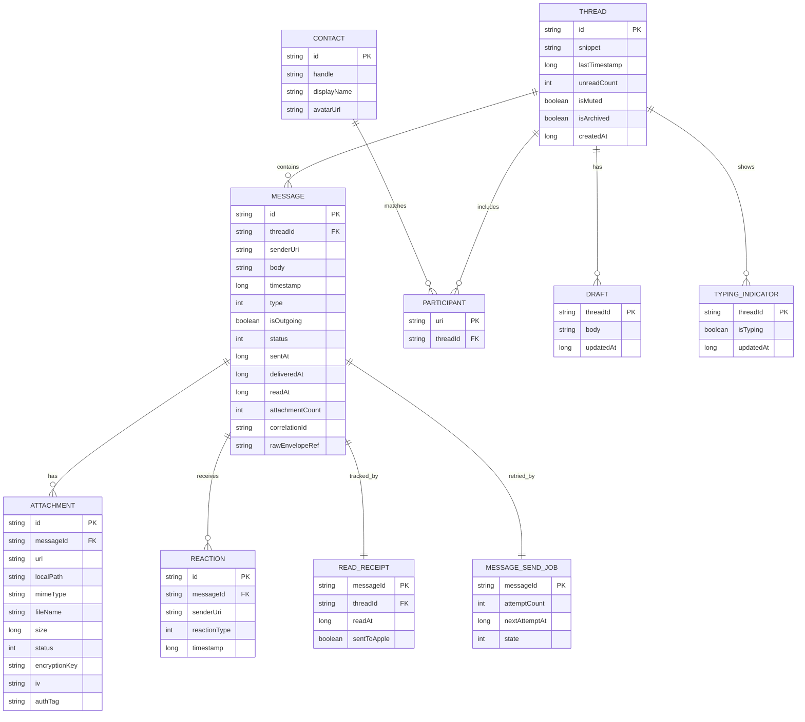

**Field definitions:**

| Entity           | Field           | Type    | Constraints      | Description                                                                 |
| ---------------- | --------------- | ------- | ---------------- | --------------------------------------------------------------------------- |
| MESSAGE          | id              | string  | PK               | UUIDv4 message identifier.                                                  |
| MESSAGE          | threadId        | string  | FK, NOT NULL     | Parent thread identifier.                                                   |
| MESSAGE          | senderUri       | string  | NOT NULL         | `tel:` or `mailto:` URI of the sender.                                      |
| MESSAGE          | body            | string  | NOT NULL         | Decrypted message text; empty for attachment-only.                          |
| MESSAGE          | timestamp       | long    | NOT NULL         | Unix epoch milliseconds (UTC).                                              |
| MESSAGE          | type            | int     | NOT NULL         | `0=TEXT`, `1=ATTACHMENT`, `2=TYPING`, `3=READ_RECEIPT`.                     |
| MESSAGE          | isOutgoing      | boolean | NOT NULL         | `true` if sent from this device.                                            |
| MESSAGE          | status          | int     | NOT NULL         | `0=DRAFT`, `1=SUBMITTED`, `2=SENT`, `3=DELIVERED`, `4=READ`, `5=FAILED`.    |
| MESSAGE          | sentAt          | long    | nullable         | Unix ms when `SENT` receipt received.                                       |
| MESSAGE          | deliveredAt     | long    | nullable         | Unix ms when `DELIVERED` receipt received.                                  |
| MESSAGE          | readAt          | long    | nullable         | Unix ms when `READ` receipt received.                                       |
| MESSAGE          | attachmentCount | int     | NOT NULL         | Number of attachments linked.                                               |
| MESSAGE          | correlationId   | string  | nullable         | IPC correlation ID assigned to `SEND_MESSAGE`.                              |
| MESSAGE          | rawEnvelopeRef  | string  | nullable         | Opaque reference to envelope stored by `rustpush` (not the envelope bytes). |
| THREAD           | id              | string  | PK               | Deterministic hash of sorted participant URIs.                              |
| THREAD           | snippet         | string  | NOT NULL         | Last message snippet.                                                       |
| THREAD           | lastTimestamp   | long    | NOT NULL         | Unix ms of last activity.                                                   |
| THREAD           | unreadCount     | int     | NOT NULL         | Count of unread incoming messages.                                          |
| THREAD           | isMuted         | boolean | NOT NULL         | Mute flag.                                                                  |
| THREAD           | isArchived      | boolean | NOT NULL         | Archive flag.                                                               |
| THREAD           | createdAt       | long    | NOT NULL         | Unix ms thread creation.                                                    |
| PARTICIPANT      | uri             | string  | PK               | Participant URI.                                                            |
| PARTICIPANT      | threadId        | string  | FK, NOT NULL     | Parent thread.                                                              |
| CONTACT          | id              | string  | PK               | UUIDv4 contact identifier.                                                  |
| CONTACT          | handle          | string  | NOT NULL, UNIQUE | `tel:` or `mailto:` URI.                                                    |
| CONTACT          | displayName     | string  | NOT NULL         | Resolved display name.                                                      |
| CONTACT          | avatarUrl       | string  | nullable         | Optional avatar URL.                                                        |
| DRAFT            | threadId        | string  | PK, FK           | Parent thread.                                                              |
| DRAFT            | body            | string  | NOT NULL         | Draft text.                                                                 |
| DRAFT            | updatedAt       | long    | NOT NULL         | Unix ms last update.                                                        |
| ATTACHMENT       | id              | string  | PK               | UUIDv4 attachment identifier.                                               |
| ATTACHMENT       | messageId       | string  | FK, NOT NULL     | Parent message.                                                             |
| ATTACHMENT       | url             | string  | NOT NULL         | iCloud/relay attachment URL.                                                |
| ATTACHMENT       | localPath       | string  | nullable         | Local file path after download.                                             |
| ATTACHMENT       | mimeType        | string  | NOT NULL         | MIME type.                                                                  |
| ATTACHMENT       | fileName        | string  | NOT NULL         | Original file name.                                                         |
| ATTACHMENT       | size            | long    | NOT NULL         | Size in bytes.                                                              |
| ATTACHMENT       | status          | int     | NOT NULL         | `0=PENDING`, `1=DOWNLOADING`, `2=DOWNLOADED`, `3=FAILED`.                   |
| ATTACHMENT       | encryptionKey   | string  | nullable         | Base64 AES-256 key from `rustpush`.                                         |
| ATTACHMENT       | iv              | string  | nullable         | Base64 AES-GCM IV from `rustpush`.                                          |
| ATTACHMENT       | authTag         | string  | nullable         | Base64 AES-GCM auth tag from `rustpush`.                                    |
| REACTION         | id              | string  | PK               | UUIDv4 reaction identifier.                                                 |
| REACTION         | messageId       | string  | FK, NOT NULL     | Parent message.                                                             |
| REACTION         | senderUri       | string  | NOT NULL         | Reaction sender URI.                                                        |
| REACTION         | reactionType    | int     | NOT NULL         | `0=LOVE`, `1=LIKE`, `2=DISLIKE`, `3=LAUGH`, `4=EMPHASIZE`, `5=QUESTION`.    |
| REACTION         | timestamp       | long    | NOT NULL         | Unix ms reaction timestamp.                                                 |
| READ_RECEIPT     | messageId       | string  | PK, FK           | Parent message.                                                             |
| READ_RECEIPT     | threadId        | string  | FK, NOT NULL     | Parent thread.                                                              |
| READ_RECEIPT     | readAt          | long    | NOT NULL         | Unix ms when marked read locally.                                           |
| READ_RECEIPT     | sentToApple     | boolean | NOT NULL         | `true` after `SEND_READ_RECEIPT` ACK.                                       |
| TYPING_INDICATOR | threadId        | string  | PK, FK           | Parent thread.                                                              |
| TYPING_INDICATOR | isTyping        | boolean | NOT NULL         | Current typing state.                                                       |
| TYPING_INDICATOR | updatedAt       | long    | NOT NULL         | Unix ms last update.                                                        |
| MESSAGE_SEND_JOB | messageId       | string  | PK, FK           | Parent message.                                                             |
| MESSAGE_SEND_JOB | attemptCount    | int     | NOT NULL         | Number of send attempts.                                                    |
| MESSAGE_SEND_JOB | nextAttemptAt   | long    | nullable         | Unix ms of next retry.                                                      |
| MESSAGE_SEND_JOB | state           | int     | NOT NULL         | `0=PENDING`, `1=IN_FLIGHT`, `2=PAUSED`, `3=COMPLETED`, `4=FAILED`.          |

---

## 3. Code Architecture

```mermaid
classDiagram
    class IMessagingService {
        <<interface>>
        + val connectionState: StateFlow~MessagingConnectionState~
        + suspend fun sendMessage(message: OutgoingMessage): Result~MessageId~
        + suspend fun requestSync(sinceToken: String?): Result~Unit~
        + suspend fun markThreadRead(threadId: ThreadId): Result~Unit~
        + suspend fun sendTypingIndicator(threadId: ThreadId, isTyping: Boolean): Result~Unit~
    }
    class MessagingService {
        - nativeServiceClient: INativeServiceClient
        - messageRepository: IMessageRepository
        - threadRepository: IThreadRepository
        - draftRepository: IDraftRepository
        - attachmentManager: IAttachmentManager
        - readReceiptService: IReadReceiptService
        - typingIndicatorService: ITypingIndicatorService
        - messageComposer: IMessageComposer
        - threadSynchronizer: IThreadSynchronizer
        - sendJobQueue: MutableMap~MessageId, MessageSendJob~
        + val connectionState: StateFlow~MessagingConnectionState~
        + suspend fun sendMessage(message: OutgoingMessage): Result~MessageId~
        + suspend fun requestSync(sinceToken: String?): Result~Unit~
        + suspend fun markThreadRead(threadId: ThreadId): Result~Unit~
        + suspend fun sendTypingIndicator(threadId: ThreadId, isTyping: Boolean): Result~Unit~
        - suspend fun onMessageReceived(event: MessageReceivedEvent)
        - suspend fun onDeliveryReceipt(event: DeliveryReceiptEvent)
        - suspend fun retryFailedMessages()
    }
    class IMessageRepository {
        <<interface>>
        + fun observeMessages(threadId: ThreadId): Flow~List~Message~~
        + fun observeMessage(messageId: MessageId): Flow~Message?~
        + suspend fun insertMessage(message: Message): Result~Unit~
        + suspend fun updateMessageStatus(messageId: MessageId, status: MessageStatus): Result~Unit~
        + suspend fun updateDeliveryReceipt(messageId: MessageId, deliveredAt: Long): Result~Unit~
        + suspend fun updateReadReceipt(messageId: MessageId, readAt: Long): Result~Unit~
        + suspend fun getMessageById(messageId: MessageId): Message?
        + suspend fun getPendingOutgoing(): List~Message~
    }
    class MessageRepository {
        - messageDao: MessageDao
        - attachmentDao: AttachmentDao
        - reactionDao: ReactionDao
        - readReceiptDao: ReadReceiptDao
        - domainEventDao: DomainEventDao
        + fun observeMessages(threadId: ThreadId): Flow~List~Message~~
        + fun observeMessage(messageId: MessageId): Flow~Message?~
        + suspend fun insertMessage(message: Message): Result~Unit~
        + suspend fun updateMessageStatus(messageId: MessageId, status: MessageStatus): Result~Unit~
        + suspend fun updateDeliveryReceipt(messageId: MessageId, deliveredAt: Long): Result~Unit~
        + suspend fun updateReadReceipt(messageId: MessageId, readAt: Long): Result~Unit~
        + suspend fun getMessageById(messageId: MessageId): Message?
        + suspend fun getPendingOutgoing(): List~Message~
    }
    class IThreadRepository {
        <<interface>>
        + fun observeThreads(): Flow~List~Thread~~
        + fun observeThread(threadId: ThreadId): Flow~Thread?~
        + suspend fun upsertThread(thread: Thread): Result~Unit~
        + suspend fun getThreadById(threadId: ThreadId): Thread?
        + suspend fun incrementUnread(threadId: ThreadId): Result~Unit~
        + suspend fun resetUnread(threadId: ThreadId): Result~Unit~
        + suspend fun updateSnippet(threadId: ThreadId, snippet: String, timestamp: Long): Result~Unit~
    }
    class ThreadRepository {
        - threadDao: ThreadDao
        - participantDao: ParticipantDao
        + fun observeThreads(): Flow~List~Thread~~
        + fun observeThread(threadId: ThreadId): Flow~Thread?~
        + suspend fun upsertThread(thread: Thread): Result~Unit~
        + suspend fun getThreadById(threadId: ThreadId): Thread?
        + suspend fun incrementUnread(threadId: ThreadId): Result~Unit~
        + suspend fun resetUnread(threadId: ThreadId): Result~Unit~
        + suspend fun updateSnippet(threadId: ThreadId, snippet: String, timestamp: Long): Result~Unit~
    }
    class IContactRepository {
        <<interface>>
        + suspend fun resolveContact(uri: Uri): Contact?
        + suspend fun saveContact(contact: Contact): Result~Unit~
        + fun observeContacts(): Flow~List~Contact~~
    }
    class ContactRepository {
        - contactDao: ContactDao
        + suspend fun resolveContact(uri: Uri): Contact?
        + suspend fun saveContact(contact: Contact): Result~Unit~
        + fun observeContacts(): Flow~List~Contact~~
    }
    class IDraftRepository {
        <<interface>>
        + suspend fun saveDraft(threadId: ThreadId, body: String): Result~Unit~
        + suspend fun getDraft(threadId: ThreadId): Draft?
        + suspend fun clearDraft(threadId: ThreadId): Result~Unit~
    }
    class DraftRepository {
        - draftDao: DraftDao
        + suspend fun saveDraft(threadId: ThreadId, body: String): Result~Unit~
        + suspend fun getDraft(threadId: ThreadId): Draft?
        + suspend fun clearDraft(threadId: ThreadId): Result~Unit~
    }
    class IAttachmentManager {
        <<interface>>
        + suspend fun persistAttachmentMetadata(messageId: MessageId, refs: List~AttachmentRef~): Result~Unit~
        + suspend fun scheduleDownload(attachmentId: AttachmentId): Result~Unit~
        + fun observeAttachments(messageId: MessageId): Flow~List~Attachment~~
    }
    class AttachmentManager {
        - attachmentDao: AttachmentDao
        - downloadScheduler: IDownloadScheduler
        + suspend fun persistAttachmentMetadata(messageId: MessageId, refs: List~AttachmentRef~): Result~Unit~
        + suspend fun scheduleDownload(attachmentId: AttachmentId): Result~Unit~
        + fun observeAttachments(messageId: MessageId): Flow~List~Attachment~~
    }
    class IReadReceiptService {
        <<interface>>
        + suspend fun markRead(messageId: MessageId, threadId: ThreadId): Result~Unit~
        + suspend fun sendPendingReadReceipts(): Result~Unit~
    }
    class ReadReceiptService {
        - messageRepository: IMessageRepository
        - nativeServiceClient: INativeServiceClient
        - readReceiptDao: ReadReceiptDao
        + suspend fun markRead(messageId: MessageId, threadId: ThreadId): Result~Unit~
        + suspend fun sendPendingReadReceipts(): Result~Unit~
    }
    class ITypingIndicatorService {
        <<interface>>
        + suspend fun startTyping(threadId: ThreadId): Result~Unit~
        + suspend fun stopTyping(threadId: ThreadId): Result~Unit~
    }
    class TypingIndicatorService {
        - nativeServiceClient: INativeServiceClient
        - typingState: MutableMap~ThreadId, Long~
        - throttleMs: Long
        + suspend fun startTyping(threadId: ThreadId): Result~Unit~
        + suspend fun stopTyping(threadId: ThreadId): Result~Unit~
        - fun shouldSend(threadId: ThreadId): Boolean
    }
    class IMessageComposer {
        <<interface>>
        + fun compose(text: String, recipients: Set~Uri~): Result~OutgoingMessage~
        + fun validate(text: String): ValidationResult
    }
    class MessageComposer {
        - maxLength: Int
        + fun compose(text: String, recipients: Set~Uri~): Result~OutgoingMessage~
        + fun validate(text: String): ValidationResult
        - fun buildThreadId(recipients: Set~Uri~): ThreadId
    }
    class IThreadSynchronizer {
        <<interface>>
        + suspend fun syncThreadFromMessage(message: Message): Result~Thread~
        + suspend fun updateThreadSnippet(threadId: ThreadId): Result~Unit~
    }
    class ThreadSynchronizer {
        - threadRepository: IThreadRepository
        - contactRepository: IContactRepository
        + suspend fun syncThreadFromMessage(message: Message): Result~Thread~
        + suspend fun updateThreadSnippet(threadId: ThreadId): Result~Unit~
        - fun extractSnippet(message: Message): String
    }
    class IMessagePayloadCodec {
        <<interface>>
        + fun encodeSendMessageRequest(message: OutgoingMessage): String
        + fun decodeMessageReceived(payload: JsonObject): Result~IncomingMessage~
        + fun decodeDeliveryReceipt(payload: JsonObject): Result~DeliveryReceipt~
    }
    class MessagePayloadCodec {
        - json: Json
        + fun encodeSendMessageRequest(message: OutgoingMessage): String
        + fun decodeMessageReceived(payload: JsonObject): Result~IncomingMessage~
        + fun decodeDeliveryReceipt(payload: JsonObject): Result~DeliveryReceipt~
    }
    class IConversationListViewModel {
        <<interface>>
        + val uiState: StateFlow~ConversationListUiState~
        + val effects: Flow~ConversationListEffect~
        + fun onThreadClick(threadId: ThreadId)
        + fun onMuteToggle(threadId: ThreadId)
        + fun onArchiveToggle(threadId: ThreadId)
    }
    class ConversationListViewModel {
        - messagingService: IMessagingService
        - threadRepository: IThreadRepository
        - contactRepository: IContactRepository
        + val uiState: StateFlow~ConversationListUiState~
        + val effects: Flow~ConversationListEffect~
        + fun onThreadClick(threadId: ThreadId)
        + fun onMuteToggle(threadId: ThreadId)
        + fun onArchiveToggle(threadId: ThreadId)
    }
    class IThreadViewModel {
        <<interface>>
        + val uiState: StateFlow~ThreadUiState~
        + val effects: Flow~ThreadEffect~
        + fun onSendClick(text: String)
        + fun onDraftChanged(text: String)
        + fun onAttachmentClick(attachmentId: AttachmentId)
        + fun onMarkRead()
    }
    class ThreadViewModel {
        - messagingService: IMessagingService
        - messageRepository: IMessageRepository
        - threadRepository: IThreadRepository
        - draftRepository: IDraftRepository
        - typingIndicatorService: ITypingIndicatorService
        - threadId: ThreadId
        + val uiState: StateFlow~ThreadUiState~
        + val effects: Flow~ThreadEffect~
        + fun onSendClick(text: String)
        + fun onDraftChanged(text: String)
        + fun onAttachmentClick(attachmentId: AttachmentId)
        + fun onMarkRead()
    }
    class MessageDao {
        + @Insert(onConflict = REPLACE) suspend fun upsert(message: MessageEntity)
        + @Query fun observeByThread(threadId: String): Flow~List~MessageEntity~~
        + @Query fun observeById(id: String): Flow~MessageEntity?~
        + @Query suspend fun getById(id: String): MessageEntity?
        + @Query suspend fun getPendingOutgoing(): List~MessageEntity~
        + @Query suspend fun updateStatus(id: String, status: Int)
        + @Query suspend fun updateDeliveryReceipt(id: String, deliveredAt: Long)
        + @Query suspend fun updateReadReceipt(id: String, readAt: Long)
    }
    class ThreadDao {
        + @Insert(onConflict = REPLACE) suspend fun upsert(thread: ThreadEntity)
        + @Query fun observeAll(): Flow~List~ThreadEntity~~
        + @Query fun observeById(id: String): Flow~ThreadEntity?~
        + @Query suspend fun getById(id: String): ThreadEntity?
        + @Query suspend fun incrementUnread(id: String)
        + @Query suspend fun resetUnread(id: String)
        + @Query suspend fun updateSnippet(id: String, snippet: String, timestamp: Long)
    }
    class ParticipantDao {
        + @Insert(onConflict = REPLACE) suspend fun upsert(participant: ParticipantEntity)
        + @Query suspend fun getByThreadId(threadId: String): List~ParticipantEntity~
        + @Query suspend fun deleteByThreadId(threadId: String)
    }
    class ContactDao {
        + @Insert(onConflict = REPLACE) suspend fun upsert(contact: ContactEntity)
        + @Query suspend fun getByHandle(handle: String): ContactEntity?
        + @Query fun observeAll(): Flow~List~ContactEntity~~
    }
    class DraftDao {
        + @Insert(onConflict = REPLACE) suspend fun upsert(draft: DraftEntity)
        + @Query suspend fun getByThreadId(threadId: String): DraftEntity?
        + @Query suspend fun deleteByThreadId(threadId: String)
    }
    class AttachmentDao {
        + @Insert(onConflict = REPLACE) suspend fun upsert(attachment: AttachmentEntity)
        + @Query fun observeByMessageId(messageId: String): Flow~List~AttachmentEntity~~
        + @Query suspend fun getById(id: String): AttachmentEntity?
        + @Query suspend fun updateStatus(id: String, status: Int)
    }
    class ReadReceiptDao {
        + @Insert(onConflict = REPLACE) suspend fun upsert(receipt: ReadReceiptEntity)
        + @Query suspend fun getPending(): List~ReadReceiptEntity~
        + @Query suspend fun markSent(messageId: String)
    }

    IMessagingService <|.. MessagingService : implements
    IMessageRepository <|.. MessageRepository : implements
    IThreadRepository <|.. ThreadRepository : implements
    IContactRepository <|.. ContactRepository : implements
    IDraftRepository <|.. DraftRepository : implements
    IAttachmentManager <|.. AttachmentManager : implements
    IReadReceiptService <|.. ReadReceiptService : implements
    ITypingIndicatorService <|.. TypingIndicatorService : implements
    IMessageComposer <|.. MessageComposer : implements
    IThreadSynchronizer <|.. ThreadSynchronizer : implements
    IMessagePayloadCodec <|.. MessagePayloadCodec : implements
    IConversationListViewModel <|.. ConversationListViewModel : implements
    IThreadViewModel <|.. ThreadViewModel : implements

    MessagingService --> INativeServiceClient : uses
    MessagingService --> IMessageRepository : uses
    MessagingService --> IThreadRepository : uses
    MessagingService --> IDraftRepository : uses
    MessagingService --> IAttachmentManager : uses
    MessagingService --> IReadReceiptService : uses
    MessagingService --> ITypingIndicatorService : uses
    MessagingService --> IMessageComposer : uses
    MessagingService --> IThreadSynchronizer : uses
    MessagingService --> IMessagePayloadCodec : uses
    MessageRepository --> MessageDao : uses
    MessageRepository --> AttachmentDao : uses
    MessageRepository --> ReactionDao : uses
    MessageRepository --> ReadReceiptDao : uses
    ThreadRepository --> ThreadDao : uses
    ThreadRepository --> ParticipantDao : uses
    ContactRepository --> ContactDao : uses
    DraftRepository --> DraftDao : uses
    AttachmentManager --> AttachmentDao : uses
    ReadReceiptService --> INativeServiceClient : uses
    ReadReceiptService --> IMessageRepository : uses
    ReadReceiptService --> ReadReceiptDao : uses
    TypingIndicatorService --> INativeServiceClient : uses
    MessageComposer --> IThreadSynchronizer : uses
    ThreadSynchronizer --> IThreadRepository : uses
    ThreadSynchronizer --> IContactRepository : uses
    ConversationListViewModel --> IMessagingService : uses
    ConversationListViewModel --> IThreadRepository : uses
    ConversationListViewModel --> IContactRepository : uses
    ThreadViewModel --> IMessagingService : uses
    ThreadViewModel --> IMessageRepository : uses
    ThreadViewModel --> IThreadRepository : uses
    ThreadViewModel --> IDraftRepository : uses
    ThreadViewModel --> ITypingIndicatorService : uses
```

**Module boundaries:**

| Component                   | Responsibility                                                                  | Owned By                          |
| --------------------------- | ------------------------------------------------------------------------------- | --------------------------------- |
| `MessagingService`          | Orchestrate send/receive lifecycle, retry, sync, and IPC event routing.         | Messaging bounded context         |
| `MessageRepository`         | Message CRUD, status updates, delivery/read receipt application, Flow exposure. | Local Messaging & Storage context |
| `ThreadRepository`          | Thread upsert, observation, unread counters, snippet updates.                   | Local Messaging & Storage context |
| `ContactRepository`         | Contact resolution and persistence.                                             | Local Messaging & Storage context |
| `DraftRepository`           | Per-thread draft persistence.                                                   | Messaging bounded context         |
| `AttachmentManager`         | Attachment metadata persistence and download scheduling.                        | Messaging bounded context         |
| `ReadReceiptService`        | Mark messages read locally and send `SEND_READ_RECEIPT` via IPC.                | Messaging bounded context         |
| `TypingIndicatorService`    | Throttle and send `SEND_TYPING` via IPC.                                        | Messaging bounded context         |
| `MessageComposer`           | Build outgoing messages, validate length, generate thread ID.                   | Messaging bounded context         |
| `ThreadSynchronizer`        | Maintain thread ordering, snippet extraction, participant deduplication.        | Messaging bounded context         |
| `MessagePayloadCodec`       | Serialize/deserialize IPC JSON payloads for messaging commands/events.          | Messaging bounded context         |
| `ConversationListViewModel` | Expose thread list UI state and effects.                                        | UI & Presentation bounded context |
| `ThreadViewModel`           | Expose message list UI state, send, draft, and read/typing actions.             | UI & Presentation bounded context |

---

## 4. Component Interactions

### 4.1 Send Text Message

```mermaid
sequenceDiagram
    autonumber
    actor U as User
    participant TVM as ThreadViewModel
    participant MC as MessageComposer
    participant MS as MessagingService
    participant MPC as MessagePayloadCodec
    participant NC as NativeServiceClient
    participant RP as rustpush
    participant MR as MessageRepository
    participant TR as ThreadRepository
    participant DB as Room Database

    U->>+TVM: onSendClick("hello")
    TVM->>+MC: compose("hello", recipients)
    MC->>MC: validate length
    MC->>MC: buildThreadId(recipients)
    MC-->>-TVM: OutgoingMessage(id, threadId, body)
    TVM->>+MS: sendMessage(outgoingMessage)
    MS->>+MR: insertMessage(status=DRAFT)
    MR->>DB: INSERT MessageEntity
    DB-->>-MR: success
    MR-->>-MS: Result.success
    MS->>MS: update status to SUBMITTED
    MS->>+MPC: encodeSendMessageRequest(message)
    MPC-->>-MS: JSON payload
    MS->>+NC: sendCommand(SEND_MESSAGE)
    NC->>+RP: SEND_MESSAGE {message_id, recipients, text}
    RP-->>-NC: ACK {message_id}
    NC-->>-MS: Result.success
    MS->>+MR: updateMessageStatus(SUBMITTED)
    MR->>DB: UPDATE status
    DB-->>-MR: success
    MR-->>-MS: Result.success
    MS->>+TR: updateSnippet(threadId, "hello", now)
    TR->>DB: UPSERT ThreadEntity
    DB-->>-TR: success
    TR-->>-MS: Result.success
    MS-->>-TVM: Result.success(messageId)
    TVM->>TVM: clear draft

    Note over RP,MS: Later: DELIVERY_RECEIPT(SENT/DELIVERED)
    RP->>+NC: MESSAGE_RECEIVED (delivery receipt)
    NC->>MS: onDeliveryReceipt(event)
    MS->>+MR: updateMessageStatus(DELIVERED)
    MR->>DB: UPDATE status + deliveredAt
    DB-->>-MR: success
```

**Preconditions:** `AuthState` is `Activated`; `NativeServiceClient` connected; recipients are valid URIs.
**Postconditions:** Message persisted with `status=SUBMITTED`; thread snippet updated; delivery receipt will update status asynchronously.

### 4.2 Receive Incoming Message

```mermaid
sequenceDiagram
    autonumber
    participant APN as Apple APNs
    participant RP as rustpush
    participant UP as UnifiedPush Distributor
    participant PR as PushReceiver
    participant PH as PushHandler
    participant MS as MessagingService
    participant MPC as MessagePayloadCodec
    participant MR as MessageRepository
    participant TR as ThreadRepository
    participant CR as ContactRepository
    participant DB as Room Database

    APN->>+RP: TLS push payload
    RP->>RP: decrypt and build UnifiedPush message
    RP->>+UP: POST {type: MESSAGE_DELIVERY, data: base64}
    UP-->>-RP: 200 OK
    UP->>+PR: onMessage
    PR->>+PH: handlePush
    PH->>PH: decode base64
    PH->>+MS: handleIncomingPush(type, payload)
    MS->>+MPC: decodeMessageReceived(payload)
    MPC-->>-MS: IncomingMessage
    MS->>+MR: insertMessage(status=DELIVERED)
    MR->>DB: INSERT MessageEntity
    DB-->>-MR: success
    MS->>+TR: incrementUnread(threadId)
    TR->>DB: UPDATE unreadCount
    DB-->>-TR: success
    MS->>+TR: updateSnippet(threadId, snippet, timestamp)
    TR->>DB: UPSERT ThreadEntity
    DB-->>-TR: success
    MS->>+CR: resolveContact(senderUri)
    CR-->>-MS: Contact?
    MS-->>-PH: Result.success
    PH-->>-PR: ack
    PR-->>-UP: ack
```

**Preconditions:** `rustpush` connected to APNs; UnifiedPush distributor registered; app can receive pushes.
**Postconditions:** Incoming message and thread persisted; unread counter incremented; push acknowledged.

### 4.3 Mark Thread as Read

```mermaid
sequenceDiagram
    autonumber
    actor U as User
    participant TVM as ThreadViewModel
    participant MS as MessagingService
    participant RRS as ReadReceiptService
    participant MR as MessageRepository
    participant TR as ThreadRepository
    participant NC as NativeServiceClient
    participant RP as rustpush
    participant DB as Room Database

    U->>+TVM: onMarkRead()
    TVM->>+MS: markThreadRead(threadId)
    MS->>+MR: getUnreadIncoming(threadId)
    MR->>DB: SELECT unread incoming
    DB-->>-MR: list
    MR-->>-MS: unread messages
    loop for each unread message
        MS->>+RRS: markRead(messageId, threadId)
        RRS->>+MR: updateMessageStatus(READ)
        MR->>DB: UPDATE status + readAt
        DB-->>-MR: success
        RRS->>+NC: sendCommand(SEND_READ_RECEIPT)
        NC->>+RP: SEND_READ_RECEIPT {message_id, thread_id}
        RP-->>-NC: ACK
        NC-->>-RRS: Result.success
        RRS->>RRS: mark sentToApple=true
    end
    MS->>+TR: resetUnread(threadId)
    TR->>DB: UPDATE unreadCount=0
    DB-->>-TR: success
    TR-->>-MS: Result.success
    MS-->>-TVM: Result.success
```

**Preconditions:** Thread has unread incoming messages; `NativeServiceClient` connected.
**Postconditions:** Messages marked `READ`; read receipts sent to Apple; unread counter reset.

### 4.4 Send Typing Indicator

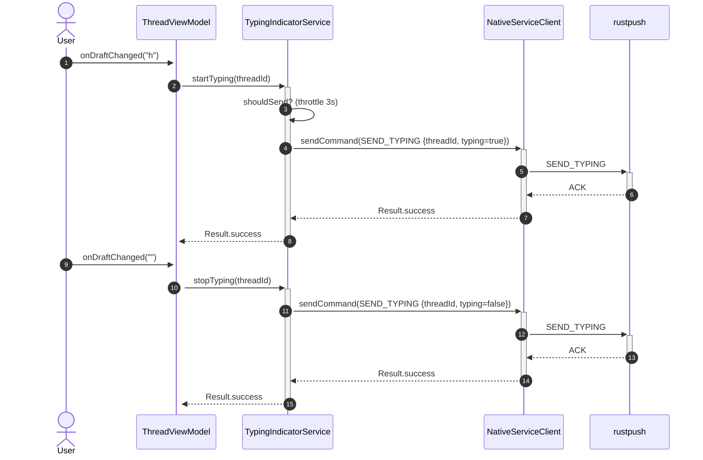

**Preconditions:** `NativeServiceClient` connected; typing throttle window elapsed.
**Postconditions:** `SEND_TYPING` command sent to `rustpush`.

### 4.5 Sync Messages on Request

```mermaid
sequenceDiagram
    autonumber
    participant MS as MessagingService
    participant NC as NativeServiceClient
    participant RP as rustpush
    participant MPC as MessagePayloadCodec
    participant MR as MessageRepository
    participant TR as ThreadRepository
    participant DB as Room Database

    MS->>MS: requestSync(sinceToken)
    MS->>+NC: sendCommand(REQUEST_SYNC {sinceToken})
    NC->>+RP: REQUEST_SYNC
    RP-->>-NC: SYNC_RESPONSE {messages[], syncToken}
    NC-->>-MS: Result.success
    MS->>+MPC: decodeMessageReceived for each
    MPC-->>-MS: IncomingMessage list
    loop for each message
        MS->>+MR: insertMessage(status=DELIVERED)
        MR->>DB: INSERT or IGNORE
        DB-->>-MR: success
        MS->>+TR: updateSnippet(threadId, snippet, timestamp)
        TR->>DB: UPSERT ThreadEntity
        DB-->>-TR: success
    end
    MS->>MS: persist syncToken
```

**Preconditions:** `NativeServiceClient` connected; `AuthState` is `Activated`.
**Postconditions:** New messages since `sinceToken` persisted; sync token updated.

### 4.6 Retry Failed Outgoing Messages

```mermaid
sequenceDiagram
    autonumber
    participant BW as BackgroundSyncWorker
    participant MS as MessagingService
    participant MR as MessageRepository
    participant NC as NativeServiceClient
    participant RP as rustpush
    participant DB as Room Database

    BW->>+MS: retryFailedMessages()
    MS->>+MR: getPendingOutgoing()
    MR->>DB: SELECT status=FAILED or SUBMITTED
    DB-->>-MR: list
    MR-->>-MS: pending messages
    loop for each retryable message
        MS->>MS: check nextAttemptAt <= now
        MS->>MS: check attemptCount < 5
        MS->>+NC: sendCommand(SEND_MESSAGE)
        NC->>+RP: SEND_MESSAGE
        RP-->>-NC: ACK
        NC-->>-MS: Result.success
        MS->>+MR: updateMessageStatus(SUBMITTED)
        MS->>MR: increment attemptCount
        MR->>DB: UPDATE
        DB-->>-MR: success
    end
    MS->>MS: mark messages with attemptCount >= 5 as Failed
    MS-->>-BW: Result.success
```

**Preconditions:** Background sync triggered; pending messages exist.
**Postconditions:** Retryable messages re-submitted (max 5 attempts total); failed messages marked terminal after 5 attempts with exponential backoff (1s, 2s, 4s, 8s, 16s).

---

## 5. Stateful Behavior

### 5.1 Message Status

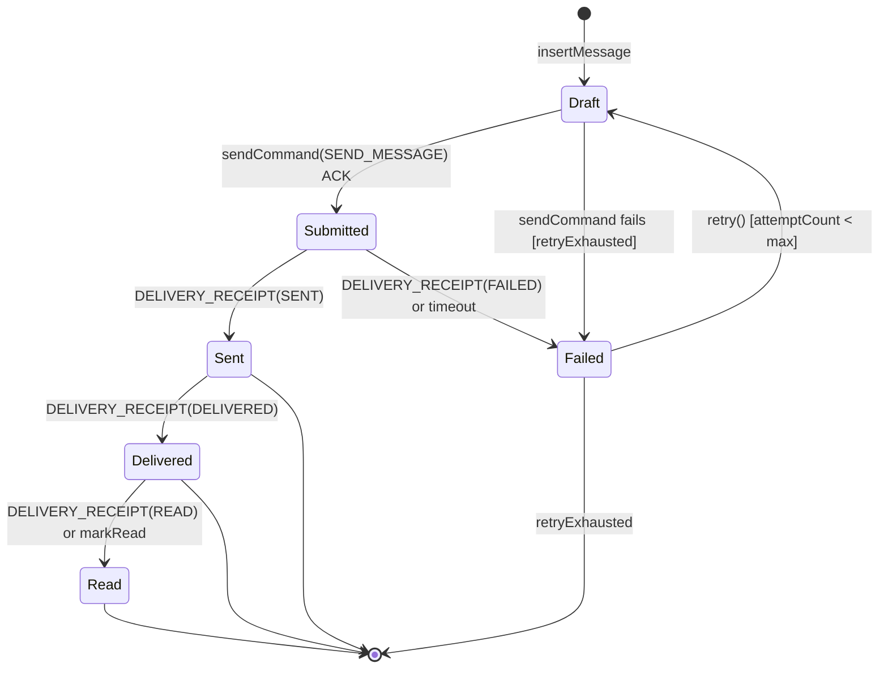

**Transition table:**

| From      | To        | Trigger                                | Guard                    | Action                                                         |
| --------- | --------- | -------------------------------------- | ------------------------ | -------------------------------------------------------------- |
| Draft     | Submitted | `sendCommand(SEND_MESSAGE)` ACK        | `NativeServiceClient` OK | Update `status=SUBMITTED`; set `correlationId`.                |
| Draft     | Failed    | `sendCommand` fails                    | attemptCount >= 5        | Update `status=FAILED`; record failure.                        |
| Submitted | Sent      | `DELIVERY_RECEIPT(SENT)`               | message ID matches       | Update `status=SENT`; set `sentAt`.                            |
| Submitted | Failed    | `DELIVERY_RECEIPT(FAILED)` or timeout  | attemptCount >= 5        | Update `status=FAILED`.                                        |
| Sent      | Delivered | `DELIVERY_RECEIPT(DELIVERED)`          | message ID matches       | Update `status=DELIVERED`; set `deliveredAt`.                  |
| Delivered | Read      | `DELIVERY_RECEIPT(READ)` or `markRead` | message ID matches       | Update `status=READ`; set `readAt`.                            |
| Failed    | Draft     | `retry()`                              | `attemptCount < 5`       | Increment `attemptCount`; reschedule with exponential backoff. |
| Failed    | [*]       | `retryExhausted()`                     | `attemptCount >= 5`      | Terminal failure; notify user.                                 |

### 5.2 Draft

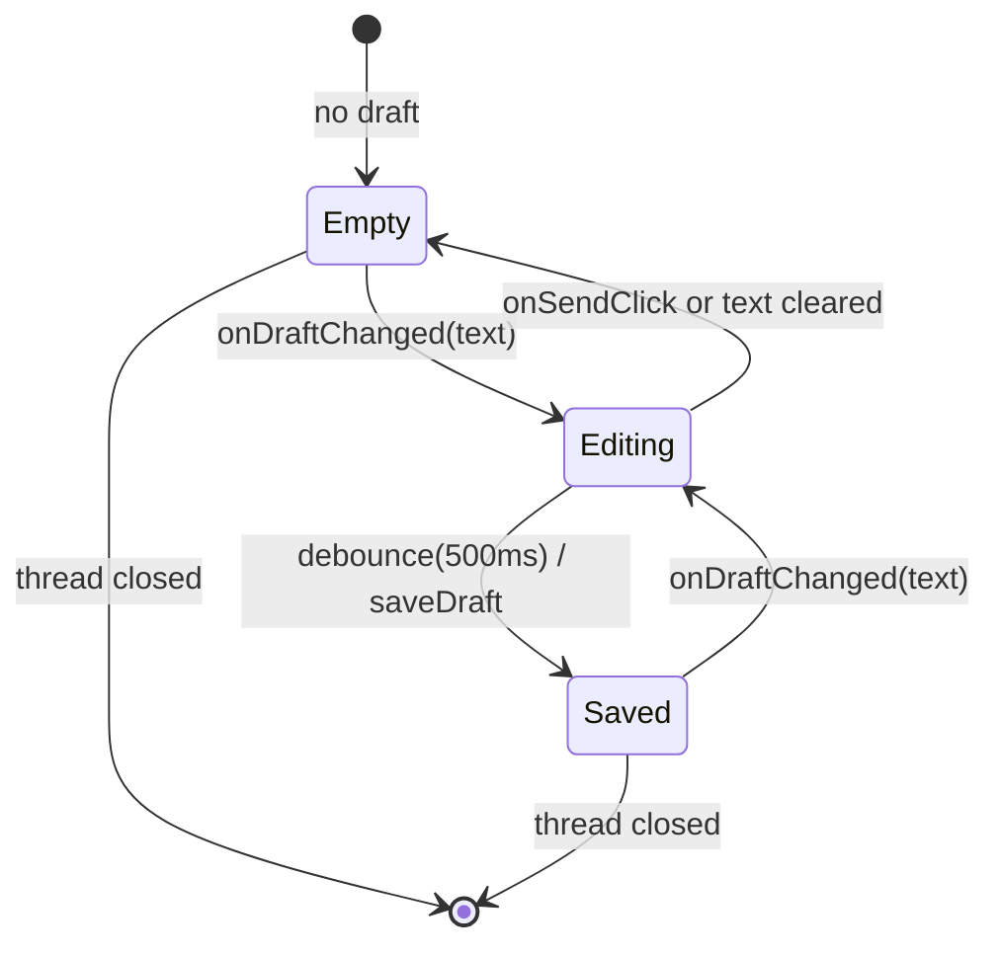

**Transition table:**

| From    | To      | Trigger                | Guard            | Action                       |
| ------- | ------- | ---------------------- | ---------------- | ---------------------------- |
| Empty   | Editing | `onDraftChanged(text)` | `text` non-empty | Update UI state.             |
| Editing | Saved   | debounce 500ms         | —                | Persist `DraftEntity`.       |
| Saved   | Editing | `onDraftChanged(text)` | text changed     | Update UI and schedule save. |
| Editing | Empty   | `onSendClick`          | message sent     | Clear draft in DB and UI.    |
| Editing | Empty   | text cleared           | —                | Delete `DraftEntity`.        |

### 5.3 Thread

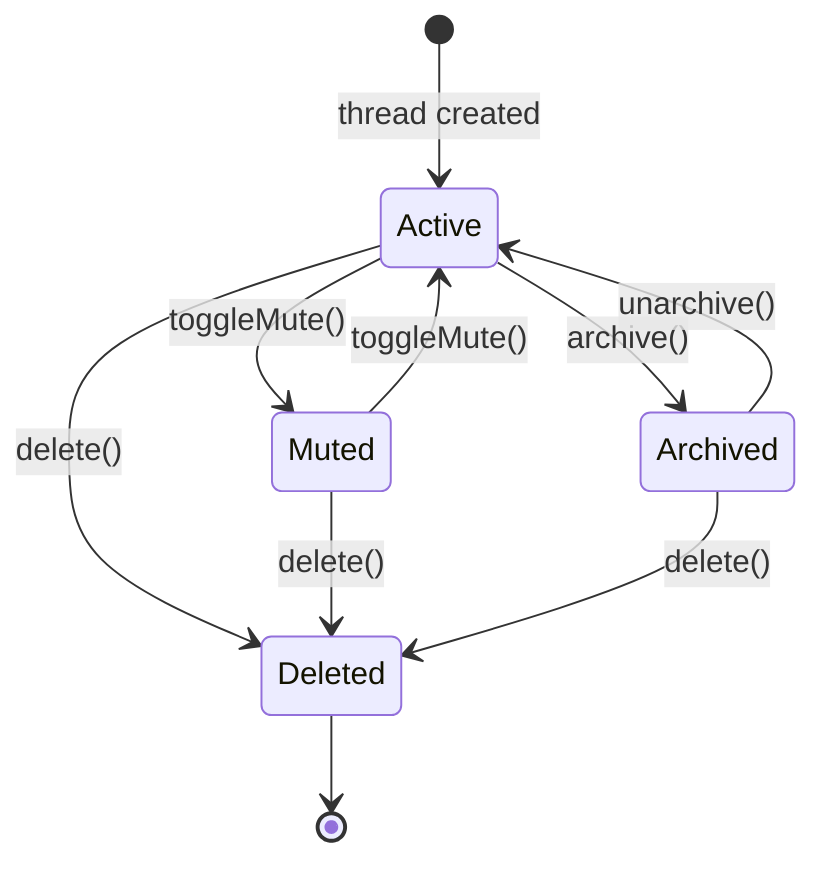

**Transition table:**

| From     | To       | Trigger        | Guard | Action                                |
| -------- | -------- | -------------- | ----- | ------------------------------------- |
| Active   | Muted    | `toggleMute()` | —     | Set `isMuted=true`.                   |
| Muted    | Active   | `toggleMute()` | —     | Set `isMuted=false`.                  |
| Active   | Archived | `archive()`    | —     | Set `isArchived=true`.                |
| Archived | Active   | `unarchive()`  | —     | Set `isArchived=false`.               |
| Active   | Deleted  | `delete()`     | —     | Delete thread and messages (cascade). |
| Muted    | Deleted  | `delete()`     | —     | Delete thread and messages.           |
| Archived | Deleted  | `delete()`     | —     | Delete thread and messages.           |

---

## 6. Algorithmic Logic

### 6.1 Build Thread ID

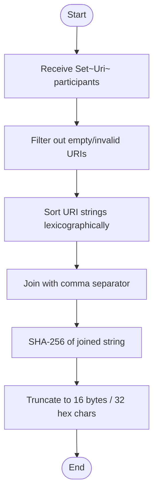

### 6.2 Send Message Orchestration

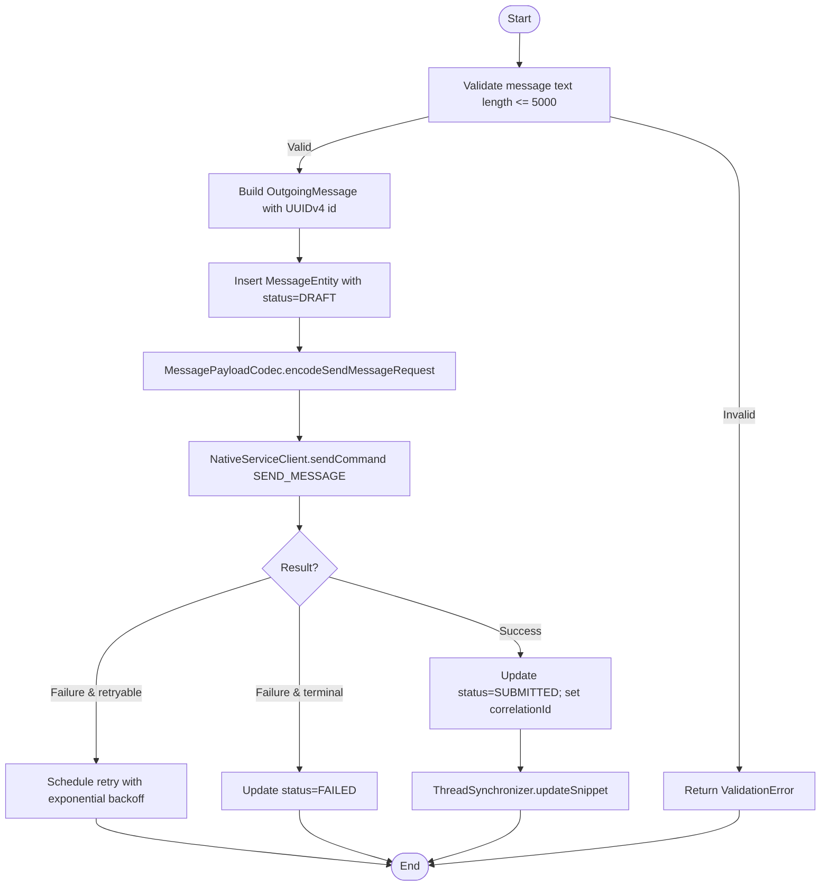

### 6.3 Handle Incoming Message

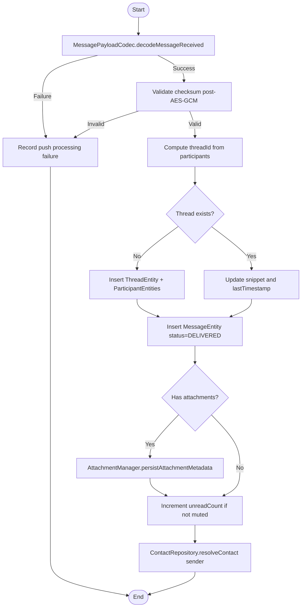

### 6.4 Apply Delivery Receipt

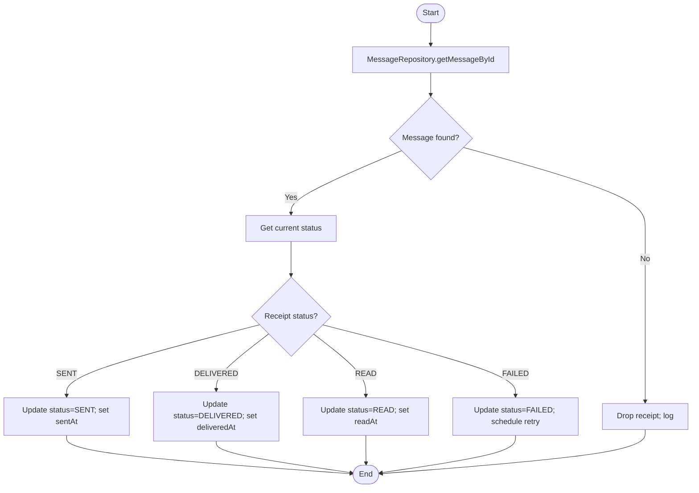

### 6.5 Typing Indicator Throttle

```mermaid
flowchart TD
    Start([Start]) --> Input[Receive startTyping(threadId)]
    Input --> Now[Get current time]
    Now --> Last[Get lastSentAt for threadId]
    Last --> Delta[delta = now - lastSentAt]
    Delta --> Check{delta >= throttleMs?}
    Check -->|No| Skip[Skip sending]
    Check -->|Yes| Send[Send SEND_TYPING true via NativeServiceClient]
    Send --> Update[Update lastSentAt = now]
    Skip --> End([End])
    Update --> End
```

---

## 7. Exhaustive Test Matrix

### 7.1 Unit Paths

| Target                                         | Scenario                       | Input                        | Expected Output                                    | Assertion                                                 |
| ---------------------------------------------- | ------------------------------ | ---------------------------- | -------------------------------------------------- | --------------------------------------------------------- |
| `MessageComposer.compose`                      | Valid text                     | `"hello", {recipients}`      | `OutgoingMessage` with UUIDv4 id and threadId      | `assertNotNull(result.id)`                                |
| `MessageComposer.compose`                      | Text too long                  | `5001 chars`, {recipients}   | `ValidationError`                                  | `assertTrue(result.isFailure)`                            |
| `MessageComposer.compose`                      | Empty recipients               | `"hello", {}`                | `ValidationError`                                  | `assertTrue(result.isFailure)`                            |
| `MessageComposer.buildThreadId`                | Same participants              | `{mailto:a@b.com, tel:+123}` | Same threadId for any order                        | `assertEquals(id1, id2)`                                  |
| `MessagePayloadCodec.encodeSendMessageRequest` | Valid outgoing message         | `OutgoingMessage`            | JSON with `message_id`, `recipients`, `text`       | `assertTrue(json.contains("message_id"))`                 |
| `MessagePayloadCodec.decodeMessageReceived`    | Valid MESSAGE_RECEIVED payload | `JsonObject`                 | `IncomingMessage` with correct fields              | `assertEquals("hello", result.text)`                      |
| `MessagePayloadCodec.decodeDeliveryReceipt`    | Valid DELIVERED receipt        | `JsonObject`                 | `DeliveryReceipt` status DELIVERED                 | `assertEquals(DELIVERED, result.status)`                  |
| `MessagingService.sendMessage`                 | Connected native service       | `OutgoingMessage`            | `Result.success(MessageId)`; status=SUBMITTED      | `assertEquals(SUBMITTED, message.status)`                 |
| `MessagingService.sendMessage`                 | Disconnected native service    | `OutgoingMessage`            | `Result.failure`; status=FAILED or retry scheduled | `assertEquals(FAILED, message.status)`                    |
| `MessagingService.onMessageReceived`           | Incoming text message          | `MessageReceivedEvent`       | Message inserted; thread snippet updated           | `assertNotNull(messageRepository.getById(id))`            |
| `MessagingService.onDeliveryReceipt`           | SENT receipt                   | `DeliveryReceiptEvent(SENT)` | Message status updated to SENT                     | `assertEquals(SENT, message.status)`                      |
| `ReadReceiptService.markRead`                  | Incoming unread message        | `messageId, threadId`        | Status READ; SEND_READ_RECEIPT command sent        | `verify(nativeClient).sendCommand(...)`                   |
| `TypingIndicatorService.startTyping`           | First keystroke                | `threadId`                   | SEND_TYPING sent                                   | `verify(nativeClient).sendCommand(...)`                   |
| `TypingIndicatorService.startTyping`           | Within throttle window         | `threadId` (sent 1s ago)     | No command sent                                    | `verify(nativeClient, never()).sendCommand(...)`          |
| `ThreadSynchronizer.syncThreadFromMessage`     | New participants               | `Message`                    | New ThreadEntity created                           | `assertNotNull(threadRepository.getById(threadId))`       |
| `ThreadSynchronizer.updateThreadSnippet`       | Existing thread                | `threadId`                   | Snippet matches last message                       | `assertEquals("hello", thread.snippet)`                   |
| `MessageRepository.insertMessage`              | Valid message                  | `Message`                    | DB row exists                                      | `assertNotNull(dao.getById(id))`                          |
| `MessageRepository.updateMessageStatus`        | DRAFT to SUBMITTED             | `messageId, SUBMITTED`       | DB status updated                                  | `assertEquals(SUBMITTED, dao.getById(id).status)`         |
| `ThreadRepository.incrementUnread`             | Existing thread                | `threadId`                   | `unreadCount` incremented by 1                     | `assertEquals(1, thread.unreadCount)`                     |
| `DraftRepository.saveDraft`                    | Non-empty text                 | `threadId, "draft"`          | Draft persisted                                    | `assertEquals("draft", dao.getByThreadId(threadId).body)` |
| `ConversationListViewModel.uiState`            | Threads loaded                 | 2 threads in DB              | `uiState.threads` size 2                           | `assertEquals(2, uiState.threads.size)`                   |
| `ThreadViewModel.onSendClick`                  | Valid text                     | `"hello"`                    | `MessagingService.sendMessage` called              | `verify(messagingService).sendMessage(...)`               |

### 7.2 Integration Paths

| Flow                               | Steps | Mocked                          | Verified                                          | Result |
| ---------------------------------- | ----- | ------------------------------- | ------------------------------------------------- | ------ |
| 4.1 Send Text Message              | 1–19  | `rustpush` as local socket mock | Message persisted, ACK received, status=SUBMITTED | Pass   |
| 4.2 Receive Incoming Message       | 1–18  | UnifiedPush distributor mock    | Message in Room, thread snippet updated           | Pass   |
| 4.3 Mark Thread as Read            | 1–14  | `rustpush` as local socket mock | Messages READ, receipts sent, unread=0            | Pass   |
| 4.4 Send Typing Indicator          | 1–10  | `rustpush` as local socket mock | SEND_TYPING commands sent                         | Pass   |
| 4.5 Sync Messages on Request       | 1–12  | `rustpush` as local socket mock | New messages persisted, sync token updated        | Pass   |
| 4.6 Retry Failed Outgoing Messages | 1–10  | `rustpush` as local socket mock | Failed messages re-sent                           | Pass   |
| Full send → receive round-trip     | Full  | `rustpush` end-to-end mock      | Outgoing and incoming messages both persisted     | Pass   |
| Thread list observation with Flow  | Full  | Room in-memory DB               | UI state updates on new message                   | Pass   |

### 7.3 Edge Cases & Failure Modes

| Condition                         | Stimulus                          | Expected Behavior                                         | Invariant Preserved         |
| --------------------------------- | --------------------------------- | --------------------------------------------------------- | --------------------------- |
| Duplicate message ID              | Insert same `Message.id` twice    | Second insert ignored or updates existing                 | Uniqueness                  |
| Send ACK timeout                  | No ACK within 10s                 | Status=FAILED; retry scheduled                            | No duplicate sends          |
| rustpush disconnect mid-send      | `onFailure` during `SEND_MESSAGE` | Message queued; reconnect with backoff                    | No message loss             |
| Incoming message with no text     | `text=null` in MESSAGE_RECEIVED   | Persisted with empty body                                 | Data integrity              |
| Incoming message unknown sender   | Sender URI not in contacts        | Insert message; contact unresolved                        | No crash                    |
| Thread with single participant    | Single URI set                    | Thread ID deterministic; no crash                         | Deterministic IDs           |
| Message with 5 attachments        | 5 `AttachmentRef` payloads        | 5 `AttachmentEntity` rows inserted; `attachmentCount=5`   | Referential integrity       |
| Muted thread incoming message     | `isMuted=true`                    | Unread counter not incremented                            | Mute semantics              |
| Read receipt for outgoing message | User marks own message read       | No `SEND_READ_RECEIPT` sent                               | Only incoming read receipts |
| Typing indicator flood            | 10 keystrokes within 3s           | Only first `SEND_TYPING` sent                             | Throttle                    |
| Sync token unchanged              | `REQUEST_SYNC` returns empty list | No DB changes; token persisted                            | Idempotency                 |
| Corrupted MESSAGE_RECEIVED JSON   | Missing required field            | Record processing failure; no crash                       | Robustness                  |
| Attachment metadata missing URL   | `AttachmentRef.url` empty         | `AttachmentEntity` inserted with status FAILED or skipped | Data integrity              |

### 7.4 Invariant Checks

| Invariant                              | Enforcement Point                   | Verification Test                                      |
| -------------------------------------- | ----------------------------------- | ------------------------------------------------------ |
| Only whitelisted dependencies          | `build.gradle.kts`                  | `LightSdkPlugin` whitelist test                        |
| Message UUID uniqueness                | `MessageComposer.compose`           | UUIDv4 format and uniqueness test                      |
| Thread ID deterministic                | `MessageComposer.buildThreadId`     | Same participants produce same ID                      |
| Status transitions valid               | `MessageStatusUpdater`              | Invalid transition rejection test                      |
| Plaintext stored in Room               | `MessageRepository.insertMessage`   | DB inspection confirms unencrypted body                |
| Read receipts only for incoming        | `ReadReceiptService.markRead`       | Outgoing message read → no `SEND_READ_RECEIPT`         |
| Typing throttle 3s                     | `TypingIndicatorService.shouldSend` | Multiple calls within window → one command             |
| No direct Apple connection from Kotlin | `MessagingService`                  | No APNs/Apple host references in code                  |
| Outgoing message persisted before send | `MessagingService.sendMessage`      | DB row exists before `NativeServiceClient.sendCommand` |
| Unread counter only for incoming       | `ThreadRepository.incrementUnread`  | Outgoing message → unread unchanged                    |

---

## 8. Task Dependencies

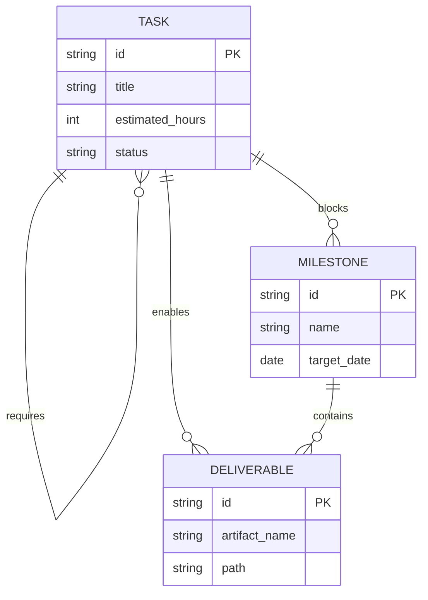

**Dependency rules:**

- A `Task` with status `blocked` must have an uncompleted `requires` `Task`.
- A `Milestone` is `achievable` only when all `blocks` `Task`s are complete.
- A `Deliverable` is `available` only when all `enables` `Task`s are complete.

**Task dependency graph:**

| Task ID  | Requires           | Blocks Story | Enables Deliverable |
| -------- | ------------------ | ------------ | ------------------- |
| TASK_001 | —                  | S1           | DEL_001             |
| TASK_002 | TASK_001           | S1           | DEL_002             |
| TASK_003 | TASK_001           | S1           | DEL_003             |
| TASK_004 | TASK_002, TASK_003 | S2           | DEL_004             |
| TASK_005 | TASK_002, TASK_003 | S2           | DEL_005             |
| TASK_006 | TASK_004, TASK_005 | S2           | DEL_006             |
| TASK_007 | TASK_004, TASK_005 | S2           | DEL_007             |
| TASK_008 | TASK_006, TASK_007 | S3           | DEL_008             |
| TASK_009 | TASK_006, TASK_007 | S3           | DEL_009             |
| TASK_010 | TASK_008, TASK_009 | S3           | DEL_010             |
| TASK_011 | TASK_010           | S4           | DEL_011             |
| TASK_012 | TASK_010           | S4           | DEL_012             |
| TASK_013 | TASK_011, TASK_012 | S4           | DEL_013             |
| TASK_014 | TASK_013           | S5           | DEL_014             |
| TASK_015 | TASK_014           | S5           | DEL_015             |

---

## 9. Implementation Timeline

```mermaid
gantt
    title LightOS iMessage Client — Milestone 5 Messaging Service Implementation Plan
    dateFormat  YYYY-MM-DD
    axisFormat  %m/%d

    section Data & Repositories
    TASK_001 :a1, 2026-07-18, 4h
    TASK_002 :a2, after a1, 4h
    TASK_003 :a3, after a1, 4h

    section Domain Services
    TASK_004 :b1, after a2, after a3, 4h
    TASK_005 :b2, after a2, after a3, 4h
    TASK_006 :b3, after b1, 4h
    TASK_007 :b4, after b2, 4h

    section Messaging Orchestration
    TASK_008 :c1, after b3, after b4, 4h
    TASK_009 :c2, after b3, after b4, 4h
    TASK_010 :c3, after c1, after c2, 4h

    section ViewModels
    TASK_011 :d1, after c3, 4h
    TASK_012 :d2, after c3, 4h

    section Verification
    TASK_013 :e1, after d1, after d2, 4h
    TASK_014 :e2, after e1, 4h
    TASK_015 :e3, after e2, 2h

    section Stories
    story S1 Data & Repositories Ready :milestone, after a3, 0h
    story S2 Domain Services Ready :milestone, after b4, 0h
    story S3 Messaging Orchestration Ready :milestone, after c3, 0h
    story S4 ViewModels Ready :milestone, after d2, 0h
    story S5 Milestone 5 Review :milestone, after e3, 0h
```

**Task list:**

| ID       | Title                                                                                                                                                        | Est. Hours | Start                    | Dependencies       | Owner              |
| -------- | ------------------------------------------------------------------------------------------------------------------------------------------------------------ | ---------- | ------------------------ | ------------------ | ------------------ |
| TASK_001 | Define Room entities and DAOs for `Message`, `Thread`, `Participant`, `Draft`, `Attachment`, `Reaction`, `ReadReceipt`, and `TypingIndicator`.               | 4          | 2026-07-18               | None               | Data Engineer      |
| TASK_002 | Implement `MessageRepository` with `Flow` observation, status updates, and receipt application.                                                              | 4          | after TASK_001           | TASK_001           | Data Engineer      |
| TASK_003 | Implement `ThreadRepository`, `ContactRepository`, and `DraftRepository` with upsert and unread counter logic.                                               | 4          | after TASK_001           | TASK_001           | Data Engineer      |
| TASK_004 | Implement `MessageComposer` for outgoing message construction, validation, and deterministic thread ID generation.                                           | 4          | after TASK_002, TASK_003 | TASK_002, TASK_003 | Protocol Engineer  |
| TASK_005 | Implement `MessagePayloadCodec` for IPC JSON serialization of `SEND_MESSAGE` requests and deserialization of `MESSAGE_RECEIVED` / `DELIVERY_RECEIPT` events. | 4          | after TASK_002, TASK_003 | TASK_002, TASK_003 | Protocol Engineer  |
| TASK_006 | Implement `ThreadSynchronizer` for snippet extraction, participant deduplication, and thread ordering.                                                       | 4          | after TASK_004           | TASK_004           | Messaging Engineer |
| TASK_007 | Implement `AttachmentManager` for metadata persistence and download scheduling.                                                                              | 4          | after TASK_005           | TASK_005           | Messaging Engineer |
| TASK_008 | Implement `ReadReceiptService` for marking incoming messages read and sending `SEND_READ_RECEIPT` via `NativeServiceClient`.                                 | 4          | after TASK_006, TASK_007 | TASK_006, TASK_007 | Messaging Engineer |
| TASK_009 | Implement `TypingIndicatorService` with 3-second throttle and `SEND_TYPING` command.                                                                         | 4          | after TASK_006, TASK_007 | TASK_006, TASK_007 | Messaging Engineer |
| TASK_010 | Implement `MessagingService` orchestrating send, receive, retry, sync, and IPC event routing.                                                                | 4          | after TASK_008, TASK_009 | TASK_008, TASK_009 | Messaging Engineer |
| TASK_011 | Implement `ConversationListViewModel` with `StateFlow` and `Flow` effects.                                                                                   | 4          | after TASK_010           | TASK_010           | UI Engineer        |
| TASK_012 | Implement `ThreadViewModel` with send, draft, mark-read, and typing actions.                                                                                 | 4          | after TASK_010           | TASK_010           | UI Engineer        |
| TASK_013 | Write unit tests for repositories, composer, codec, synchronizer, read/typing services, and `MessagingService`.                                              | 4          | after TASK_011, TASK_012 | TASK_011, TASK_012 | QA Engineer        |
| TASK_014 | Write integration tests for send/receive round-trip, read receipts, typing indicators, and sync.                                                             | 4          | after TASK_013           | TASK_013           | QA Engineer        |
| TASK_015 | Document public APIs, update ADRs, and conduct Milestone 5 review.                                                                                           | 2          | after TASK_014           | TASK_014           | Tech Lead          |

**Deliverable list:**

| ID      | Artifact                                  | Path                                                                                | Enabled By |
| ------- | ----------------------------------------- | ----------------------------------------------------------------------------------- | ---------- |
| DEL_001 | Messaging Room schema and DAOs            | `data/local/entity/*Entity.kt`, `*Dao.kt`                                           | TASK_001   |
| DEL_002 | Message repository                        | `data/repository/MessageRepository.kt`                                              | TASK_002   |
| DEL_003 | Thread, contact, and draft repositories   | `data/repository/ThreadRepository.kt`, `ContactRepository.kt`, `DraftRepository.kt` | TASK_003   |
| DEL_004 | Message composer                          | `domain/messaging/MessageComposer.kt`                                               | TASK_004   |
| DEL_005 | Message payload codec                     | `domain/messaging/MessagePayloadCodec.kt`                                           | TASK_005   |
| DEL_006 | Thread synchronizer                       | `domain/messaging/ThreadSynchronizer.kt`                                            | TASK_006   |
| DEL_007 | Attachment manager                        | `domain/messaging/AttachmentManager.kt`                                             | TASK_007   |
| DEL_008 | Read receipt service                      | `domain/messaging/ReadReceiptService.kt`                                            | TASK_008   |
| DEL_009 | Typing indicator service                  | `domain/messaging/TypingIndicatorService.kt`                                        | TASK_009   |
| DEL_010 | Messaging service                         | `domain/messaging/MessagingService.kt`                                              | TASK_010   |
| DEL_011 | Conversation list view model              | `presentation/messaging/ConversationListViewModel.kt`                               | TASK_011   |
| DEL_012 | Thread view model                         | `presentation/messaging/ThreadViewModel.kt`                                         | TASK_012   |
| DEL_013 | Unit test suite                           | `src/test/java/...`                                                                 | TASK_013   |
| DEL_014 | Integration test suite                    | `src/androidTest/java/...`                                                          | TASK_014   |
| DEL_015 | Milestone 5 specification and ADR updates | `docs/initiatives/v1/codespec/milestone-5.md`                                       | TASK_015   |

---

## 10. Revision History

| Version | Date       | Author                  | Change                                                                                                                                                 |
| ------- | ---------- | ----------------------- | ------------------------------------------------------------------------------------------------------------------------------------------------------ |
| 1.0     | 2026-07-18 | Specification Architect | Initial Milestone 5 implementation-ready specification for the Messaging Service layer based on the rustpush-native architecture and prior milestones. |
