# Specification: LightOS iMessage Client — Milestone 6 UI & Keyboard

## 1. Formal Requirement Restatement

**Goal:** Implement the user-facing E-Ink Compose UI layer for the LightOS iMessage client, including the conversation list, thread detail with `Lp3Keyboard` input, attachment viewer, and settings screens, all integrated with the messaging and auth ViewModels from prior milestones.

This specification builds on the rustpush-native architecture established in the project proposal and Milestone 0 design, the auth/session layer from Milestone 4, and the messaging service layer from Milestone 5.

**Scope In:**

- `ConversationListScreen`: E-Ink list of threads with snippet, timestamp, unread counter, and mute/archive indicators.
- `ThreadScreen`: scrollable message history, `Lp3Keyboard` input, send button, read-receipt and delivery-status indicators, and typing indicator display.
- `AttachmentViewer`: inline attachment thumbnails and full-screen image viewer.
- `SettingsScreen`: account status, logout, notification preferences, and relay info display.
- `LightScreen` navigation integration: `navigateTo`, `onBackPressed`, and screen result routing.
- `SettingsViewModel` exposing preferences and account actions.
- E-Ink optimization: no animations, high-contrast monochrome styling, 5000-character message length limit.
- Integration with `ConversationListViewModel`, `ThreadViewModel`, and `AuthViewModel`.
- Accessibility labels and hardware button navigation support.

**Scope Out:**

- `rustpush` native service implementation (Milestone 3).
- Apple ID authentication logic and session persistence (Milestone 4).
- Messaging service, repositories, and business logic (Milestone 5).
- Full attachment upload/download pipeline (Milestone 5 covers scheduling; UI only displays metadata/thumbnails).
- SMS/MMS fallback, FaceTime, and iMessage app extensions.
- Custom keyboard implementation beyond integrating the provided `Lp3Keyboard` composable.

**Actors:**

- `User` — navigates threads, reads messages, composes replies, views attachments, and changes settings.
- `LightOS iMessage Tool` — the Kotlin application.
- `ConversationListScreen` — displays the thread list.
- `ThreadScreen` — displays a single thread and captures input.
- `AttachmentViewer` — previews attachments.
- `SettingsScreen` — displays account and app settings.
- `ConversationListViewModel` — exposes thread list UI state (Milestone 5).
- `ThreadViewModel` — exposes message list UI state and send/draft actions (Milestone 5).
- `AuthViewModel` — exposes auth UI state and effects (Milestone 4).
- `SettingsViewModel` — exposes settings UI state and actions.
- `Lp3Keyboard` — embedded text input composable from `com.thelightphone.lp3keyboard`.
- `LightScreen` — Light SDK navigation host.
- `Room Database` — local cache observed by ViewModels.

**Invariants:**

- Only dependencies listed in `LightSdkPlugin.kt` lines 17–37 are permitted.
- All UI must be E-Ink optimized: no animations, no gradients, monochrome palette, minimum touch target 48dp.
- Message composition text length must not exceed 5000 characters.
- `Lp3Keyboard` is the only text input component used in `ThreadScreen`.
- Navigation commands are issued only through `LightScreen` APIs (`navigateTo`, `onBackPressed`).
- UI state is derived from `StateFlow`/`Flow` exposed by ViewModels; screens do not perform business logic.
- Outgoing messages are not sent until the user explicitly taps the send button.
- Attachment viewer displays only downloaded attachments; pending downloads show placeholder.
- Settings screen must confirm logout with a destructive-action dialog before invoking `AppleIdAuth.logout()`.

---

## 2. Data Model

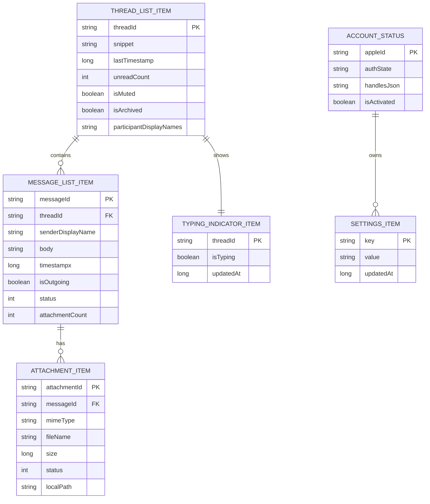

**Field definitions:**

| Entity                | Field                   | Type    | Constraints  | Description                                                              |
| --------------------- | ----------------------- | ------- | ------------ | ------------------------------------------------------------------------ |
| THREAD_LIST_ITEM      | threadId                | string  | PK           | Deterministic thread identifier.                                         |
| THREAD_LIST_ITEM      | snippet                 | string  | NOT NULL     | Last message snippet.                                                    |
| THREAD_LIST_ITEM      | lastTimestamp           | long    | NOT NULL     | Unix ms of last activity.                                                |
| THREAD_LIST_ITEM      | unreadCount             | int     | NOT NULL     | Count of unread incoming messages.                                       |
| THREAD_LIST_ITEM      | isMuted                 | boolean | NOT NULL     | Mute flag.                                                               |
| THREAD_LIST_ITEM      | isArchived              | boolean | NOT NULL     | Archive flag.                                                            |
| THREAD_LIST_ITEM      | participantDisplayNames | string  | NOT NULL     | Comma-separated display names.                                           |
| MESSAGE_LIST_ITEM     | messageId               | string  | PK           | UUIDv4 message identifier.                                               |
| MESSAGE_LIST_ITEM     | threadId                | string  | FK, NOT NULL | Parent thread identifier.                                                |
| MESSAGE_LIST_ITEM     | senderDisplayName       | string  | NOT NULL     | Resolved sender display name.                                            |
| MESSAGE_LIST_ITEM     | body                    | string  | NOT NULL     | Decrypted message text.                                                  |
| MESSAGE_LIST_ITEM     | timestamp               | long    | NOT NULL     | Unix ms message timestamp.                                               |
| MESSAGE_LIST_ITEM     | isOutgoing              | boolean | NOT NULL     | `true` if sent from this device.                                         |
| MESSAGE_LIST_ITEM     | status                  | int     | NOT NULL     | `0=DRAFT`, `1=SUBMITTED`, `2=SENT`, `3=DELIVERED`, `4=READ`, `5=FAILED`. |
| MESSAGE_LIST_ITEM     | attachmentCount         | int     | NOT NULL     | Number of attachments.                                                   |
| ATTACHMENT_ITEM       | attachmentId            | string  | PK           | UUIDv4 attachment identifier.                                            |
| ATTACHMENT_ITEM       | messageId               | string  | FK, NOT NULL | Parent message identifier.                                               |
| ATTACHMENT_ITEM       | mimeType                | string  | NOT NULL     | MIME type.                                                               |
| ATTACHMENT_ITEM       | fileName                | string  | NOT NULL     | Original file name.                                                      |
| ATTACHMENT_ITEM       | size                    | long    | NOT NULL     | Size in bytes.                                                           |
| ATTACHMENT_ITEM       | status                  | int     | NOT NULL     | `0=PENDING`, `1=DOWNLOADING`, `2=DOWNLOADED`, `3=FAILED`.                |
| ATTACHMENT_ITEM       | localPath               | string  | nullable     | Local file path after download.                                          |
| TYPING_INDICATOR_ITEM | threadId                | string  | PK           | Parent thread identifier.                                                |
| TYPING_INDICATOR_ITEM | isTyping                | boolean | NOT NULL     | Current typing state.                                                    |
| TYPING_INDICATOR_ITEM | updatedAt               | long    | NOT NULL     | Unix ms last update.                                                     |
| SETTINGS_ITEM         | key                     | string  | PK           | Setting key.                                                             |
| SETTINGS_ITEM         | value                   | string  | NOT NULL     | Serialized setting value.                                                |
| SETTINGS_ITEM         | updatedAt               | long    | NOT NULL     | Unix ms last update.                                                     |
| ACCOUNT_STATUS        | appleId                 | string  | PK           | Apple ID email address.                                                  |
| ACCOUNT_STATUS        | authState               | string  | NOT NULL     | Current `AuthState` enum value.                                          |
| ACCOUNT_STATUS        | handlesJson             | string  | nullable     | JSON array of activated handles.                                         |
| ACCOUNT_STATUS        | isActivated             | boolean | NOT NULL     | `true` if session is active.                                             |

---

## 3. Code Architecture

```mermaid
classDiagram
    class IConversationListViewModel {
        <<interface>>
        + val uiState: StateFlow~ConversationListUiState~
        + val effects: Flow~ConversationListEffect~
        + fun onThreadClick(threadId: ThreadId)
        + fun onMuteToggle(threadId: ThreadId)
        + fun onArchiveToggle(threadId: ThreadId)
        + fun onSettingsClick()
    }
    class ConversationListViewModel {
        - messagingService: IMessagingService
        - threadRepository: IThreadRepository
        - contactRepository: IContactRepository
        + val uiState: StateFlow~ConversationListUiState~
        + val effects: Flow~ConversationListEffect~
        + fun onThreadClick(threadId: ThreadId)
        + fun onMuteToggle(threadId: ThreadId)
        + fun onArchiveToggle(threadId: ThreadId)
        + fun onSettingsClick()
        - fun mapThreadsToUiState(threads: List~Thread~): List~ThreadListItem~
    }
    class IThreadViewModel {
        <<interface>>
        + val uiState: StateFlow~ThreadUiState~
        + val effects: Flow~ThreadEffect~
        + fun onSendClick(text: String)
        + fun onDraftChanged(text: String)
        + fun onAttachmentClick(attachmentId: AttachmentId)
        + fun onMarkRead()
        + fun onBackClick()
    }
    class ThreadViewModel {
        - messagingService: IMessagingService
        - messageRepository: IMessageRepository
        - threadRepository: IThreadRepository
        - draftRepository: IDraftRepository
        - typingIndicatorService: ITypingIndicatorService
        - threadId: ThreadId
        + val uiState: StateFlow~ThreadUiState~
        + val effects: Flow~ThreadEffect~
        + fun onSendClick(text: String)
        + fun onDraftChanged(text: String)
        + fun onAttachmentClick(attachmentId: AttachmentId)
        + fun onMarkRead()
        + fun onBackClick()
        - fun mapMessagesToUiState(messages: List~Message~): List~MessageListItem~
    }
    class ISettingsViewModel {
        <<interface>>
        + val uiState: StateFlow~SettingsUiState~
        + val effects: Flow~SettingsEffect~
        + fun onLogoutClick()
        + fun onLogoutConfirm()
        + fun onLogoutCancel()
        + fun onNotificationToggle(enabled: Boolean)
        + fun onRelayInfoClick()
    }
    class SettingsViewModel {
        - appleIdAuth: IAppleIdAuth
        - settingsRepository: ISettingsRepository
        - pushTokenRepository: IPushTokenRepository
        + val uiState: StateFlow~SettingsUiState~
        + val effects: Flow~SettingsEffect~
        + fun onLogoutClick()
        + fun onLogoutConfirm()
        + fun onLogoutCancel()
        + fun onNotificationToggle(enabled: Boolean)
        + fun onRelayInfoClick()
    }
    class IAuthViewModel {
        <<interface>>
        + val uiState: StateFlow~AuthUiState~
        + val effects: Flow~AuthEffect~
        + fun onLoginClick(appleId: String, password: String)
        + fun onTwoFactorSubmit(code: String)
        + fun onLogoutClick()
    }
    class AuthViewModel {
        - appleIdAuth: IAppleIdAuth
        + val uiState: StateFlow~AuthUiState~
        + val effects: Flow~AuthEffect~
        + fun onLoginClick(appleId: String, password: String)
        + fun onTwoFactorSubmit(code: String)
        + fun onLogoutClick()
    }
    class ISettingsRepository {
        <<interface>>
        + suspend fun getSetting(key: String): String?
        + suspend fun setSetting(key: String, value: String): Result~Unit~
        + fun observeNotificationsEnabled(): Flow~Boolean~
    }
    class SettingsRepository {
        - dataStore: DataStore~Preferences~
        + suspend fun getSetting(key: String): String?
        + suspend fun setSetting(key: String, value: String): Result~Unit~
        + fun observeNotificationsEnabled(): Flow~Boolean~
    }
    class ConversationListScreen {
        + fun Content(viewModel: IConversationListViewModel)
    }
    class ThreadScreen {
        + fun Content(viewModel: IThreadViewModel)
    }
    class AttachmentViewer {
        + fun Thumbnail(attachment: AttachmentItem, onClick: () -> Unit)
        + fun FullScreen(localPath: String, onClose: () -> Unit)
    }
    class SettingsScreen {
        + fun Content(viewModel: ISettingsViewModel)
    }
    class LoginScreen {
        + fun Content(viewModel: IAuthViewModel)
    }
    class TwoFactorScreen {
        + fun Content(viewModel: IAuthViewModel)
    }
    class LightScreenHost {
        + fun AppNavigation(authViewModel: IAuthViewModel, conversationListViewModel: IConversationListViewModel, threadViewModelFactory: ThreadViewModelFactory, settingsViewModel: ISettingsViewModel)
    }
    class Lp3Keyboard {
        + fun Input(value: String, onValueChange: (String) -> Unit, maxLength: Int)
    }

    IConversationListViewModel <|.. ConversationListViewModel : implements
    IThreadViewModel <|.. ThreadViewModel : implements
    ISettingsViewModel <|.. SettingsViewModel : implements
    IAuthViewModel <|.. AuthViewModel : implements
    ISettingsRepository <|.. SettingsRepository : implements

    ConversationListScreen --> IConversationListViewModel : uses
    ThreadScreen --> IThreadViewModel : uses
    ThreadScreen --> Lp3Keyboard : uses
    ThreadScreen --> AttachmentViewer : uses
    SettingsScreen --> ISettingsViewModel : uses
    LoginScreen --> IAuthViewModel : uses
    TwoFactorScreen --> IAuthViewModel : uses
    LightScreenHost --> IAuthViewModel : uses
    LightScreenHost --> IConversationListViewModel : uses
    LightScreenHost --> IThreadViewModel : uses
    LightScreenHost --> ISettingsViewModel : uses
    ConversationListViewModel --> IMessagingService : uses
    ConversationListViewModel --> IThreadRepository : uses
    ConversationListViewModel --> IContactRepository : uses
    ThreadViewModel --> IMessagingService : uses
    ThreadViewModel --> IMessageRepository : uses
    ThreadViewModel --> IThreadRepository : uses
    ThreadViewModel --> IDraftRepository : uses
    ThreadViewModel --> ITypingIndicatorService : uses
    SettingsViewModel --> IAppleIdAuth : uses
    SettingsViewModel --> ISettingsRepository : uses
    SettingsViewModel --> IPushTokenRepository : uses
    SettingsRepository --> DataStore : uses
```

**Module boundaries:**

| Component                   | Responsibility                                                                 | Owned By                          |
| --------------------------- | ------------------------------------------------------------------------------ | --------------------------------- |
| `ConversationListViewModel` | Expose thread list UI state and effects; map repository data to UI models.     | UI & Presentation bounded context |
| `ThreadViewModel`           | Expose message list UI state, send, draft, mark-read, and typing actions.      | UI & Presentation bounded context |
| `SettingsViewModel`         | Expose settings UI state, account status, and logout confirmation flow.        | UI & Presentation bounded context |
| `AuthViewModel`             | Map `AuthState` to `AuthUiState` and emit one-time `AuthEffect` events.        | UI & Presentation bounded context |
| `ConversationListScreen`    | Render E-Ink thread list with snippet, timestamp, unread counter, and actions. | UI & Presentation bounded context |
| `ThreadScreen`              | Render message history, `Lp3Keyboard`, send button, and typing indicators.     | UI & Presentation bounded context |
| `AttachmentViewer`          | Render attachment thumbnails and full-screen viewer.                           | UI & Presentation bounded context |
| `SettingsScreen`            | Render account status, preferences, and logout confirmation.                   | UI & Presentation bounded context |
| `LoginScreen`               | Capture Apple ID and password; display validation errors.                      | UI & Presentation bounded context |
| `TwoFactorScreen`           | Capture 6-digit 2FA code; support resend.                                      | UI & Presentation bounded context |
| `LightScreenHost`           | Host `LightScreen` navigation and route between auth, list, thread, settings.  | UI & Presentation bounded context |
| `SettingsRepository`        | Persist simple settings in `DataStore`.                                        | UI & Presentation bounded context |
| `Lp3Keyboard`               | Embedded text input composable from Light SDK.                                 | External dependency               |

---

## 4. Component Interactions

### 4.1 App Launch and Navigation Routing

```mermaid
sequenceDiagram
    autonumber
    actor U as User
    participant APP as Application
    participant VM as AuthViewModel
    participant AA as AppleIdAuth
    participant LSH as LightScreenHost
    participant CLS as ConversationListScreen
    participant LS as LoginScreen

    U->>+APP: launch app
    APP->>+VM: init
    VM->>+AA: resumeSession()
    AA-->>-VM: AuthState
    VM->>LSH: uiState/effects
    alt Activated
        LSH->>+CLS: navigateTo(ConversationList)
        CLS-->>-LSH: shown
    else CredentialsRequired
        LSH->>+LS: navigateTo(Login)
        LS-->>-LSH: shown
    end
    LSH-->>-APP: screen displayed
```

**Preconditions:** App process started; ViewModels initialized.
**Postconditions:** Correct initial screen displayed based on auth state.

### 4.2 Open Thread from Conversation List

```mermaid
sequenceDiagram
    autonumber
    actor U as User
    participant CLS as ConversationListScreen
    participant CLVM as ConversationListViewModel
    participant LSH as LightScreenHost
    participant TVM as ThreadViewModel
    participant TS as ThreadScreen
    participant MR as MessageRepository
    participant DB as Room Database

    U->>+CLS: tap thread
    CLS->>+CLVM: onThreadClick(threadId)
    CLVM->>CLVM: emit NavigateToThread(threadId)
    CLVM-->>-CLS: effect
    CLS->>+LSH: navigateTo(Thread(threadId))
    LSH->>+TVM: create with threadId
    TVM->>+MR: observeMessages(threadId)
    MR->>DB: SELECT
    DB-->>-MR: messages Flow
    MR-->>-TVM: Flow
    TVM-->>-LSH: ThreadUiState
    LSH->>+TS: show ThreadScreen
    TS-->>-LSH: rendered
    LSH-->>-CLS: navigation complete
```

**Preconditions:** `ConversationListScreen` displayed; thread exists.
**Postconditions:** `ThreadScreen` displayed with message history loaded.

### 4.3 Compose and Send Message in Thread

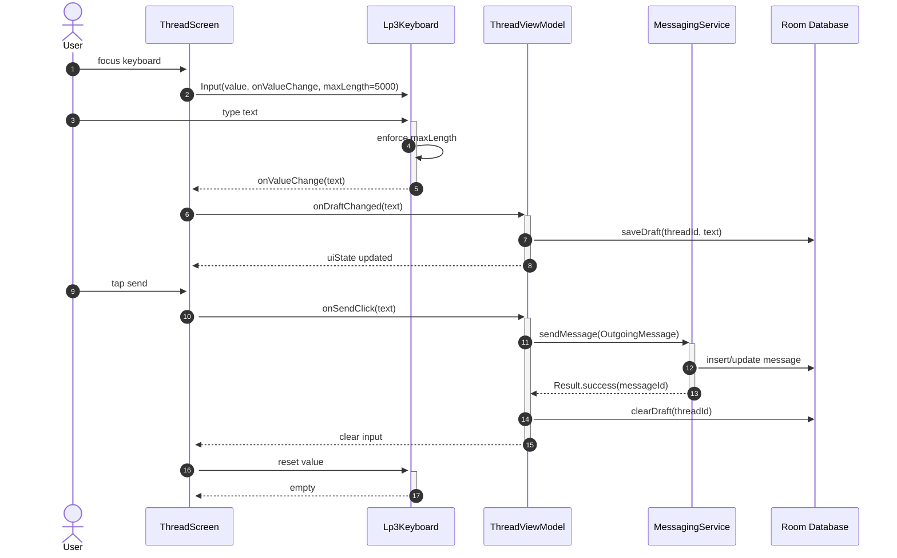

**Preconditions:** `ThreadScreen` displayed; `NativeServiceClient` connected.
**Postconditions:** Message submitted; draft cleared; input reset.

### 4.4 View Attachment

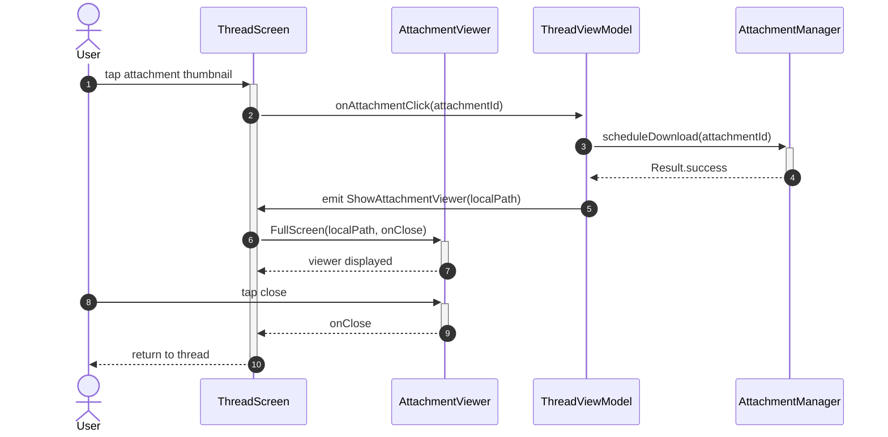

**Preconditions:** Attachment exists in message; local path available or download scheduled.
**Postconditions:** Full-screen attachment viewer shown and dismissed.

### 4.5 Logout from Settings

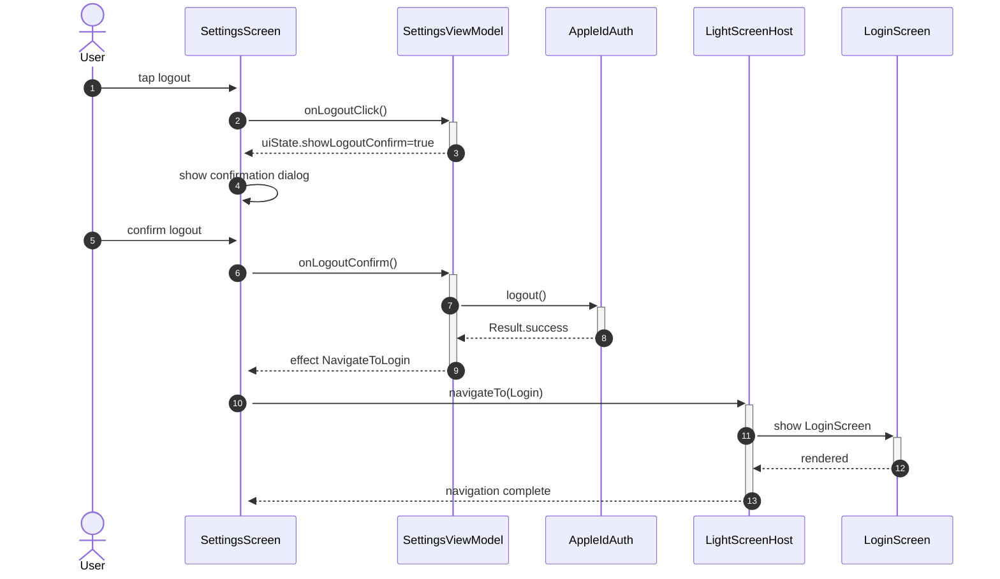

**Preconditions:** `SettingsScreen` displayed; user is activated.
**Postconditions:** Session cleared; `LoginScreen` displayed.

---

## 5. Stateful Behavior

### 5.1 ConversationList UI State

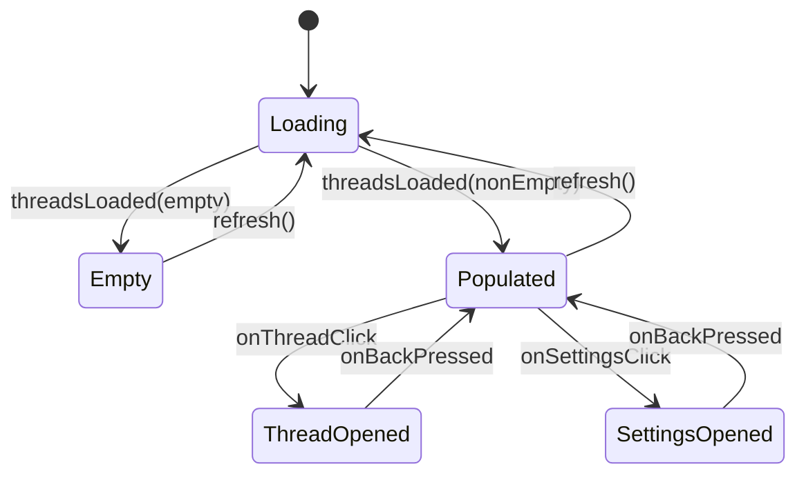

**Transition table:**

| From           | To             | Trigger                   | Guard          | Action                  |
| -------------- | -------------- | ------------------------- | -------------- | ----------------------- |
| Loading        | Empty          | `threadsLoaded(empty)`    | list empty     | Show empty state.       |
| Loading        | Populated      | `threadsLoaded(nonEmpty)` | list non-empty | Show thread list.       |
| Populated      | Loading        | `refresh()`               | —              | Show refresh indicator. |
| Empty          | Loading        | `refresh()`               | —              | Show refresh indicator. |
| Populated      | ThreadOpened   | `onThreadClick`           | threadId valid | Navigate to thread.     |
| Populated      | SettingsOpened | `onSettingsClick`         | —              | Navigate to settings.   |
| ThreadOpened   | Populated      | `onBackPressed`           | —              | Return to list.         |
| SettingsOpened | Populated      | `onBackPressed`           | —              | Return to list.         |

### 5.2 Thread UI State

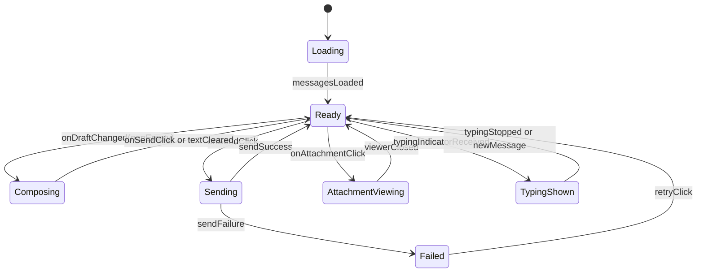

**Transition table:**

| From              | To                | Trigger                    | Guard           | Action                     |
| ----------------- | ----------------- | -------------------------- | --------------- | -------------------------- |
| Loading           | Ready             | `messagesLoaded`           | —               | Show message list.         |
| Ready             | Composing         | `onDraftChanged(nonEmpty)` | text non-empty  | Update draft UI.           |
| Ready             | Sending           | `onSendClick`              | text valid      | Show sending state.        |
| Sending           | Ready             | `sendSuccess`              | —               | Clear input; refresh list. |
| Sending           | Failed            | `sendFailure`              | —               | Show error; allow retry.   |
| Failed            | Ready             | `retryClick`               | —               | Retry send.                |
| Composing         | Ready             | `onSendClick`              | message sent    | Clear input.               |
| Composing         | Ready             | `textCleared`              | —               | Clear draft.               |
| Ready             | AttachmentViewing | `onAttachmentClick`        | localPath valid | Show full-screen viewer.   |
| AttachmentViewing | Ready             | `viewerClosed`             | —               | Return to thread.          |
| Ready             | TypingShown       | `typingIndicatorReceived`  | incoming typing | Show typing bubble.        |
| TypingShown       | Ready             | `typingStopped`            | —               | Hide typing bubble.        |
| TypingShown       | Ready             | `newMessage`               | —               | Hide bubble; show message. |

### 5.3 Settings UI State

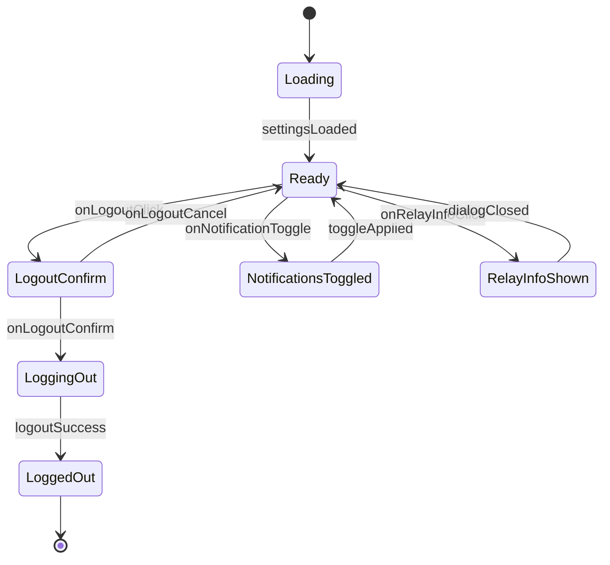

**Transition table:**

| From                 | To                   | Trigger                | Guard | Action                      |
| -------------------- | -------------------- | ---------------------- | ----- | --------------------------- |
| Loading              | Ready                | `settingsLoaded`       | —     | Show settings.              |
| Ready                | LogoutConfirm        | `onLogoutClick`        | —     | Show confirmation dialog.   |
| LogoutConfirm        | Ready                | `onLogoutCancel`       | —     | Dismiss dialog.             |
| LogoutConfirm        | LoggingOut           | `onLogoutConfirm`      | —     | Show progress; call logout. |
| LoggingOut           | LoggedOut            | `logoutSuccess`        | —     | Navigate to login.          |
| Ready                | NotificationsToggled | `onNotificationToggle` | —     | Toggle preference.          |
| NotificationsToggled | Ready                | `toggleApplied`        | —     | Update UI.                  |
| Ready                | RelayInfoShown       | `onRelayInfoClick`     | —     | Show relay info dialog.     |
| RelayInfoShown       | Ready                | `dialogClosed`         | —     | Dismiss dialog.             |

---

## 6. Algorithmic Logic

### 6.1 Render Thread List

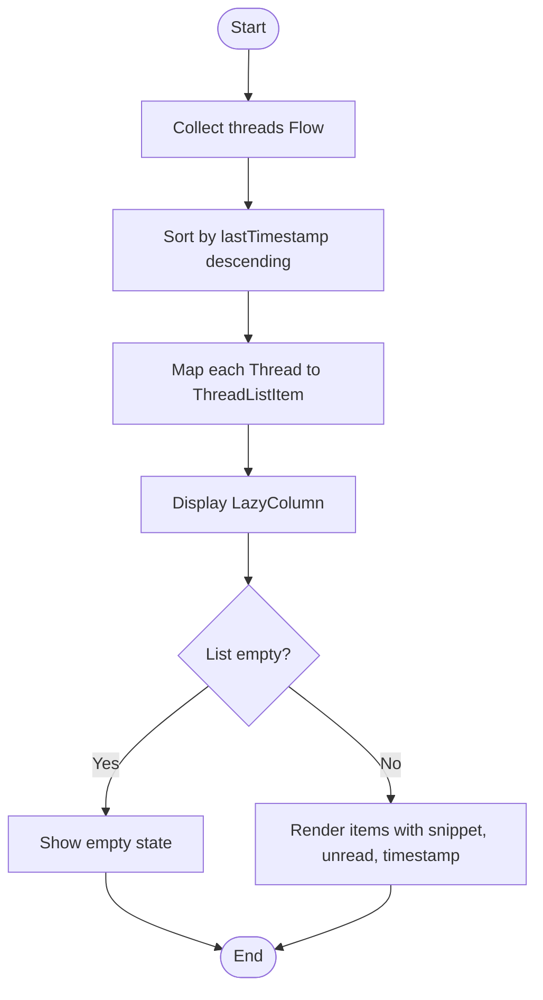

### 6.2 Render Message Bubble

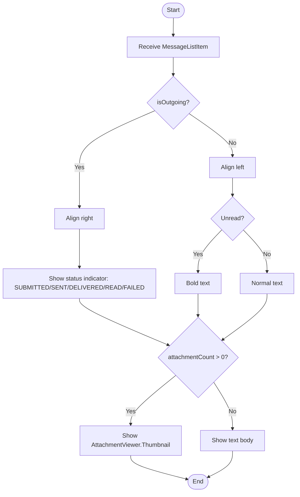

### 6.3 Send Button Enablement

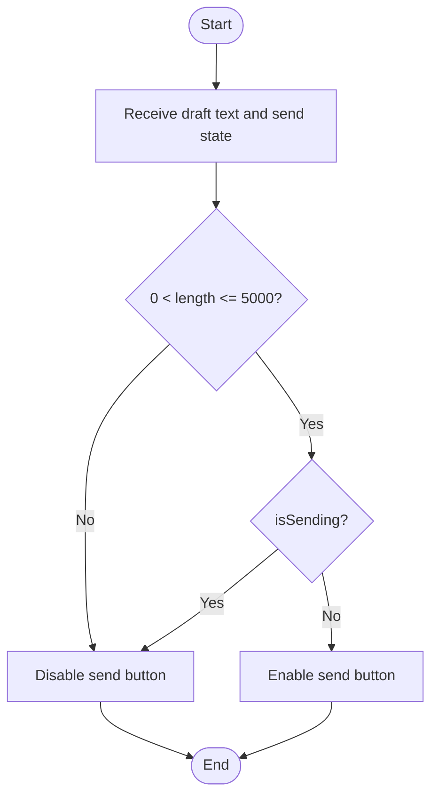

### 6.4 Settings Logout Confirmation

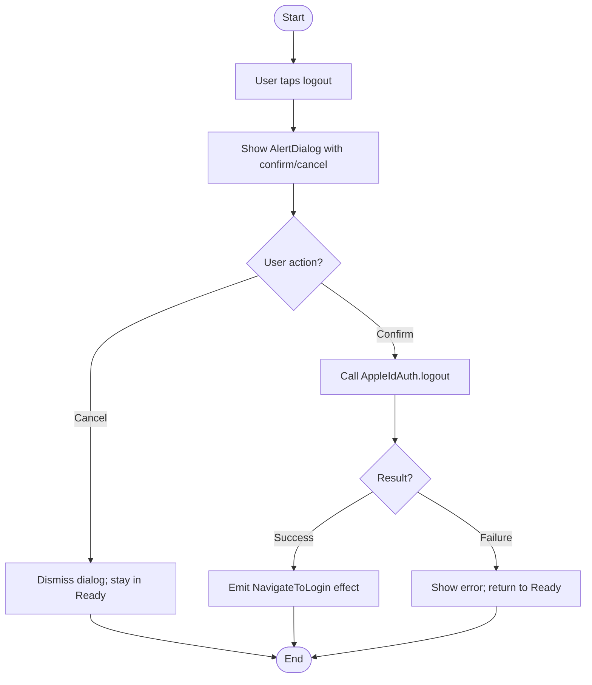

---

## 7. Exhaustive Test Matrix

### 7.1 Unit Paths

| Target                                      | Scenario           | Input                               | Expected Output                          | Assertion                                           |
| ------------------------------------------- | ------------------ | ----------------------------------- | ---------------------------------------- | --------------------------------------------------- |
| `ConversationListViewModel.uiState`         | Threads loaded     | 2 threads in DB                     | `uiState.threads` size 2                 | `assertEquals(2, uiState.threads.size)`             |
| `ConversationListViewModel.onThreadClick`   | Valid threadId     | `threadId`                          | `NavigateToThread` effect emitted        | `assertTrue(effects.first() is NavigateToThread)`   |
| `ConversationListViewModel.onSettingsClick` | User taps settings | —                                   | `NavigateToSettings` effect emitted      | `assertTrue(effects.first() is NavigateToSettings)` |
| `ThreadViewModel.onSendClick`               | Valid text         | `"hello"`                           | `MessagingService.sendMessage` called    | `verify(messagingService).sendMessage(...)`         |
| `ThreadViewModel.onDraftChanged`            | Non-empty text     | `"draft"`                           | `DraftRepository.saveDraft` called       | `verify(draftRepository).saveDraft(...)`            |
| `ThreadViewModel.onMarkRead`                | Unread messages    | threadId                            | `MessagingService.markThreadRead` called | `verify(messagingService).markThreadRead(...)`      |
| `ThreadViewModel.onBackClick`               | User presses back  | —                                   | `NavigateBack` effect emitted            | `assertTrue(effects.first() is NavigateBack)`       |
| `SettingsViewModel.onLogoutClick`           | User taps logout   | —                                   | `uiState.showLogoutConfirm=true`         | `assertTrue(uiState.showLogoutConfirm)`             |
| `SettingsViewModel.onLogoutConfirm`         | User confirms      | —                                   | `AppleIdAuth.logout` called              | `verify(appleIdAuth).logout()`                      |
| `SettingsViewModel.onNotificationToggle`    | Toggle on          | `enabled=true`                      | `SettingsRepository.setSetting` called   | `verify(settingsRepository).setSetting(...)`        |
| `AuthViewModel.onLoginClick`                | Valid input        | email, password                     | `AppleIdAuth.startAuthentication` called | `verify(appleIdAuth).startAuthentication(...)`      |
| `AuthViewModel.mapStateToUiState`           | Activated          | `AuthState.Activated`               | `AuthUiState.Activated`                  | `assertEquals(Activated, uiState)`                  |
| `AttachmentViewer.Thumbnail`                | Downloaded image   | `AttachmentItem(status=DOWNLOADED)` | Thumbnail composable rendered            | `assertExists()`                                    |
| `AttachmentViewer.FullScreen`               | Local path valid   | `localPath`                         | Full-screen viewer rendered              | `assertExists()`                                    |

### 7.2 Integration Paths

| Flow                               | Steps | Mocked                    | Verified                                   | Result |
| ---------------------------------- | ----- | ------------------------- | ------------------------------------------ | ------ |
| 4.1 App Launch and Navigation      | 1–8   | `AuthViewModel`           | Correct initial screen shown               | Pass   |
| 4.2 Open Thread from List          | 1–10  | `ThreadViewModel`         | Thread screen loaded with messages         | Pass   |
| 4.3 Compose and Send Message       | 1–15  | `MessagingService`        | Draft saved, message sent, input cleared   | Pass   |
| 4.4 View Attachment                | 1–8   | `AttachmentManager`       | Full-screen viewer shown                   | Pass   |
| 4.5 Logout from Settings           | 1–10  | `AppleIdAuth`             | Login screen shown after logout            | Pass   |
| Thread list updates on new message | Full  | Room in-memory DB + Flow  | UI thread list updates automatically       | Pass   |
| Message status updates in thread   | Full  | `MessagingService` + Flow | Status indicator changes from SENT to READ | Pass   |

### 7.3 Edge Cases & Failure Modes

| Condition                                         | Stimulus                             | Expected Behavior                                   | Invariant Preserved    |
| ------------------------------------------------- | ------------------------------------ | --------------------------------------------------- | ---------------------- |
| Empty thread list                                 | No threads in DB                     | Show empty state with new-message hint              | No crash               |
| Very long message                                 | 5001 characters typed                | `Lp3Keyboard` truncates to 5000; send disabled if 0 | Length limit           |
| Send while offline                                | `MessagingService.sendMessage` fails | Show failed state; allow retry                      | No duplicate sends     |
| Attachment not downloaded                         | Tap pending thumbnail                | Show placeholder; schedule download                 | No crash               |
| Logout cancelled                                  | User taps cancel in dialog           | Dialog dismissed; stay in settings                  | No accidental logout   |
| Settings load failure                             | DataStore read error                 | Show error state; retry available                   | Robustness             |
| Back pressed on thread                            | Hardware back button                 | Return to conversation list                         | Navigation consistency |
| New message while viewing thread                  | Push received                        | Message list updates; unread counter updated        | Real-time sync         |
| Muted thread                                      | Incoming message in muted thread     | Thread shown without unread increment in UI         | Mute semantics         |
| Failed message retry                              | User taps retry on failed bubble     | Re-invokes `MessagingService.sendMessage`           | Retry path             |
| Auth state changes to Deactivated while in thread | Session invalidated                  | UI navigates to login                               | Security               |

### 7.4 Invariant Checks

| Invariant                              | Enforcement Point                           | Verification Test                                    |
| -------------------------------------- | ------------------------------------------- | ---------------------------------------------------- |
| Only whitelisted dependencies          | `build.gradle.kts`                          | `LightSdkPlugin` whitelist test                      |
| E-Ink: no animations                   | `ConversationListScreen`, `ThreadScreen`    | Compose test asserts no animated transitions         |
| Message length <= 5000                 | `Lp3Keyboard` maxLength + `ThreadViewModel` | Input truncation test; boundary test                 |
| `Lp3Keyboard` only input in thread     | `ThreadScreen`                              | Code review / lint rule                              |
| Navigation via `LightScreen` only      | `LightScreenHost`                           | No direct `NavController` usage outside host         |
| UI derives state from ViewModels       | All screens                                 | No business logic in composable tests                |
| Logout requires confirmation           | `SettingsScreen` + `SettingsViewModel`      | Dialog shown before `AppleIdAuth.logout`             |
| Outgoing send requires explicit action | `ThreadScreen`                              | Send button click test; no auto-send on draft change |
| Attachment viewer only for downloaded  | `AttachmentViewer`                          | Pending attachments show placeholder, not viewer     |

---

## 8. Task Dependencies

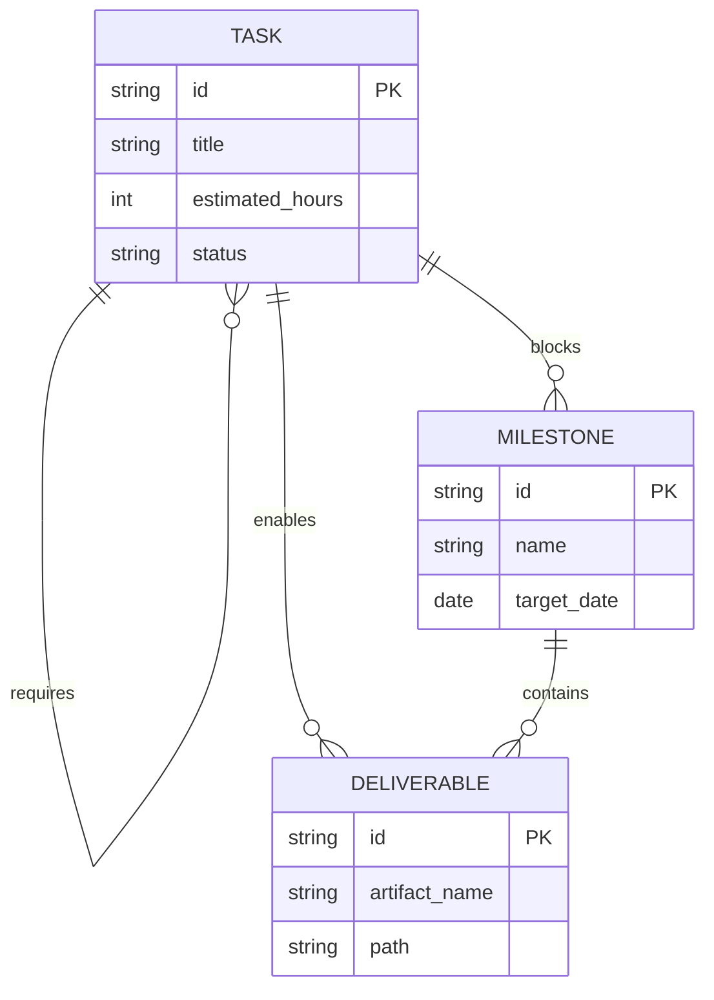

**Dependency rules:**

- A `Task` with status `blocked` must have an uncompleted `requires` `Task`.
- A `Milestone` is `achievable` only when all `blocks` `Task`s are complete.
- A `Deliverable` is `available` only when all `enables` `Task`s are complete.

**Task dependency graph:**

| Task ID  | Requires           | Blocks Story | Enables Deliverable |
| -------- | ------------------ | ------------ | ------------------- |
| TASK_001 | —                  | S1           | DEL_001             |
| TASK_002 | TASK_001           | S1           | DEL_002             |
| TASK_003 | TASK_001           | S1           | DEL_003             |
| TASK_004 | TASK_002, TASK_003 | S2           | DEL_004             |
| TASK_005 | TASK_002, TASK_003 | S2           | DEL_005             |
| TASK_006 | TASK_004, TASK_005 | S2           | DEL_006             |
| TASK_007 | TASK_006           | S3           | DEL_007             |
| TASK_008 | TASK_006           | S3           | DEL_008             |
| TASK_009 | TASK_007, TASK_008 | S3           | DEL_009             |
| TASK_010 | TASK_009           | S4           | DEL_010             |
| TASK_011 | TASK_010           | S4           | DEL_011             |
| TASK_012 | TASK_011           | S5           | DEL_012             |

---

## 9. Implementation Timeline

```mermaid
gantt
    title LightOS iMessage Client — Milestone 6 UI & Keyboard Implementation Plan
    dateFormat  YYYY-MM-DD
    axisFormat  %m/%d

    section Foundation
    TASK_001 :a1, 2026-07-18, 4h
    TASK_002 :a2, after a1, 4h
    TASK_003 :a3, after a1, 4h

    section Screens
    TASK_004 :b1, after a2, after a3, 4h
    TASK_005 :b2, after a2, after a3, 4h
    TASK_006 :b3, after b1, after b2, 4h

    section Keyboard & Attachments
    TASK_007 :c1, after b3, 4h
    TASK_008 :c2, after b3, 4h

    section Navigation & Settings
    TASK_009 :d1, after c1, after c2, 4h
    TASK_010 :d2, after d1, 4h

    section Verification
    TASK_011 :e1, after d2, 4h
    TASK_012 :e2, after e1, 2h

    section Stories
    story S1 UI Foundation Ready :milestone, after a3, 0h
    story S2 Conversation & Thread Screens Ready :milestone, after b3, 0h
    story S3 Keyboard & Attachments Ready :milestone, after c2, 0h
    story S4 Navigation & Settings Ready :milestone, after d2, 0h
    story S5 Milestone 6 Review :milestone, after e2, 0h
```

**Task list:**

| ID       | Title                                                                                                                     | Est. Hours | Start                    | Dependencies       | Owner       |
| -------- | ------------------------------------------------------------------------------------------------------------------------- | ---------- | ------------------------ | ------------------ | ----------- |
| TASK_001 | Define UI data models (`ThreadListItem`, `MessageListItem`, `AttachmentItem`, `SettingsItem`) and E-Ink theme tokens.     | 4          | 2026-07-18               | None               | UI Engineer |
| TASK_002 | Implement `SettingsRepository` and `SettingsViewModel` with account status, preferences, and logout confirmation.         | 4          | after TASK_001           | TASK_001           | UI Engineer |
| TASK_003 | Set up `LightScreenHost` navigation and integrate `AuthViewModel` routing from Milestone 4.                               | 4          | after TASK_001           | TASK_001           | UI Engineer |
| TASK_004 | Implement `ConversationListScreen` with E-Ink thread list, unread counters, mute/archive indicators, and pull-to-refresh. | 4          | after TASK_002, TASK_003 | TASK_002, TASK_003 | UI Engineer |
| TASK_005 | Implement `ThreadScreen` layout with message list, send button, status indicators, and typing bubble.                     | 4          | after TASK_002, TASK_003 | TASK_002, TASK_003 | UI Engineer |
| TASK_006 | Implement `ConversationListViewModel` and `ThreadViewModel` UI mapping and effect routing.                                | 4          | after TASK_004, TASK_005 | TASK_004, TASK_005 | UI Engineer |
| TASK_007 | Integrate `Lp3Keyboard` into `ThreadScreen` with 5000-character enforcement and draft binding.                            | 4          | after TASK_006           | TASK_006           | UI Engineer |
| TASK_008 | Implement `AttachmentViewer` thumbnail and full-screen viewer with download-state handling.                               | 4          | after TASK_006           | TASK_006           | UI Engineer |
| TASK_009 | Implement `SettingsScreen` with account status, notification toggle, relay info, and logout confirmation dialog.          | 4          | after TASK_007, TASK_008 | TASK_007, TASK_008 | UI Engineer |
| TASK_010 | Wire `LightScreenHost` navigation between auth, conversation list, thread, settings, and attachment viewer.               | 4          | after TASK_009           | TASK_009           | UI Engineer |
| TASK_011 | Write unit and Compose UI tests for all screens, ViewModels, and navigation flows.                                        | 4          | after TASK_010           | TASK_010           | QA Engineer |
| TASK_012 | Document public UI APIs, update ADRs, and conduct Milestone 6 review.                                                     | 2          | after TASK_011           | TASK_011           | Tech Lead   |

**Deliverable list:**

| ID      | Artifact                                  | Path                                                                                  | Enabled By |
| ------- | ----------------------------------------- | ------------------------------------------------------------------------------------- | ---------- |
| DEL_001 | UI data models and E-Ink theme            | `ui/model/*Item.kt`, `ui/theme/EInkTheme.kt`                                          | TASK_001   |
| DEL_002 | Settings repository and view model        | `data/repository/SettingsRepository.kt`, `presentation/settings/SettingsViewModel.kt` | TASK_002   |
| DEL_003 | LightScreen navigation host               | `ui/navigation/LightScreenHost.kt`                                                    | TASK_003   |
| DEL_004 | Conversation list screen                  | `ui/conversation/ConversationListScreen.kt`                                           | TASK_004   |
| DEL_005 | Thread screen                             | `ui/thread/ThreadScreen.kt`                                                           | TASK_005   |
| DEL_006 | Conversation and thread view models       | `presentation/messaging/ConversationListViewModel.kt`, `ThreadViewModel.kt`           | TASK_006   |
| DEL_007 | Lp3Keyboard integration                   | `ui/thread/Lp3KeyboardIntegration.kt`                                                 | TASK_007   |
| DEL_008 | Attachment viewer                         | `ui/attachment/AttachmentViewer.kt`                                                   | TASK_008   |
| DEL_009 | Settings screen                           | `ui/settings/SettingsScreen.kt`                                                       | TASK_009   |
| DEL_010 | Full navigation wiring                    | `ui/navigation/AppNavigation.kt`                                                      | TASK_010   |
| DEL_011 | UI and unit test suite                    | `src/test/java/...`, `src/androidTest/java/...`                                       | TASK_011   |
| DEL_012 | Milestone 6 specification and ADR updates | `docs/initiatives/v1/codespec/milestone-6.md`                                         | TASK_012   |

---

## 10. Revision History

| Version | Date       | Author                  | Change                                                                                                                                             |
| ------- | ---------- | ----------------------- | -------------------------------------------------------------------------------------------------------------------------------------------------- |
| 1.0     | 2026-07-18 | Specification Architect | Initial Milestone 6 implementation-ready specification for the UI & Keyboard layer based on the rustpush-native architecture and prior milestones. |
