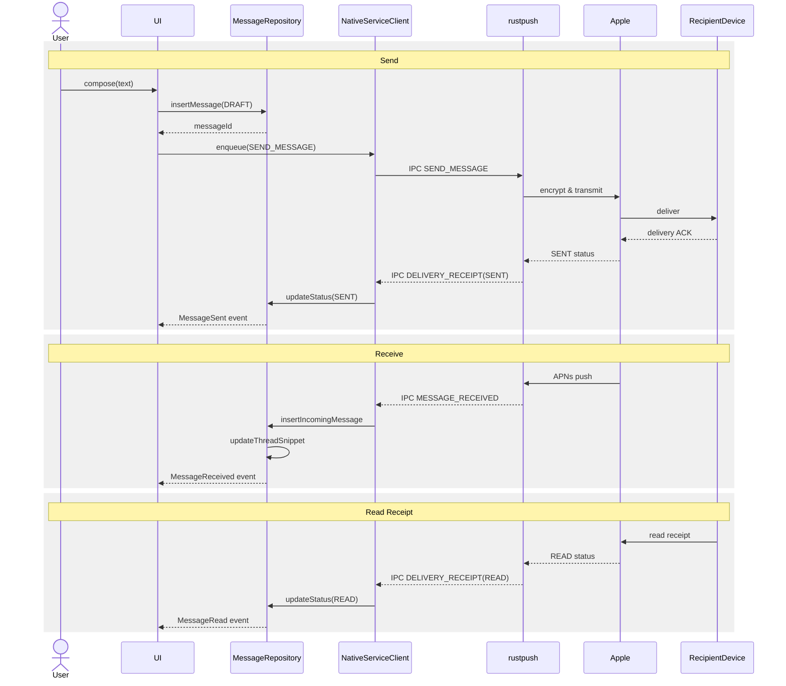
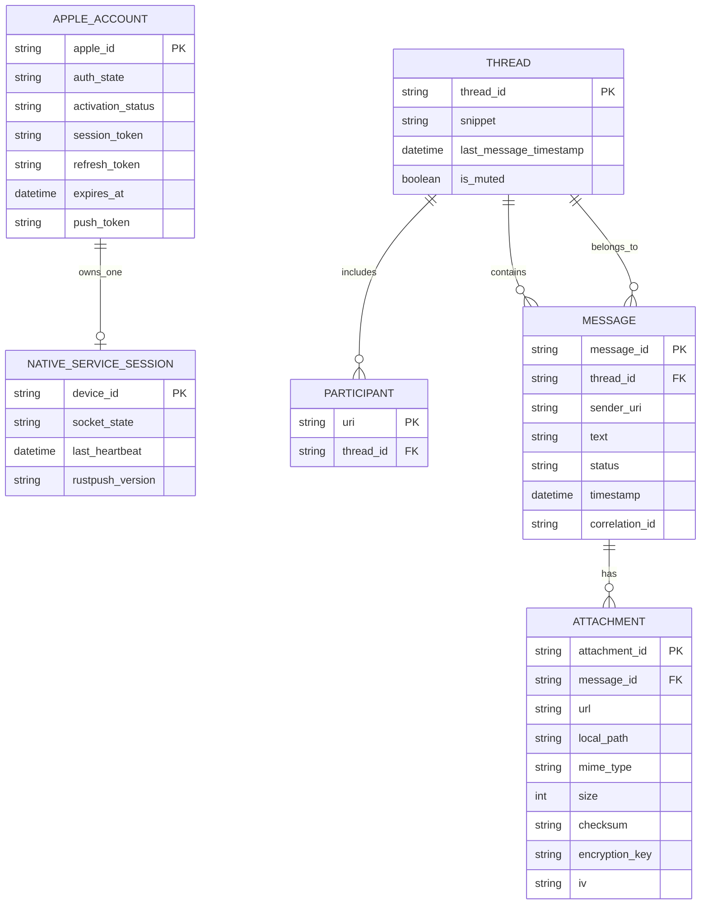
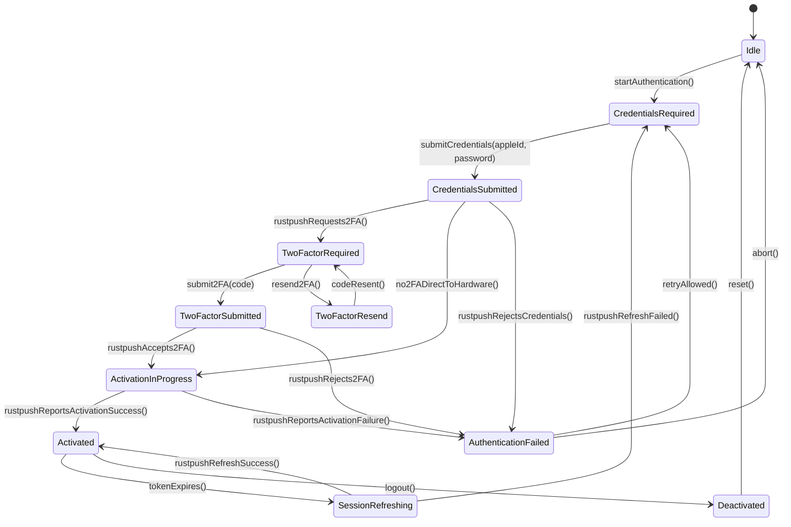

# Milestone 0-1: TDD

## 1. Domain Overview & Bounded Contexts

The architecture is hybrid: a Kotlin-native client handles UI, business logic, and local persistence, while a native Rust service (`rustpush`) handles all Apple protocol heavy-lifting. The always-on Mac relay is eliminated; the relay is reduced to one-time activation only.

| Bounded Context                  | Responsibility                                                                                                                     | Whitelisted Dependencies                               |
| -------------------------------- | ---------------------------------------------------------------------------------------------------------------------------------- | ------------------------------------------------------ |
| **Native Service Communication** | IPC lifecycle (Unix domain socket or AIDL), command framing, native service heartbeat, attachment download orchestration           | `JNI`, `OkHttp` (for iCloud CDN attachment downloads)  |
| **Authentication & Activation**  | Apple ID auth state machine (UI and credential storage); delegates hardware attestation and Apple server communication to rustpush | `DataStore`, `javax.crypto` (local storage encryption) |
| **Local Messaging & Storage**    | Message composition, thread management, contact resolution, plaintext persistence, UI-facing domain logic                          | `Room`, `kotlinx.serialization`                        |
| **Push & Delivery**              | Consumes UnifiedPush notifications from the rustpush bridge; wake-up triggers; notification routing                                | `org.unifiedpush.android:connector`                    |
| **UI & Navigation**              | E-Ink Compose screens, Lp3Keyboard input, custom `LightScreen` navigation stack                                                    | `Jetpack Compose`, `Lp3Keyboard`                       |

The `rustpush` native service (`.so`, `arm64-v8a`) owns all Apple-side protocol concerns: APNs TLS connection, AES-GCM envelope encryption, binary Plist serialization, `open-absinthe` hardware validation, and IDS certificate management.

---

## 2. Protocol Specification

### 2.1 Native Service IPC Protocol (Runtime)

- **Transport**: Unix domain socket (`abstract:rustpush_ipc`) or AIDL binder interface.
- **Framing**: Length-prefixed JSON messages. 4-byte big-endian length header + UTF-8 JSON payload.
- **Heartbeat**: Kotlin client sends `PING` every 30s; rustpush responds with `PONG` within 5s. Missing `PONG` within 5s triggers `NativeServiceConnectionLost` and reconnect with exponential backoff (1s, 2s, 4s, 8s, cap 60s). No max retry count; reconnect indefinitely until successful.
- **Concurrency**: Single IPC connection; commands serialized with queue depth ≤ 100. If queue overflows, client returns `ERROR` with code `IPC_QUEUE_FULL`. rustpush processes asynchronously and returns responses with matching `correlation_id`.

### 2.2 IPC Message Catalog

> [JSONSchema: IPCMessage](../schemas/IPCMessage.json)

```mermaid
classDiagram
    class IpcEnvelope {
        +UInt32 length
        +String payload
    }

    class CommandType {
        <<enumeration>>
        SEND_MESSAGE
        SEND_READ_RECEIPT
        SEND_TYPING
        REQUEST_SYNC
        ACTIVATE
        PING
    }

    class NativeCommand {
        +UUID correlationId
        +CommandType msgType
    }

    class SendMessageRequest {
        +UUID messageId
        +List~String~ recipients
        +String? text
        +List~AttachmentMeta~ attachments
    }

    class SendReadReceiptRequest {
        +UUID messageId
        +String threadId
    }

    class SendTypingRequest {
        +String threadId
        +Boolean typing
    }

    class RequestSync {
        +String? sinceToken
        +note: Kotlin persists sinceToken to Room on successful sync; if rustpush crashes mid-sync, retry with last persisted token.
    }

    class ActivateRequest {
        +String appleId
        +String password
        +String? twoFaCode
    }

    class PingRequest {
    }

    class NativeResponse {
        +UUID correlationId
        +String msgType
    }

    class MessageReceived {
        +UUID messageId
        +String sender
        +List~String~ recipients
        +String? text
        +List~AttachmentRef~ attachments
        +String timestamp
    }

    class DeliveryReceipt {
        +UUID messageId
        +String status
    }

    class ActivationStatus {
        +String status
        +String? error
        +List~String~? handles
    }

    class PongResponse {
        +UUID correlationId
    }

    class ErrorResponse {
        +UUID correlationId
        +String code
        +String message
        +Object? context
    }

    class AttachmentMeta {
        +String? localUri
        +String? mimeType
        +String? fileName
        +Long? size
    }

    class AttachmentRef {
        +String url
        +String? encryptionKey
        +String? iv
        +String? authTag
        +Int size
        +String mimeType
        +String? fileName
        +String? checksum
    }

    NativeCommand <|-- SendMessageRequest
    NativeCommand <|-- SendReadReceiptRequest
    NativeCommand <|-- SendTypingRequest
    NativeCommand <|-- RequestSync
    NativeCommand <|-- ActivateRequest
    NativeCommand <|-- PingRequest

    NativeResponse <|-- MessageReceived
    NativeResponse <|-- DeliveryReceipt
    NativeResponse <|-- ActivationStatus
    NativeResponse <|-- PongResponse
    NativeResponse <|-- ErrorResponse

    SendMessageRequest ..> AttachmentMeta : uses
    MessageReceived ..> AttachmentRef : uses
```

### 2.3 Message Lifecycle

### 2.4 UnifiedPush Contract

- **rustpush UnifiedPush Bridge**: `aps_client` receives APNs push, decodes the Apple payload, and POSTs to the local UnifiedPush distributor endpoint.
- **Distributor**: Lightweight on-device or local-network UnifiedPush distributor (bundled or self-hosted).
- **Kotlin App**: Receives via `org.unifiedpush.android:connector` `PushReceiver`.
- **Push Types**: `WAKE`, `MESSAGE_DELIVERY`, `READ_RECEIPT`, `TYPING`.

### 2.5 One-Time Mac Relay Activation Protocol

- **Purpose**: Hardware info attestation via `open-absinthe` or NAC relay when rustpush cannot self-activate on-device.
- **Transport**: HTTPS POST to Mac relay.
- **Frequency**: Once per device/Apple ID pairing.
- **Retry**: 3 attempts with exponential backoff (1s, 2s, 4s). If all fail, emit `AuthenticationFailed` event with reason `RELAY_UNAVAILABLE`.
- **API**: `POST /api/v1/activate` with hardware info (serial, board_id, model, udid). Returns activation blob / certificate.
- **Subsequent**: rustpush consumes the activation blob to establish a direct, persistent Apple connection.

---

## 3. Object Model

### 3.1 Aggregates

| Aggregate              | Root Entity               | Invariants                                                                                                                                  | Repository                                   |
| ---------------------- | ------------------------- | ------------------------------------------------------------------------------------------------------------------------------------------- | -------------------------------------------- |
| `NativeServiceSession` | `NativeServiceConnection` | Only one active IPC connection per device; heartbeat must be ≤ 30s stale                                                                    | `NativeServiceSessionRepository` (DataStore) |
| `AppleIdentity`        | `AppleAccount`            | Must have valid `ActivationStatus` or `SessionToken`; `handles` are immutable once activated; hardware attestation is non-replayable        | `AppleIdentityRepository` (DataStore)        |
| `MessageThread`        | `Thread`                  | `ThreadId` is deterministic hash of sorted participant URI set; participants ≥ 1; thread must have ≥ 1 message to be persisted              | `ThreadRepository` (Room)                    |
| `iMessage`             | `Message`                 | `MessageId` is UUIDv4; `status` transitions: `DRAFT → SUBMITTED → SENT → DELIVERED → READ` (unidirectional); `timestamp` immutable once set | `MessageRepository` (Room)                   |

### 3.2 Entities

| Entity                    | Identity             | Attributes                                                                                                                                                                                  | Behaviors                                                                                                                               |
| ------------------------- | -------------------- | ------------------------------------------------------------------------------------------------------------------------------------------------------------------------------------------- | --------------------------------------------------------------------------------------------------------------------------------------- |
| `Message`                 | `messageId: UUID`    | `threadId`, `senderUri`, `recipientUris`, `plaintext: PlaintextPayload`, `status: DeliveryStatus`, `timestamp: Instant`, `attachments: List<AttachmentMeta>`, `rustpushCorrelationId: UUID` | `submitToNativeService()`, `markSubmitted()`, `markSent()`, `markDelivered()`, `markRead()`, `addAttachment()`, `detectDuplicateSend()` |
| `Thread`                  | `threadId: ThreadId` | `participantUris: Set<Uri>`, `lastMessageTimestamp: Instant`, `isMuted: Boolean`, `snippet: String?`                                                                                        | `addMessage()`, `updateSnippet()`, `toggleMute()`                                                                                       |
| `AppleAccount`            | `appleId: AppleId`   | `authState: AuthState`, `activationStatus: ActivationStatus`, `sessionToken: SessionToken?`, `handles: List<Uri>`, `pushToken: PushToken?`                                                  | `submitCredentials()`, `submit2FA()`, `requestActivation()`, `logout()`                                                                 |
| `NativeServiceConnection` | `deviceId: DeviceId` | `socketState: SocketState`, `lastHeartbeat: Instant`, `pendingCommands: Queue<NativeCommand>` (max 100), `rustpushVersion: String?`                                                         | `connect()`, `disconnect()`, `enqueue()`, `flush()`, `rejectIfQueueFull()`                                                              |

### 3.3 Value Objects

| Value Object       | Definition                                                                                                                                | Validation Rules                                                                                        |
| ------------------ | ----------------------------------------------------------------------------------------------------------------------------------------- | ------------------------------------------------------------------------------------------------------- |
| `AppleId`          | Apple ID email string                                                                                                                     | Regex `^[A-Z0-9._%+-]+@[A-Z0-9.-]+\\.[A-Z]{2,}$`                                                        |
| `Uri`              | iMessage URI `tel:+1...` or `mailto:...`                                                                                                  | Starts with `tel:` or `mailto:`                                                                         |
| `PlaintextPayload` | `(text: String?, attachments: List<AttachmentMeta>)`                                                                                      | `text?.length <= 5000` (E-Ink constraint); `text XOR attachments` must be non-empty (no blank messages) |
| `AttachmentMeta`   | `(localUri: String?, mimeType: String?, fileName: String?, size: Long?)`                                                                  | `mimeType` from whitelist if present                                                                    |
| `AttachmentRef`    | `(url: String, encryptionKey: String?, iv: String?, authTag: String?, size: Int, mimeType: String, fileName: String?, checksum: String?)` | `url` valid HTTPS; `size >= 0`                                                                          |
| `ThreadId`         | SHA-256 of sorted participant URI strings, truncated to 16 bytes                                                                          | Deterministic, immutable; collisions documented in code (rare; switch to full 32-byte hash if detected) |
| `PushToken`        | UnifiedPush token string                                                                                                                  | Non-empty, URL-safe Base64                                                                              |
| `NativeCommand`    | `(correlationId: UUID, type: CommandType, payload: JsonObject)`                                                                           | `correlationId` unique per command                                                                      |
| `SessionToken`     | `(token: String, expiresAt: Instant, refreshToken: String)`                                                                               | `expiresAt` must be > now                                                                               |

### 3.4 Domain Services

| Service               | Responsibility                                                                                                                                                                                                                                                                   | Collaborators                                    |
| --------------------- | -------------------------------------------------------------------------------------------------------------------------------------------------------------------------------------------------------------------------------------------------------------------------------- | ------------------------------------------------ |
| `NativeServiceClient` | IPC connection manager (Unix domain socket / AIDL), frame routing, command/response correlation, heartbeat scheduling, duplicate detection (reject retried SEND_MESSAGE with same messageId within 30s), **message send retry policy (max 5 attempts with exponential backoff)** | `NativeServiceSessionRepository`                 |
| `AuthService`         | Orchestrate Apple ID login state machine in Kotlin; delegate activation and hardware attestation to rustpush via IPC. **Separate retry counters: credentials max 3, 2FA max 3**                                                                                                  | `AppleIdentityRepository`, `NativeServiceClient` |
| `MessageRepository`   | Persist message/thread state, manage status transitions, handle attachment download scheduling. **Retry failed sends max 5 times; exponential backoff**                                                                                                                          | `Room`, `ThreadRepository`, `OkHttp`             |
| `PushHandler`         | Process UnifiedPush notifications from rustpush bridge, route wake-ups to `NativeServiceClient` for sync                                                                                                                                                                         | `UnifiedPush connector`, `MessageRepository`     |
| `ThreadSynchronizer`  | Maintain thread ordering, snippet extraction, participant deduplication                                                                                                                                                                                                          | `ThreadRepository`, `MessageRepository`          |

### 3.5 Entity Model

> [JSONSchema](../schemas/entityModel.json)

---

### 4. Domain Events

#### 4.1 Event Catalog

| Event                         | Aggregate              | Trigger                                                                 | Consumers                                                                                                   | Payload                                                            |
| ----------------------------- | ---------------------- | ----------------------------------------------------------------------- | ----------------------------------------------------------------------------------------------------------- | ------------------------------------------------------------------ |
| `NativeServiceConnected`      | `NativeServiceSession` | IPC socket connected / AIDL bound                                       | `AuthService` (resume activation), `PushHandler` (trigger sync)                                             | `connectedAt: Instant`, `rustpushVersion: String?`                 |
| `NativeServiceConnectionLost` | `NativeServiceSession` | IPC failure / socket closed (unclean)                                   | `NativeServiceClient` (schedule reconnect), `UI` (show offline banner)                                      | `reason: DisconnectReason`, `willRetry: Boolean`                   |
| `ActivationRequested`         | `AppleIdentity`        | User submits credentials; Kotlin sends `ACTIVATE` via IPC               | `NativeServiceClient` (enqueue command)                                                                     | `appleId: AppleId`, `requestedAt: Instant`                         |
| `ActivationProgressed`        | `AppleIdentity`        | rustpush pushes `ACTIVATION_STATUS` with `PENDING` or `2FA_REQUIRED`    | `AuthService` (update state machine), `UI` (show progress / 2FA prompt)                                     | `status: ActivationStatus`, `error: String?`                       |
| `ActivationCompleted`         | `AppleIdentity`        | rustpush pushes `ACTIVATION_STATUS` with `SUCCESS` and `handles`        | `AuthService` (persist handles), `UI` (navigate to thread list)                                             | `appleId: AppleId`, `handles: List<Uri>`, `activatedAt: Instant`   |
| `AuthenticationFailed`        | `AppleIdentity`        | rustpush pushes `ACTIVATION_STATUS` with `FAILED` or session invalid    | `AuthService` (prompt re-auth), `UI` (show login screen)                                                    | `appleId: AppleId`, `reason: AuthFailureReason`                    |
| `MessageComposed`             | `iMessage`             | User completes input via `Lp3Keyboard`                                  | `MessageRepository` (persist draft), `NativeServiceClient` (send `SEND_MESSAGE`)                            | `messageId: UUID`, `threadId: ThreadId`                            |
| `MessageSubmittedToNative`    | `iMessage`             | `NativeServiceClient` receives rustpush ACK for `SEND_MESSAGE` command  | `MessageRepository` (update status to `SUBMITTED`)                                                          | `messageId: UUID`, `correlationId: UUID`, `submittedAt: Instant`   |
| `MessageSent`                 | `iMessage`             | rustpush pushes `DELIVERY_RECEIPT` with `SENT` status (or implicit ACK) | `MessageRepository` (update status to `SENT`), `Thread` (update timestamp)                                  | `messageId: UUID`, `sentAt: Instant`                               |
| `MessageReceived`             | `iMessage`             | rustpush pushes `MESSAGE_RECEIVED` via IPC                              | `MessageRepository` (persist, deduplicate), `ThreadSynchronizer` (update snippet), `Thread` (create if new) | `messageId: UUID`, `sender: Uri`, `plaintext: PlaintextPayload`    |
| `DeliveryReceiptReceived`     | `iMessage`             | rustpush pushes `DELIVERY_RECEIPT` with `DELIVERED` or `READ`           | `MessageRepository` (update status)                                                                         | `messageId: UUID`, `status: DeliveryStatus`, `receivedAt: Instant` |
| `ThreadCreated`               | `MessageThread`        | First message to/from new participant set                               | `UI` (navigate to thread), `ThreadRepository` (persist)                                                     | `threadId: ThreadId`, `participantUris: Set<Uri>`                  |
| `ThreadUpdated`               | `MessageThread`        | New message or participant change in existing thread                    | `UI` (refresh thread list), `ThreadRepository` (persist)                                                    | `threadId: ThreadId`, `lastMessageAt: Instant`                     |
| `AttachmentDownloadRequested` | `iMessage`             | `MessageReceived` contains `AttachmentRef` with URL                     | `MessageRepository` (enqueue download), `OkHttp` (fetch from iCloud CDN)                                    | `messageId: UUID`, `attachmentRef: AttachmentRef`                  |
| `AttachmentDownloaded`        | `iMessage`             | Download completed + verified (SHA-256)                                 | `MessageRepository` (update attachment status), `UI` (render thumbnail)                                     | `attachmentRef: AttachmentRef`, `localPath: String`                |
| `PushTokenRegistered`         | `AppleIdentity`        | UnifiedPush distributor assigns token                                   | `NativeServiceClient` (forward token to rustpush for bridge registration)                                   | `pushToken: PushToken`, `distributor: String`                      |
| `PushReceived`                | `Push & Delivery`      | UnifiedPush notification arrives from rustpush bridge                   | `NativeServiceClient` (request sync if `WAKE`), `UI` (wake screen if `MESSAGE_DELIVERY`)                    | `type: PushType`, `payload: ByteArray`, `receivedAt: Instant`      |

#### 4.2 Event Model

---

### 5. Ubiquitous Language

| Term                   | Definition                                                                                                                                                                                                                                                                                                                                                             |
| ---------------------- | ---------------------------------------------------------------------------------------------------------------------------------------------------------------------------------------------------------------------------------------------------------------------------------------------------------------------------------------------------------------------- |
| **rustpush**           | Native Rust `.so` service running on-device; handles APNs TLS, iMessage encryption, binary Plist serialization, `open-absinthe` hardware validation, and Apple protocol                                                                                                                                                                                                |
| **Native Service**     | The rustpush headless process and its IPC boundary to the Kotlin app                                                                                                                                                                                                                                                                                                   |
| **IPC**                | Inter-process communication between Kotlin app and rustpush (Unix domain socket or AIDL)                                                                                                                                                                                                                                                                               |
| **Mac Relay**          | External Mac machine used for **one-time** hardware attestation/activation only; not required for runtime messaging                                                                                                                                                                                                                                                    |
| **Activation**         | One-time process where Apple validates hardware info (via rustpush, optionally using Mac relay) and authorizes the device for iMessage                                                                                                                                                                                                                                 |
| **UnifiedPush Bridge** | rustpush component that translates APNs wake-ups into UnifiedPush-compatible POSTs to a local distributor                                                                                                                                                                                                                                                              |
| **Distributor**        | Lightweight UnifiedPush endpoint (bundled or local) that receives push notifications from rustpush and forwards them to the Kotlin app via `org.unifiedpush.android:connector`                                                                                                                                                                                         |
| **IDS**                | Apple Identity Service; provides public keys for message encryption. Managed entirely by rustpush.                                                                                                                                                                                                                                                                     |
| **Blue Bubble**        | iMessage-specific message (encrypted, Apple-native) vs. SMS (green bubble)                                                                                                                                                                                                                                                                                             |
| **Retry Policies**     | **IPC heartbeat:** exponential backoff 1s–60s cap, no max count (indefinite reconnect). **Message send:** max 5 attempts with exponential backoff (1s, 2s, 4s, 8s, 16s). **Auth:** separate counters: credentials max 3 attempts, 2FA max 3 attempts. Each counter resets on state change per design.md §6. **Relay activation:** max 3 retries with backoff 1s/2s/4s. |

---

### 6. Apple ID Auth State Machine

| Transition                                    | Guard Condition                                                | Domain Event Emitted   |
| --------------------------------------------- | -------------------------------------------------------------- | ---------------------- |
| `CredentialsSubmitted → TwoFactorRequired`    | rustpush `ACTIVATION_STATUS` reports `2FA_REQUIRED`            | `ActivationProgressed` |
| `CredentialsSubmitted → ActivationInProgress` | No 2FA required; rustpush begins hardware attestation          | `ActivationRequested`  |
| `CredentialsSubmitted → AuthenticationFailed` | Credentials rejected (max 3 retries)                           | `AuthenticationFailed` |
| `TwoFactorSubmitted → ActivationInProgress`   | 2FA code accepted; rustpush begins hardware attestation        | `ActivationProgressed` |
| `TwoFactorSubmitted → AuthenticationFailed`   | 2FA code rejected or max 2FA attempts (3) exceeded             | `AuthenticationFailed` |
| `ActivationInProgress → Activated`            | rustpush `ACTIVATION_STATUS` reports `SUCCESS` with handles    | `ActivationCompleted`  |
| `ActivationInProgress → AuthenticationFailed` | rustpush `ACTIVATION_STATUS` reports `FAILED` or relay timeout | `AuthenticationFailed` |
| `Activated → SessionRefreshing`               | `expiresAt` within 5 minutes of `now()`                        | `SessionRefreshing`    |

---

### 7. Attachment URL Structure

| Field          | Source                                                                             | Format                                                                             |
| -------------- | ---------------------------------------------------------------------------------- | ---------------------------------------------------------------------------------- |
| Base URL       | Apple iCloud CDN                                                                   | `https://p{partition}-content.icloud.com/{container}/{guid}/{filename}`            |
| Auth           | Query parameter                                                                    | `?token={jwtSessionToken}` (provided by rustpush via IPC; refreshed before expiry) |
| Encryption key | rustpush decrypts envelope; provides key via `AttachmentRef` in `MESSAGE_RECEIVED` | 32-byte AES-256 key, Base64-encoded (required for encrypted attachments)           |
| IV             | rustpush decrypts envelope; provides nonce via `AttachmentRef`                     | 12-byte AES-GCM nonce, Base64-encoded (required for encrypted attachments)         |
| Checksum       | rustpush verifies via SHA-256                                                      | SHA-256 hex digest of decrypted plaintext; verified before rendering attachment    |

> [**JsonSchema: AttachmentRef (IPC Payload)**](../schemas/attachmentRef.json)

---

### 8. iMessage Envelope Format (rustpush internal)

The following is internal to the `rustpush` native service. The Kotlin app exchanges plaintext via IPC and does not construct or parse these envelopes.

#### 8.1 Outer Encrypted Envelope (bplist00 Wire)

| Plist Key | Type       | Size (bytes) | Description                            |
| --------- | ---------- | ------------ | -------------------------------------- |
| `v`       | `NSNumber` | 1            | Envelope version; literal `1`          |
| `c`       | `NSData`   | variable     | AES-256-GCM ciphertext of inner bplist |
| `i`       | `NSData`   | 12           | 12-byte IV (AES-GCM nonce)             |
| `t`       | `NSData`   | 16           | 16-byte GCM authentication tag         |
| `k`       | `NSData`   | 128          | RSA-2048-OAEP-SHA256 wrapped AES key   |
| `s`       | `NSData`   | 64           | ECDSA P-256 signature over `k \|\| c`  |

[**JsonSchema: Outer Envelope (rustpush internal)**](../schemas/encryptedEnvelope.json)

#### 8.2 Inner Decrypted Payload (bplist00 Wire)

| Plist Key | Type       | Logical Field     | Description                                           |
| --------- | ---------- | ----------------- | ----------------------------------------------------- |
| `g`       | `NSString` | `guid`            | Message UUID                                          |
| `t`       | `NSString` | `text`            | Message body                                          |
| `s`       | `NSString` | `subject`         | Optional subject                                      |
| `p`       | `NSArray`  | `participants`    | Array of `tel:` or `mailto:` URI strings              |
| `f`       | `NSString` | `sender`          | Sender URI                                            |
| `b`       | `NSString` | `balloon`         | iMessage app bundle ID                                |
| `d`       | `NSDate`   | `timestamp`       | Apple absolute-time double (seconds since 2001-01-01) |
| `a`       | `NSArray`  | `attachments`     | Array of `AttachmentRef` dictionaries                 |
| `r`       | `NSNumber` | `readReceipt`     | Boolean read receipt flag                             |
| `y`       | `NSNumber` | `typingIndicator` | Boolean typing indicator flag                         |

[**JsonSchema: Inner Payload (rustpush internal)**](../schemas/messagePayload.json)

#### 8.3 AES-GCM Key Derivation (rustpush internal)

| Step                     | Description                                                                                                                          |
| ------------------------ | ------------------------------------------------------------------------------------------------------------------------------------ |
| **CEK Generation**       | 32 random bytes via `SecureRandom` or `getrandom(2)` in Rust.                                                                        |
| **IV Generation**        | 12 random bytes via same CSPRNG.                                                                                                     |
| **AAD (Optional)**       | If sender URI is known, include as UTF-8 bytes. If absent, AAD length = 0. Recipient must know whether to use AAD during decryption. |
| **Pairwise Session Key** | ECDH P-256 shared secret (32 bytes) → HKDF-SHA256 with salt=32 zero bytes, info=`"iMessageEncryptionKey"`, L=32.                     |
| **Algorithm**            | `AES-256-GCM` via Rust `ring` or equivalent. Verify authentication tag; fail decryption if tag invalid.                              |

---

### 9. APNs / UnifiedPush Push Contract (AsyncAPI 3.1.0)

[AsyncAPI Spec](../specs/apns-unifiedpush.asyncapi.yaml)

---

### 10. Mac Relay One-Time Activation API (OpenAPI 3.2.0)

[OpenAPI Spec](../specs/mac-relay-activation.openapi.yaml)

---

### 11. Compliance & Constraint Mapping

| Constraint               | DDD Implementation                                                                                                                                             |
| ------------------------ | -------------------------------------------------------------------------------------------------------------------------------------------------------------- |
| No always-on Mac relay   | Mac relay bounded to one-time activation OpenAPI; runtime messaging delegated to rustpush direct APNs connection                                               |
| No `Ktor`                | `NativeServiceClient` uses Unix domain sockets / AIDL; no HTTP client for Apple protocol                                                                       |
| No `BouncyCastle`        | All Apple-side cryptography (AES-GCM, RSA, ECDSA) is inside rustpush; Kotlin uses `javax.crypto` only for local DataStore encryption                           |
| No native Plist libs     | Binary Plist serialization is internal to rustpush; Kotlin exchanges JSON over IPC                                                                             |
| No Google Play Services  | `PushHandler` consumes `org.unifiedpush.android:connector` exclusively; rustpush bridges APNs to UnifiedPush                                                   |
| E-Ink / 3.92" display    | `UI` bounded context enforces `text.length <= 5000` and no animation states                                                                                    |
| `LightScreen` navigation | `UI` bounded context uses `navigateTo`/`onBackPressed` as aggregate command boundaries                                                                         |
| Whitelist-only build     | `NativeServiceClient` introduces `JNI` and `System.loadLibrary` for rustpush `.so`; all other dependencies remain in their assigned bounded context boundaries |
| NDK / rust binary size   | `rustpush` is compiled as `arm64-v8a` `.so` via `cargo-ndk`; binary size is a bounded context concern of the native layer                                      |

---

### 12. Milestone 0 Gate Verification

| Gate Criterion                       | DDD Artifact Coverage                                                                                     | Status      |
| ------------------------------------ | --------------------------------------------------------------------------------------------------------- | ----------- |
| NDK `.so` loading permitted          | `NativeServiceClient` domain service with `JNI` / `System.loadLibrary` path defined                       | ✓ Confirmed |
| `rustpush` handles APNs + protocol   | `NativeServiceSession` aggregate, rustpush internal envelope spec, IPC catalog                            | ✓ Confirmed |
| `UnifiedPush` connector available    | `PushHandler` domain service + `PushReceived` / `PushTokenRegistered` events                              | ✓ Confirmed |
| IPC mechanism viable (socket / AIDL) | `NativeServiceClient` domain service with length-prefixed JSON framing spec + timeout bounds              | ✓ Confirmed |
| One-time Mac relay documented        | OpenAPI 3.2.0 `/activate` endpoint with retry logic; `ActivationRequested` / `ActivationCompleted` events | ✓ Confirmed |
| IPC framing unit tests pass          | IPCMessage schema validation; length-prefixed frame parsing; correlation ID matching                      | ✓ Confirmed |
| AES-GCM decryption verified          | Attachment.checksum verified post-decryption; authentication tag validation in envelope (rustpush)        | ✓ Confirmed |
| Path A: Pure Kotlin for UI + logic   | All Kotlin aggregates/services exclude Apple protocol crypto; rustpush encapsulates native surface        | ✓ Confirmed |
